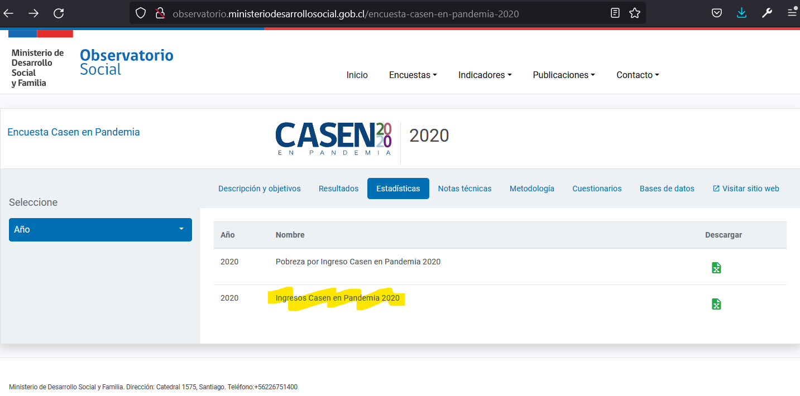
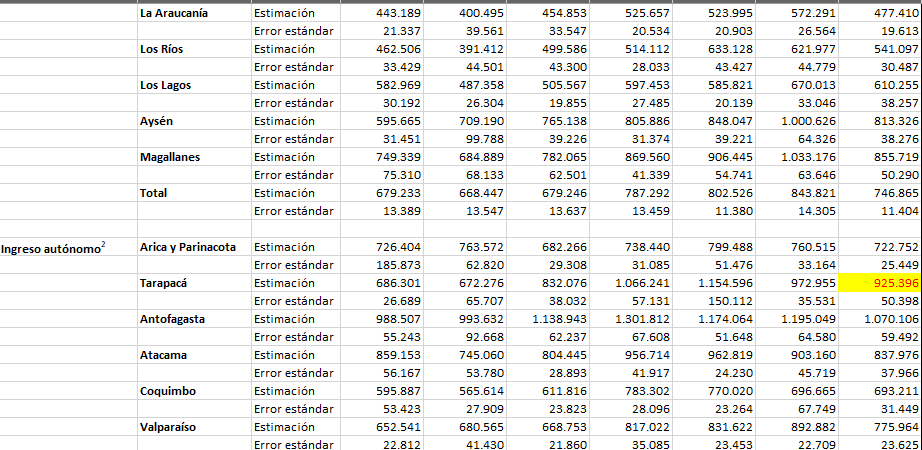

date: `r format(Sys.time(), "%d-%m-%Y")`
<style type="text/css">
.main-container {
  max-width: 1600px;
  margin-left: 100px;
  margin-right: auto;
}
</style>


```{r , message=FALSE, warning=FALSE, include = FALSE, eecho = FALSE}
#suppressWarnings(library(RODBC))
library(ggplot2)
library(ggpubr)
library(markdown)
library(shiny)
library(shinythemes)
library(tidyverse)
library(magrittr)
library(lubridate)
library(plotly)
library(xts)
library(dygraphs)
library(kableExtra)
library(knitr)
library("readxl")
library(rsconnect)
library(dplyr)
library(summarytools)
library(epiDisplay)
#library(leaflet)
library(haven)
library(epiDisplay)
library("readxl")
library(expss)
library(hrbrthemes)
library(viridis)
library(viridisLite)
library(DescTools)
library(roperators)
library(shinycssloaders)
library(writexl)
library(labelled)
library(tidyverse)
library(haven)
library(readr)
library(sjmisc)
library(WriteXLS)
library(ineq)
library(readstata13)
library(reldist)
library(foreign)
library(DT)

options(digits=2)
```


# Introducción


Cuando estimamos porcentualmente la variación del ingreso total personal entre el 2017 y el 2020 por comuna nos encontramos con una caída del -34,45294636 a nivel nacional, lo que no se condice con las estadísticas que obtuvimos a nivel de hogares [aquí](http://observatorio.ministeriodesarrollosocial.gob.cl/encuesta-casen-en-pandemia-2020): Ingreso promedio de los hogares por tipo de ingreso y región. Los últimos apenas varian  frente a la tremenda caida del -34% de ytotcor, pero como demostraremos, creemos que es problema de interpretación y no de método o base de datos corrupta, sino que del concepto de **Alquiler imputado** que suaviza muchísimo la pobreza por ingresos.

Casen se concentra en el analisis de los ingresos de los hogares, entonces el cálculo básico es el siguiente:

1 Se agrupan todos los hogares por núcleo familiar con una columna que indique su cantidad si queremos calcular los ingresos per cápita.

2 Hacemos un merge para traernos una variable de ingreso para el hogar (que es la suma de los ingresos de todos sus integrantes), por ejemplo ytrabajocorh (en general éstas terminan siempre con h).

3 Calculamos los promedios por región.

Dividimos el informe en tres:

1. Para el 2020 comparamos nuestros cálculos con los publicados.

2. Generalizamos para los cuatro ingresos fundamentales entre 2009 y 2020, agregando la variación porcentual entre años contiguos para nuestros ingresos calculados y agregando una gráfica que compara para todos los años disponibles los calculados y los publicados. Adjuntamos la tabla completa descargable.

3. Problema. 

Cuando llegamos al análisis de los ingresos por persona por comuna 2017-2020 nos encontramos con una caída enorme, que no parece justificada por las cifras oficiales. No hay error. Ésto es así. Lo que pasa es que en éste momento entra en juego el concepto de "Alquiler imputado". Una muy buena definición la entrega la fundación SOl:

Una persona de 75 años vive sola y, luego de haber pagado dividendos por más de 30 años, es dueña de su casa. El arriendo que se paga en el sector por una vivienda similar es de $300.000. Esta persona no recibe pensión básica y su pensión autofinanciada a través del sistema de AFP es de $100.000. Tampoco recibe aporte previsional solidario. Dicho de otro modo: es una persona mayor que vive en su casa y cuyo único ingreso es de $100.000. Al momento de calcular el porcentaje de pobreza, sin embargo, esta persona obtiene un ingreso mensual de $400.000, correspondiente a la suma del alquiler imputado y su pensión autofinanciada y, como la línea de pobreza para el hogar de una persona es de $158.145, figurará estadísticamente como que no es pobre.>https://www.elmostrador.cl/noticias/opinion/columnas/2018/08/29/y-si-miramos-la-pobreza-de-mercado-las-trampas-del-famoso-alquiler-imputado/


4. Solucion


Informes de las Casen e información básica para Casen 2011 y anteriores:\

1 Informes de las Casen e información básica:\

http://observatorio.ministeriodesarrollosocial.gob.cl/encuesta-casen-2011

# El problema

Nos encontramos con inconsistencias en el cálculo de  ingresos, pero como demostraremos, creemos que es problema de interpretación y no de método o base de datos corrupta.

<br>


## Los ingresos

Recordemos los cuatro datos fundamentales de la generación de los ingresos:

 | | | | 
:-----:|:-----:|:-----:|:-----:|:-----:
 | **Tipo** |Ingreso total|Ingreso autónomo|Ingreso del trabajo|Ingreso de la ocupación principal
año| | |
2020|ytotcor|yautcor|ytrabajocor|yoprcor
2017|ytotcor|yautcor|ytrabajocor|yoprcor
2015|ytotcor|yautcor|ytrabajocor|yoprcor
2013|ytotcor|yautcor|ytrabajocor|yoprcor
2011|ytrabaj |yautaj |ytrabaj      |yopraj
2009|ytrabaj |yautaj |ytrabaj      |yopraj
2006|ytrabaj |yautaj |ytrabaj      |yopraj

 


## Metodología y fuentes de datos

Nuestra metodología fue la de encontrar publicaciones oficiales con datos calculados de la Casen y compararlos con cálculos propios.


En general la Casen no es analizada a  nivel de personas, sino que de hogares. 

La página de la Casen 2020 en pandemia analizada contiene  un excel con datos calculados. Son todos referidos a hogares. Uno se llama:

"Ingreso promedio de los hogares por tipo de ingreso y región", con lo que se tiene que hacer el siguiente cálculo, por ejemplo para la variable ytrabajocorh:


para cada hogar la Casen lleva asociado la variable ytrabajocorh que significa "Ingreso del trabajo del hogar corregido" que se repite para cada registro perteneciente a un hogar (folio). Se transforma la tabla y se hace un sólo registro con el ingreso familiar. Se promedian en una región. Si bien el cálculo es simple, nos da cierto nivel de complejidad que hará notar con mayor facilidad los errores:

# Verificación para el Censo 2020

Los ejercicios resultan con los $ a noviembre de cada año.

Nuestra mayor preocupación era que las cifras de ingresos del Censo 2020 coincidieran con nuestros cálculos, por lo que la primera base de datos que buscamos fue ella.

Para ello calculamos el ingreso promedio de los hogares por tipo de ingreso y región, 2006-2020, ($ noviembre de cada año de la siguiente base de datos:




<!-- ############################################################################################################################################################ -->

## Verificación de nuestros cálculos con datos oficiales del 2020

```{r, warning=FALSE, message=FALSE} 
# casen2020 <- readRDS("C:/Users/chris/OneDrive/Documentos/archivos_grandes/casen/casen_2020.rds")
# casen2020 <- mutate_if(casen2020, is.factor, as.character)
# casen2017 <- readRDS("C:/Users/chris/OneDrive/Documentos/archivos_grandes/casen/casen_2017_c2.rds")
# casen2017 <- mutate_if(casen2017, is.factor, as.character)
# casen2015 <- readRDS("C:/Users/chris/OneDrive/Documentos/archivos_grandes/casen/casen_2015_c2.rds")
# casen2015 <- mutate_if(casen2015, is.factor, as.character)
# casen2013 <- readRDS("C:/Users/chris/OneDrive/Documentos/archivos_grandes/casen/casen_2013_c2.rds")
# casen2013 <- mutate_if(casen2013, is.factor, as.character)
# casen2011 <- readRDS("C:/Users/chris/OneDrive/Documentos/archivos_grandes/casen/casen_2011_c2.rds")
# casen2011 <- mutate_if(casen2011, is.factor, as.character)
# casen2009 <- readRDS("C:/Users/chris/OneDrive/Documentos/archivos_grandes/casen/casen_2009_c.rds")
# casen2009 <- mutate_if(casen2009, is.factor, as.character)
# casen2006 <- readRDS("C:/Users/chris/OneDrive/Documentos/archivos_grandes/casen/casen_2006_c.rds")
# casen2006 <- mutate_if(casen2006, is.factor, as.character)
 

casen2006 <- readRDS("C:/Users/chris/OneDrive/Documentos/archivos_grandes/casen_2006_c.rds")
casen2006 <- mutate_if(casen2006, is.factor, as.character)
casen2009 <- readRDS("C:/Users/chris/OneDrive/Documentos/archivos_grandes/casen_2009_c.rds")
casen2009 <- mutate_if(casen2009, is.factor, as.character)
casen2011 <- readRDS("C:/Users/chris/OneDrive/Documentos/archivos_grandes/casen_2011_c.rds")
casen2011 <- mutate_if(casen2011, is.factor, as.character)
casen2013 <- readRDS("C:/Users/chris/OneDrive/Documentos/archivos_grandes/casen_2013_c.rds")
casen2013 <- mutate_if(casen2013, is.factor, as.character)
casen2015 <- readRDS("C:/Users/chris/OneDrive/Documentos/archivos_grandes/casen_2015_c.rds")
casen2015 <- mutate_if(casen2015, is.factor, as.character)
casen2017 <- readRDS("C:/Users/chris/OneDrive/Documentos/archivos_grandes/casen_2017_c.rds")
casen2017 <- mutate_if(casen2017, is.factor, as.character)
casen2020 <- read.spss(file="C:/Users/chris/OneDrive/Documentos/archivos_grandes/casen_2020.sav", to.data.frame=TRUE)
saveRDS(casen2020,"casen2020.rds")
casen2020 <- readRDS("casen2020.rds")
casen2020 <- mutate_if(casen2020, is.factor, as.character)
codigos_comunales <- readRDS(file = "C:/Users/chris/OneDrive/Documentos/archivos_grandes/codigos_comunales_2011-2017.rds")


reg_20 <- unique(casen2020$region)
# length(reg_20)
reg_17 <- unique(casen2017$region)
# length(reg_17)
reg_15 <- unique(casen2015$region)
# length(reg_15)
reg_13 <- unique(casen2013$region)
# length(reg_13)
reg_11 <- unique(casen2011$region)
# length(reg_11)
reg_09 <- unique(casen2009$REGION)
# length(reg_09)
reg_06 <- unique(casen2006$R)
# length(reg_06)
```


```{r}

# tabla_2017 <- casen2017
# tabla_2017$region[tabla_2017$region == "Región de Ayséndel Gral. Carlos Ibáñez del Campo"] <- "Región de Aysén del Gral. Carlos Ibáñez del Campo"
# tabla_2017$region[tabla_2017$region == "Región del Libertador Gral. Bernardo O’Higgins"] <- "Región del Libertador Gral. Bernardo O'Higgins"
# saveRDS(tabla_2017,"C:/Users/chris/OneDrive/Documentos/archivos_grandes/casen/casen_2017_c2.rds")
# 
# tabla_2015 <- casen2015
# tabla_2015$region[tabla_2015$region == "Región del Libertador Gral. Bernardo O Higgins"] <- "Región del Libertador Gral. Bernardo O'Higgins"
# saveRDS(tabla_2015,"C:/Users/chris/OneDrive/Documentos/archivos_grandes/casen/casen_2015_c2.rds")
# 
# tabla_2013 <- casen2013
# tabla_2013$region[tabla_2013$region == "I. Tarapaca"] <- "Región de Tarapacá"
# tabla_2013$region[tabla_2013$region == "II. Antofagasta"] <- "Región de Antofagasta"
# tabla_2013$region[tabla_2013$region == "III. Atacama"] <- "Región de Atacama"
# tabla_2013$region[tabla_2013$region == "IV. Coquimbo"] <- "Región de Coquimbo"
# tabla_2013$region[tabla_2013$region == "IX. La Araucanía"] <- "Región de La Araucanía"
# tabla_2013$region[tabla_2013$region == "Metropolitana"] <- "Región Metropolitana de Santiago"
# tabla_2013$region[tabla_2013$region == "V. Valparaíso"] <- "Región de Valparaíso"
# tabla_2013$region[tabla_2013$region == "VI. O Higgins"] <- "Región del Libertador Gral. Bernardo O'Higgins"
# tabla_2013$region[tabla_2013$region == "VII. Maule"] <- "Región del Maule"
# tabla_2013$region[tabla_2013$region == "VIII. Biobío"] <- "Región del Biobío"
# tabla_2013$region[tabla_2013$region == "X. Los Lagos"] <- "Región de Los Lagos"
# tabla_2013$region[tabla_2013$region == "XI. Aysén"] <- "Región de Aysén del Gral. Carlos Ibáñez del Campo"
# tabla_2013$region[tabla_2013$region == "XII. Magallanes"] <- "Región de Magallanes y de la Antártica Chilena"
# tabla_2013$region[tabla_2013$region == "XIV. Los Ríos"] <- "Región de Los Ríos"
# tabla_2013$region[tabla_2013$region == "XV. Arica y Parinacota"] <- "Región de Arica y Parinacota"
# saveRDS(tabla_2013,"C:/Users/chris/OneDrive/Documentos/archivos_grandes/casen/casen_2013_c2.rds")
# 
# tabla_2011 <- casen2011
# tabla_2011$region[tabla_2011$region == "Antofagasta"] <- "Región de Antofagasta"
# tabla_2011$region[tabla_2011$region == "Araucanía"] <- "Región de La Araucanía"
# tabla_2011$region[tabla_2011$region == "Arica y Parinacota"] <- "Región de Arica y Parinacota"
# tabla_2011$region[tabla_2011$region == "Aysén"] <- "Región de Aysén del Gral. Carlos Ibáñez del Campo"
# tabla_2011$region[tabla_2011$region == "Bio Bio"] <- "Región del Biobío"
# tabla_2011$region[tabla_2011$region == "Copiapó"] <- "Región de Atacama"
# tabla_2011$region[tabla_2011$region == "Coquimbo"] <- "Región de Coquimbo"
# tabla_2011$region[tabla_2011$region == "Los Lagos"] <- "Región de Los Lagos"
# tabla_2011$region[tabla_2011$region == "Los Ríos"] <- "Región de Los Ríos"
# tabla_2011$region[tabla_2011$region == "Magallanes"] <- "Región de Magallanes y de la Antártica Chilena"
# tabla_2011$region[tabla_2011$region == "Maule"] <- "Región del Maule"
# tabla_2011$region[tabla_2011$region == "Metropolitana"] <- "Región Metropolitana de Santiago"
# tabla_2011$region[tabla_2011$region == "O Higgins"] <- "Región del Libertador Gral. Bernardo O'Higgins"
# tabla_2011$region[tabla_2011$region == "Tarapacá"] <- "Región de Tarapacá"
# tabla_2011$region[tabla_2011$region == "Valparaíso"] <- "Región de Valparaíso"
# saveRDS(tabla_2011,"C:/Users/chris/OneDrive/Documentos/archivos_grandes/casen/casen_2011_c2.rds")

```


```{r} 
tabla_prom_reg <- data.frame()

for (i in reg_20) {
  casen_fh <- filter(casen2020, casen2020$region == i)
  
casen_fh <- casen_fh[,c("region","folio","ytrabajocorh")]
casen_fh$folio <- as.character(casen_fh$folio)
  
tabla <- table(casen_fh$folio)
tabla <- as.data.frame(tabla)
colnames(tabla) <- c("folio","freq_folio")


repetidos2 <- merge(x=casen_fh, y=tabla, by = "folio", all.x = T)
repetidos2 <- repetidos2[,c(2,1,4,3)]
rr <- repetidos2[!duplicated(repetidos2$folio ), ]

tabla_reg <- data.frame(
  region = i,
  promedio = mean(rr$ytrabajocorh)
)

tabla_prom_reg <- rbind(tabla_prom_reg, tabla_reg)

}
# tabla_prom_reg
```


```{r} 
tabla_ing_aut <- read_xlsx("ingreso_del_trabajo_oficial_2020.xlsx")
names(tabla_ing_aut)[3] <- "region"
names(tabla_ing_aut)[1] <- "region_c"

tabla_unida = merge(x = tabla_prom_reg, y = tabla_ing_aut, by = "region", all.x = T)
tabla_unida <- tabla_unida[,-c(3)]
# kbl(tabla_unida) %>%
#   kable_styling(bootstrap_options = c("striped", "hover")) %>%
#   kable_paper() %>%
#   scroll_box(width = "100%", height = "300px")
```

```{r, warning = FALSE, message=FALSE}
p <- plot_ly(tabla_unida, width = 1200, x = ~
region, y = ~promedio) %>%
  add_lines() 
p <- p %>% add_trace(y = ~`Ingreso del trabajo`, name = 'ingreso del trabajo oficial', mode = 'markers')
p 
```

### Ingreso autonomo del hogar: **yautcorh**

```{r, message=FALSE} 

tabla_prom_reg <- data.frame()

for (i in reg_20) {
  casen_fh <- filter(casen2020, casen2020$region == i)
  
casen_fh <- casen_fh[,c("region","folio","yautcorh")]
casen_fh$folio <- as.character(casen_fh$folio)
  
tabla <- table(casen_fh$folio)
tabla <- as.data.frame(tabla)
colnames(tabla) <- c("folio","freq_folio")
repetidos2 <- merge(x=casen_fh, y=tabla, by = "folio", all.x = T)
repetidos2 <- repetidos2[,c(2,1,4,3)]
rr <- repetidos2[!duplicated(repetidos2$folio ), ]

tabla_reg <- data.frame(
  region = i,
  promedio = mean(rr$yautcorh)
)

tabla_prom_reg <- rbind(tabla_prom_reg, tabla_reg)

}

tabla_ing_aut <- read_xlsx("ingreso_autonomo_2020_3.xlsx")
names(tabla_ing_aut)[3] <- "region"
 
tabla_unida = merge(x = tabla_prom_reg, y = tabla_ing_aut, by = "region", all.x = T)
tabla_unida <- tabla_unida[,-c(3)]
 
kbl(tabla_unida) %>%
  kable_styling(bootstrap_options = c("striped", "hover")) %>%
  kable_paper() %>%
  scroll_box(width = "100%", height = "300px")
```

```{r, warning = FALSE, message=FALSE}
p <- plot_ly(tabla_unida, width = 1200, x = ~
region, y = ~promedio) %>%
  add_lines() 
p <- p %>% add_trace(y = ~ingreso_autonomo, name = 'ingreso autonomo oficial', mode = 'markers')
p 
```
 
### Ingreso del subsidio monetario: **ysubh**

```{r} 

tabla_prom_reg <- data.frame()

for (i in reg_20) {
  casen_fh <- filter(casen2020, casen2020$region == i)
  
casen_fh <- casen_fh[,c("region","folio","ysubh")]
casen_fh$folio <- as.character(casen_fh$folio)
  
tabla <- table(casen_fh$folio)
tabla <- as.data.frame(tabla)
colnames(tabla) <- c("folio","freq_folio")
repetidos2 <- merge(x=casen_fh, y=tabla, by = "folio", all.x = T)
repetidos2 <- repetidos2[,c(2,1,4,3)]
rr <- repetidos2[!duplicated(repetidos2$folio ), ]

tabla_reg <- data.frame(
  region = i,
  promedio = mean(rr$ysubh)
)

tabla_prom_reg <- rbind(tabla_prom_reg, tabla_reg)

}

tabla_ing_aut <- read_xlsx("subsidios_monetarios_oficial_2020.xlsx") 
names(tabla_ing_aut)[3] <- "region" 
names(tabla_ing_aut)[1] <- "region_c"
 
tabla_unida = merge(x = tabla_prom_reg, y = tabla_ing_aut, by = "region", all.x = T)
tabla_unida <- tabla_unida[,-c(3)]
kbl(tabla_unida) %>%
  kable_styling(bootstrap_options = c("striped", "hover")) %>%
  kable_paper() %>%
  scroll_box(width = "100%", height = "300px")
```

```{r, warning = FALSE, message=FALSE}
p <- plot_ly(tabla_unida, width = 1200, x = ~
region, y = ~promedio) %>%
  add_lines() 
p <- p %>% add_trace(y = ~`Subsidios monetarios`, name = 'ingreso del subsidio monetarios oficial', mode = 'markers')
p 
```


### Ingreso monetario: **ymonecorh**
 
```{r} 

tabla_prom_reg <- data.frame()

for (i in reg_20) {
  casen_fh <- filter(casen2020, casen2020$region == i)
  
casen_fh <- casen_fh[,c("region","folio","ymonecorh")]
casen_fh$folio <- as.character(casen_fh$folio)
  
tabla <- table(casen_fh$folio)
tabla <- as.data.frame(tabla)
colnames(tabla) <- c("folio","freq_folio")
repetidos2 <- merge(x=casen_fh, y=tabla, by = "folio", all.x = T)
repetidos2 <- repetidos2[,c(2,1,4,3)]
rr <- repetidos2[!duplicated(repetidos2$folio ), ]

tabla_reg <- data.frame(
  region = i,
  promedio = mean(rr$ymonecorh)
)

tabla_prom_reg <- rbind(tabla_prom_reg, tabla_reg)

}

tabla_ing_aut <- read_xlsx("ingreso_monetario_oficial_2020.xlsx") 
names(tabla_ing_aut)[3] <- "region" 
names(tabla_ing_aut)[1] <- "region_c"
 
tabla_unida = merge(x = tabla_prom_reg, y = tabla_ing_aut, by = "region", all.x = T)
tabla_unida <- tabla_unida[,-c(3)]
kbl(tabla_unida) %>%
  kable_styling(bootstrap_options = c("striped", "hover")) %>%
  kable_paper() %>%
  scroll_box(width = "100%", height = "300px")
```

```{r, warning = FALSE, message=FALSE}
p <- plot_ly(tabla_unida, width = 1200, x = ~
region, y = ~promedio) %>%
  add_lines() 
p <- p %>% add_trace(y = ~`Ingreso monetario`, name = 'ingreso monetario oficial', mode = 'markers')
p 
```

La coincidencia es prácticamente total. Realizareamos la comparación con otro año y otra variable:


# Otra comprobación

Compararemos nuestros cálculos para otro año con los datos oficiales la variable: ytrabajocorh 2017

```{r} 

tabla_prom_reg <- data.frame()

for (i in reg_17) {
  casen_fh <- filter(casen2017, casen2017$region == i)
  
casen_fh <- casen_fh[,c("region","folio","ytrabajocorh")]
casen_fh$folio <- as.character(casen_fh$folio)
  
tabla <- table(casen_fh$folio)
tabla <- as.data.frame(tabla)
colnames(tabla) <- c("folio","freq_folio")
repetidos2 <- merge(x=casen_fh, y=tabla, by = "folio", all.x = T)
repetidos2 <- repetidos2[,c(2,1,4,3)]
rr <- repetidos2[!duplicated(repetidos2$folio ), ]

tabla_reg <- data.frame(
  region = i,
  promedio_2017 = mean(rr$ytrabajocorh)
)

tabla_prom_reg <- rbind(tabla_prom_reg, tabla_reg)

}

tabla_ing_aut <- read_xlsx("ingreso_del_trabajo_oficial_2017.xlsx")
names(tabla_ing_aut)[3] <- "region" 
names(tabla_ing_aut)[1] <- "region_c" 
 
tabla_2017 = merge(x = tabla_prom_reg, y = tabla_ing_aut, by = "region", all.x = T)
tabla_2017 <- tabla_2017[,-c(3)]
kbl(tabla_2017) %>%
  kable_styling(bootstrap_options = c("striped", "hover")) %>%
  kable_paper() %>%
  scroll_box(width = "100%", height = "300px")
```

```{r, warning = FALSE, message=FALSE}
p <- plot_ly(tabla_2017, width = 1200, x = ~
region, y = ~promedio_2017) %>%
  add_lines() 
p <- p %>% add_trace(y = ~`Ingreso del trabajo 2017`, name = 'ingreso del trabajo 2017 oficial', mode = 'markers')
p 
```

 <!-- #####################################################################################----- comunas -->


 ### Ingreso monetario: **ymonecorh**
 
```{r, warning = FALSE, message=FALSE}
library(tidyr)

fn_prom <- function(n){

ingresoh<-switch(n,"ytotcorh","yautcorh","ytrabajocorh","yoprcorh")

tabla_prom_reg <- data.frame()

for (i in unique(casen2020$comuna)[1:5]) {
  casen_fh <- filter(casen2020 , casen2020$comuna == i)
  
casen_fh <- casen_fh[,c("comuna","folio",ingresoh)]
casen_fh$folio <- as.character(casen_fh$folio)
  
tabla <- table(casen_fh$folio)
tabla <- as.data.frame(tabla)
colnames(tabla) <- c("folio","freq_folio")
repetidos2 <- merge(x=casen_fh, y=tabla, by = "folio", all.x = T)
repetidos2 <- repetidos2[,c(2,1,4,3)]
rr <- repetidos2[!duplicated(repetidos2$folio ), ] 
rrr <- rr
tabla_reg <- data.frame(
  comuna = i,
  promedio = mean(na.omit(rr[,4]))
)

tabla_prom_reg <- rbind(tabla_prom_reg, tabla_reg)

}
calculados <<- tabla_prom_reg
# print(tabla_prom_reg)
}

for (n in 1:4) {
  fn_prom(n)
  assign(paste0("calculo_de_2020_",n),calculados)
}

receptaculo_unido = merge(x = calculo_de_2020_1, y = calculo_de_2020_2, by = "comuna", all.x = T)
receptaculo_unido = merge(x = calculo_de_2020_3, y = receptaculo_unido, by = "comuna", all.x = T)
receptaculo_unido = merge(x = calculo_de_2020_4, y = receptaculo_unido, by = "comuna", all.x = T)
familias_1 <- receptaculo_unido
codigos_comunales <- readRDS(file = "C:/Users/chris/OneDrive/Documentos/archivos_grandes/codigos_comunales_2011-2017.rds")
names(codigos_comunales)[2] <- "comuna"
familias_1 = merge(x = codigos_comunales, y = familias_1, by = "comuna")
regiones <- casen2020[,c("comuna","region")]
regiones <- regiones[!duplicated(regiones$comuna ), ] 
familias_1 = merge(x = regiones, y = familias_1, by = "comuna")
familias_1 <- familias_1[,c(2,1,3,4:7)]
colnames(familias_1) <- c("region","comuna","codigo_comuna","ytotcorh","yautcorh","ytrabajocorh","yoprcorh")
familias_1$año <- 2020
datatable(familias_1, extensions = 'Buttons', escape = FALSE, rownames = FALSE,
          options = list(dom = 'Bfrtip',
          buttons = list('colvis', list(extend = 'collection',
          buttons = list(
          list(extend='copy'),
          list(extend='excel',
            filename = 'hitStats'),
          list(extend='pdf',
            filename= 'hitStats')),
          text = 'Download')), scrollX = TRUE))%>%
    formatRound(columns=c("ytotcorh","yautcorh","ytrabajocorh","yoprcorh"),mark = "", digits=1)
```
 
 
<!-- ########################################## -->

```{r, warning = FALSE, message=FALSE}

fn_prom <- function(n){

ingresoh<-switch(n,"ytotcorh","yautcorh","ytrabajocorh","yoprcorh")

tabla_prom_reg <- data.frame()

for (i in unique(casen2017$comuna)[1:5]) {
  casen_fh <- filter(casen2017 , casen2017$comuna == i)
  
casen_fh <- casen_fh[,c("comuna","folio",ingresoh)]
casen_fh$folio <- as.character(casen_fh$folio)
  
tabla <- table(casen_fh$folio)
tabla <- as.data.frame(tabla)
colnames(tabla) <- c("folio","freq_folio")
repetidos2 <- merge(x=casen_fh, y=tabla, by = "folio", all.x = T)
repetidos2 <- repetidos2[,c(2,1,4,3)]
rr <- repetidos2[!duplicated(repetidos2$folio ), ] 
 
tabla_reg <- data.frame(
  comuna = i,
  promedio = mean(na.omit(rr[,4]))
)

tabla_prom_reg <- rbind(tabla_prom_reg, tabla_reg)

}
calculados <<- tabla_prom_reg
# print(rrr)
}

for (n in 1:4) {
  fn_prom(n)
  assign(paste0("calculo_de_2017_",n),calculados)
}

receptaculo_unido = merge(x = calculo_de_2017_1, y = calculo_de_2017_2, by = "comuna", all.x = T)
receptaculo_unido = merge(x = calculo_de_2017_3, y = receptaculo_unido, by = "comuna", all.x = T)
receptaculo_unido = merge(x = calculo_de_2017_4, y = receptaculo_unido, by = "comuna", all.x = T)
familias_2 <- receptaculo_unido
codigos_comunales <- readRDS(file = "C:/Users/chris/OneDrive/Documentos/archivos_grandes/codigos_comunales_2011-2017.rds")
names(codigos_comunales)[2] <- "comuna"
familias_2 = merge(x = codigos_comunales, y = familias_2, by = "comuna")
regiones <- casen2017[,c("comuna","region")]
regiones <- regiones[!duplicated(regiones$comuna ), ] 
familias_2 = merge(x = regiones, y = familias_2, by = "comuna")
familias_2 <- familias_2[,c(2,1,3,4:7)]
colnames(familias_2) <- c("region","comuna","codigo_comuna","ytotcorh","yautcorh","ytrabajocorh","yoprcorh")
familias_2$año <- 2017
datatable(familias_2, extensions = 'Buttons', escape = FALSE, rownames = FALSE,
          options = list(dom = 'Bfrtip',
          buttons = list('colvis', list(extend = 'collection',
          buttons = list(
          list(extend='copy'),
          list(extend='excel',
            filename = 'hitStats'),
          list(extend='pdf',
            filename= 'hitStats')),
          text = 'Download')), scrollX = TRUE))%>%
    formatRound(columns=c("ytotcorh","yautcorh","ytrabajocorh","yoprcorh"),mark = "", digits=1)

```
 
<!-- ########################################## -->

```{r, warning = FALSE, message=FALSE}

fn_prom <- function(n){

ingresoh<-switch(n,"ytotcorh","yautcorh","ytrabajoCorh","yoprCorh")
names(casen2015)[3] <- "folio"
tabla_prom_reg <- data.frame()

for (i in unique(casen2015$comuna)[1:5]) {
  casen_fh <- filter(casen2015 , casen2015$comuna == i)
  names(casen2015)[3] <- "folio"
casen_fh <- casen_fh[,c("comuna","folio",ingresoh)]
casen_fh$folio <- as.character(casen_fh$folio)
  
tabla <- table(casen_fh$folio)
tabla <- as.data.frame(tabla)
colnames(tabla) <- c("folio","freq_folio")
repetidos2 <- merge(x=casen_fh, y=tabla, by = "folio", all.x = T)
repetidos2 <- repetidos2[,c(2,1,4,3)]
rr <- repetidos2[!duplicated(repetidos2$folio ), ]

tabla_reg <- data.frame(
  comuna = i,
  promedio = mean(rr[,4])
)

tabla_prom_reg <- rbind(tabla_prom_reg, tabla_reg)

}
calculados <<- tabla_prom_reg
# print(tabla_prom_reg)
}

for (n in 1:4) {
  fn_prom(n)
  assign(paste0("calculo_de_2015_",n),calculados)
}

receptaculo_unido = merge(x = calculo_de_2015_1, y = calculo_de_2015_2, by = "comuna", all.x = T)
receptaculo_unido = merge(x = calculo_de_2015_3, y = receptaculo_unido, by = "comuna", all.x = T) 
receptaculo_unido = merge(x = calculo_de_2015_4, y = receptaculo_unido, by = "comuna", all.x = T) 
familias_3 <- receptaculo_unido
codigos_comunales <- readRDS(file = "C:/Users/chris/OneDrive/Documentos/archivos_grandes/codigos_comunales_2011-2017.rds") 
names(codigos_comunales)[2] <- "comuna"
familias_3 = merge(x = codigos_comunales, y = familias_3, by = "comuna")
regiones <- casen2015[,c("comuna","region")]
regiones <- regiones[!duplicated(regiones$comuna ), ] 
familias_3 = merge(x = regiones, y = familias_3, by = "comuna")
familias_3 <- familias_3[,c(2,1,3,4:7)]
colnames(familias_3) <- c("region","comuna","codigo_comuna","ytotcorh","yautcorh","ytrabajocorh","yoprcorh")
familias_3$año <- 2015
datatable(familias_3, extensions = 'Buttons', escape = FALSE, rownames = FALSE,
          options = list(dom = 'Bfrtip',
          buttons = list('colvis', list(extend = 'collection',
          buttons = list(
          list(extend='copy'),
          list(extend='excel',
            filename = 'hitStats'),
          list(extend='pdf',
            filename= 'hitStats')),
          text = 'Download')), scrollX = TRUE))%>%
    formatRound(columns=c("ytotcorh","yautcorh","ytrabajocorh","yoprcorh"),mark = "", digits=1)

```
 
```{r, warning = FALSE, message=FALSE}

fn_prom <- function(n){

ingresoh<-switch(n,"ytotcorh","yautcorh","ytrabajoCorh","yoprCorh")
# names(casen2013)[3] <- "folio"
tabla_prom_reg <- data.frame()

for (i in unique(casen2013$comuna)[1:5]) {
  casen_fh <- filter(casen2013 , casen2013$comuna == i)
  # names(casen2013)[3] <- "folio"
casen_fh <- casen_fh[,c("comuna","folio",ingresoh)]
casen_fh$folio <- as.character(casen_fh$folio)
  
tabla <- table(casen_fh$folio)
tabla <- as.data.frame(tabla)
colnames(tabla) <- c("folio","freq_folio")
repetidos2 <- merge(x=casen_fh, y=tabla, by = "folio", all.x = T)
repetidos2 <- repetidos2[,c(2,1,4,3)]
rr <- repetidos2[!duplicated(repetidos2$folio ), ]

tabla_reg <- data.frame(
  comuna = i,
  promedio = mean(rr[,4])
)

tabla_prom_reg <- rbind(tabla_prom_reg, tabla_reg)

}
calculados <<- tabla_prom_reg
# print(tabla_prom_reg)
}

for (n in 1:4) {
  fn_prom(n)
  assign(paste0("calculo_de_2013_",n),calculados)
}

receptaculo_unido = merge(x = calculo_de_2013_1, y = calculo_de_2013_2, by = "comuna", all.x = T)
receptaculo_unido = merge(x = calculo_de_2013_3, y = receptaculo_unido, by = "comuna", all.x = T) 
receptaculo_unido = merge(x = calculo_de_2013_4, y = receptaculo_unido, by = "comuna", all.x = T)
familias_4 <- receptaculo_unido
codigos_comunales <- readRDS(file = "C:/Users/chris/OneDrive/Documentos/archivos_grandes/codigos_comunales_2011-2017.rds")
names(codigos_comunales)[2] <- "comuna"
familias_4 = merge(x = codigos_comunales, y = familias_4, by = "comuna")
regiones <- casen2013[,c("comuna","region")]
regiones <- regiones[!duplicated(regiones$comuna ), ] 
familias_4 = merge(x = regiones, y = familias_4, by = "comuna")
familias_4 <- familias_4[,c(2,1,3,4:7)]
colnames(familias_4) <- c("region","comuna","codigo_comuna","ytotcorh","yautcorh","ytrabajocorh","yoprcorh")
familias_4$año <- 2013
datatable(familias_4, extensions = 'Buttons', escape = FALSE, rownames = FALSE,
          options = list(dom = 'Bfrtip',
          buttons = list('colvis', list(extend = 'collection',
          buttons = list(
          list(extend='copy'),
          list(extend='excel',
            filename = 'hitStats'),
          list(extend='pdf',
            filename= 'hitStats')),
          text = 'Download')), scrollX = TRUE))%>%
    formatRound(columns=c("ytotcorh","yautcorh","ytrabajocorh","yoprcorh"),mark = "", digits=1)

```
 
<!-- ########################################## -->

```{r, warning = FALSE, message=FALSE}

fn_prom <- function(n){

ingresoh<-switch(n,"ytothaj","yauthaj","ytrabhaj","yoprhaj")

tabla_prom_reg <- data.frame()

for (i in unique(casen2011$comuna)[1:5]) {
  casen_fh <- filter(casen2011 , casen2011$comuna == i)

casen_fh <- casen_fh[,c("comuna","folio",ingresoh)]
casen_fh$folio <- as.character(casen_fh$folio)
  
tabla <- table(casen_fh$folio)
tabla <- as.data.frame(tabla)
colnames(tabla) <- c("folio","freq_folio")
repetidos2 <- merge(x=casen_fh, y=tabla, by = "folio", all.x = T)
repetidos2 <- repetidos2[,c(2,1,4,3)]
rr <- repetidos2[!duplicated(repetidos2$folio ), ]

tabla_reg <- data.frame(
  comuna = i,
  promedio = mean(rr[,4])
)

tabla_prom_reg <- rbind(tabla_prom_reg, tabla_reg)

}
calculados <<- tabla_prom_reg
# print(tabla_prom_reg)
}

for (n in 1:4) {
  fn_prom(n)
  assign(paste0("calculo_de_2011_",n),calculados)
}

receptaculo_unido = merge(x = calculo_de_2011_1, y = calculo_de_2011_2, by = "comuna", all.x = T)
receptaculo_unido = merge(x = calculo_de_2011_3, y = receptaculo_unido, by = "comuna", all.x = T) 
receptaculo_unido = merge(x = calculo_de_2011_4, y = receptaculo_unido, by = "comuna", all.x = T) 
familias_5 <- receptaculo_unido
codigos_comunales <- readRDS(file = "C:/Users/chris/OneDrive/Documentos/archivos_grandes/codigos_comunales_2011-2017.rds")
names(codigos_comunales)[2] <- "comuna"
familias_5 = merge(x = codigos_comunales, y = familias_5, by = "comuna")
regiones <- casen2011[,c("comuna","region")]
regiones <- regiones[!duplicated(regiones$comuna ), ] 
familias_5 = merge(x = regiones, y = familias_5, by = "comuna")
familias_5 <- familias_5[,c(2,1,3,4:7)]
colnames(familias_5) <- c("region","comuna","codigo_comuna","ytotcorh","yautcorh","ytrabajocorh","yoprcorh")
familias_5$año <- 2011
datatable(familias_5, extensions = 'Buttons', escape = FALSE, rownames = FALSE,
          options = list(dom = 'Bfrtip',
          buttons = list('colvis', list(extend = 'collection',
          buttons = list(
          list(extend='copy'),
          list(extend='excel',
            filename = 'hitStats'),
          list(extend='pdf',
            filename= 'hitStats')),
          text = 'Download')), scrollX = TRUE))%>%
    formatRound(columns=c("ytotcorh","yautcorh","ytrabajocorh","yoprcorh"),mark = "", digits=1)

```

<!-- ########################################## -->
```{r, warning = FALSE, message=FALSE}
familias <- rbind(familias_1,familias_2,familias_3,familias_4,familias_5) 
datatable(familias, extensions = 'Buttons', escape = FALSE, rownames = FALSE,
          options = list(dom = 'Bfrtip',
          buttons = list('colvis', list(extend = 'collection',
          buttons = list(
          list(extend='copy'),
          list(extend='excel',
            filename = 'hitStats'),
          list(extend='pdf',
            filename= 'hitStats')),
          text = 'Download')), scrollX = TRUE))%>%
    formatRound(columns=c("ytotcorh","yautcorh","ytrabajocorh","yoprcorh"),mark = "", digits=1)

```

```{r}
write_xlsx(familias,"familias.xlsx")
```

<!-- #####################################################################################-----  --> Comuna personas
 

 <!-- ########################################## -->

```{r, warning = FALSE, message=FALSE}

fn_prom <- function(n){

ingresoh<-switch(n,"ytotcor","yautcor","ytrabajocor","yoprcor")
tabla_prom_reg <- data.frame()

for (i in unique(casen2020$comuna)) {
  
  casen_fh <- filter(casen2020, casen2020$comuna == i) 
tabla_reg <- data.frame(
  comuna = i,
  promedio = mean(na.omit(casen_fh[,c(ingresoh)]))
)

tabla_prom_reg <- rbind(tabla_prom_reg, tabla_reg)

}
calculados <<- tabla_prom_reg 
}

for (n in 1:4) {
  fn_prom(n)
  assign(paste0("calculo_de_2020_",n),calculados)
}

receptaculo_unido = merge(x = calculo_de_2020_1, y = calculo_de_2020_2, by = "comuna", all.x = T)
receptaculo_unido = merge(x = calculo_de_2020_3, y = receptaculo_unido, by = "comuna", all.x = T) 
receptaculo_unido = merge(x = calculo_de_2020_4, y = receptaculo_unido, by = "comuna", all.x = T) 
personas_1 <- receptaculo_unido
codigos_comunales <- readRDS(file = "C:/Users/chris/OneDrive/Documentos/archivos_grandes/codigos_comunales_2011-2017.rds")
names(codigos_comunales)[2] <- "comuna"
personas_1 = merge(x = codigos_comunales, y = personas_1, by = "comuna")
regiones <- casen2020[,c("comuna","region")]
regiones <- regiones[!duplicated(regiones$comuna ), ] 
personas_1 = merge(x = regiones, y = personas_1, by = "comuna")
personas_1 <- personas_1[,c(2,1,3,4:7)]
colnames(personas_1) <- c("region","comuna","codigo_comuna","ytotcor","yautcor","ytrabajocor","yoprcor") 
personas_1$año <- 2020
datatable(personas_1, extensions = 'Buttons', escape = FALSE, rownames = FALSE,
          options = list(dom = 'Bfrtip',
          buttons = list('colvis', list(extend = 'collection',
          buttons = list(
          list(extend='copy'),
          list(extend='excel',
            filename = 'hitStats'),
          list(extend='pdf',
            filename= 'hitStats')),
          text = 'Download')), scrollX = TRUE))%>%
    formatRound(columns=c("ytotcor","yautcor","ytrabajocor","yoprcor") ,mark = "", digits=1)

```

 <!-- ########################################## -->

```{r, warning = FALSE, message=FALSE}

fn_prom <- function(n){

ingresoh<-switch(n,"ytotcor","yautcor","ytrabajocor","yoprcor")
tabla_prom_reg <- data.frame()

for (i in unique(casen2017$comuna)) {
  
  casen_fh <- filter(casen2017, casen2017$comuna == i) 
tabla_reg <- data.frame(
  comuna = i,
  promedio = mean(na.omit(casen_fh[,c(ingresoh)]))
)

tabla_prom_reg <- rbind(tabla_prom_reg, tabla_reg)

}
calculados <<- tabla_prom_reg 
}

for (n in 1:4) {
  fn_prom(n)
  assign(paste0("calculo_de_2017_",n),calculados)
}

receptaculo_unido = merge(x = calculo_de_2017_1, y = calculo_de_2017_2, by = "comuna", all.x = T)
receptaculo_unido = merge(x = calculo_de_2017_3, y = receptaculo_unido, by = "comuna", all.x = T) 
receptaculo_unido = merge(x = calculo_de_2017_4, y = receptaculo_unido, by = "comuna", all.x = T) 
personas_2 <- receptaculo_unido
codigos_comunales <- readRDS(file = "C:/Users/chris/OneDrive/Documentos/archivos_grandes/codigos_comunales_2011-2017.rds")
names(codigos_comunales)[2] <- "comuna"
personas_2 = merge(x = codigos_comunales, y = personas_2, by = "comuna")
regiones <- casen2017[,c("comuna","region")]
regiones <- regiones[!duplicated(regiones$comuna ), ] 
personas_2 = merge(x = regiones, y = personas_2, by = "comuna")
personas_2 <- personas_2[,c(2,1,3,4:7)]
colnames(personas_2) <- c("region","comuna","codigo_comuna","ytotcor","yautcor","ytrabajocor","yoprcor") 
personas_2$año <- 2017
datatable(personas_2, extensions = 'Buttons', escape = FALSE, rownames = FALSE,
          options = list(dom = 'Bfrtip',
          buttons = list('colvis', list(extend = 'collection',
          buttons = list(
          list(extend='copy'),
          list(extend='excel',
            filename = 'hitStats'),
          list(extend='pdf',
            filename= 'hitStats')),
          text = 'Download')), scrollX = TRUE))%>%
    formatRound(columns=c("ytotcor","yautcor","ytrabajocor","yoprcor") ,mark = "", digits=1)

```


 <!-- ########################################## -->

```{r, warning = FALSE, message=FALSE}

fn_prom <- function(n){

ingresoh<-switch(n,"ytotcor","yautcor","ytrabajoCor","yoprCor")
tabla_prom_reg <- data.frame()

for (i in unique(casen2015$comuna)) {
  
  casen_fh <- filter(casen2015, casen2015$comuna == i)
    names(casen2015)[3] <- "folio"
tabla_reg <- data.frame(
  comuna = i,
  promedio = mean(na.omit(casen_fh[,c(ingresoh)]))
)

tabla_prom_reg <- rbind(tabla_prom_reg, tabla_reg)

}
calculados <<- tabla_prom_reg 
}

for (n in 1:4) {
  fn_prom(n)
  assign(paste0("calculo_de_2015_",n),calculados)
}

receptaculo_unido = merge(x = calculo_de_2015_1, y = calculo_de_2015_2, by = "comuna", all.x = T)
receptaculo_unido = merge(x = calculo_de_2015_3, y = receptaculo_unido, by = "comuna", all.x = T) 
receptaculo_unido = merge(x = calculo_de_2015_4, y = receptaculo_unido, by = "comuna", all.x = T) 
personas_3 <- receptaculo_unido
codigos_comunales <- readRDS(file = "C:/Users/chris/OneDrive/Documentos/archivos_grandes/codigos_comunales_2011-2017.rds")
names(codigos_comunales)[2] <- "comuna"
personas_3 = merge(x = personas_3, y = personas_3, by = "comuna")
regiones <- casen2015[,c("comuna","region")]
regiones <- regiones[!duplicated(regiones$comuna ), ] 
personas_3 = merge(x = regiones, y = personas_3, by = "comuna")
personas_3 <- personas_3[,c(2,1,3,4:7)]
colnames(personas_3) <- c("region","comuna","codigo_comuna","ytotcor","yautcor","ytrabajocor","yoprcor") 
personas_3$año <- 2015
datatable(personas_3, extensions = 'Buttons', escape = FALSE, rownames = FALSE,
          options = list(dom = 'Bfrtip',
          buttons = list('colvis', list(extend = 'collection',
          buttons = list(
          list(extend='copy'),
          list(extend='excel',
            filename = 'hitStats'),
          list(extend='pdf',
            filename= 'hitStats')),
          text = 'Download')), scrollX = TRUE))%>%
    formatRound(columns=c("ytotcor","yautcor","ytrabajocor","yoprcor") ,mark = "", digits=1)

```

 <!-- ########################################## -->

```{r, warning = FALSE, message=FALSE}

fn_prom <- function(n){

ingresoh<-switch(n,"ytotcor","yautcor","ytrabajoCor","yoprCor")
tabla_prom_reg <- data.frame()

for (i in unique(casen2013$comuna)) {
  
  casen_fh <- filter(casen2013, casen2013$comuna == i)
  
tabla_reg <- data.frame(
  comuna = i,
  promedio = mean(na.omit(casen_fh[,c(ingresoh)]))
)

tabla_prom_reg <- rbind(tabla_prom_reg, tabla_reg)

}
calculados <<- tabla_prom_reg 
}

for (n in 1:4) {
  fn_prom(n)
  assign(paste0("calculo_de_2013_",n),calculados)
}

receptaculo_unido = merge(x = calculo_de_2013_1, y = calculo_de_2013_2, by = "comuna", all.x = T)
receptaculo_unido = merge(x = calculo_de_2013_3, y = receptaculo_unido, by = "comuna", all.x = T) 
receptaculo_unido = merge(x = calculo_de_2013_4, y = receptaculo_unido, by = "comuna", all.x = T) 
personas_4 <- receptaculo_unido
codigos_comunales <- readRDS(file = "C:/Users/chris/OneDrive/Documentos/archivos_grandes/codigos_comunales_2011-2017.rds")
names(codigos_comunales)[2] <- "comuna"
personas_4 = merge(x = personas_4, y = personas_4, by = "comuna")
regiones <- casen2013[,c("comuna","region")]
regiones <- regiones[!duplicated(regiones$comuna ), ] 
personas_4 = merge(x = regiones, y = personas_4, by = "comuna")
personas_4 <- personas_4[,c(2,1,3,4:7)]
colnames(personas_4) <- c("region","comuna","codigo_comuna","ytotcor","yautcor","ytrabajocor","yoprcor") 
personas_4$año <- 2013
datatable(personas_4, extensions = 'Buttons', escape = FALSE, rownames = FALSE,
          options = list(dom = 'Bfrtip',
          buttons = list('colvis', list(extend = 'collection',
          buttons = list(
          list(extend='copy'),
          list(extend='excel',
            filename = 'hitStats'),
          list(extend='pdf',
            filename= 'hitStats')),
          text = 'Download')), scrollX = TRUE))%>%
    formatRound(columns=c("ytotcor","yautcor","ytrabajocor","yoprcor") ,mark = "", digits=1)
```

 <!-- ########################################## -->

```{r, warning = FALSE, message=FALSE}

fn_prom <- function(n){

ingresoh<-switch(n,"ytotaj","yautaj","ytrabaj","yopraj")
tabla_prom_reg <- data.frame()

for (i in unique(casen2011$comuna)) {
  
  casen_fh <- filter(casen2011 , casen2011$comuna == i)
  
tabla_reg <- data.frame(
  comuna = i,
  promedio = mean(na.omit(casen_fh[,c(ingresoh)]))
)

tabla_prom_reg <- rbind(tabla_prom_reg, tabla_reg)

}
calculados <<- tabla_prom_reg 
}

for (n in 1:4) {
  fn_prom(n)
  assign(paste0("calculo_de_2011_",n),calculados)
}

receptaculo_unido = merge(x = calculo_de_2011_1, y = calculo_de_2011_2, by = "comuna", all.x = T)
receptaculo_unido = merge(x = calculo_de_2011_3, y = receptaculo_unido, by = "comuna", all.x = T) 
receptaculo_unido = merge(x = calculo_de_2011_4, y = receptaculo_unido, by = "comuna", all.x = T) 
personas_5 <- receptaculo_unido
codigos_comunales <- readRDS(file = "C:/Users/chris/OneDrive/Documentos/archivos_grandes/codigos_comunales_2011-2017.rds")
names(codigos_comunales)[2] <- "comuna"
personas_5 = merge(x = personas_5, y = personas_5, by = "comuna")
regiones <- casen2011[,c("comuna","region")]
regiones <- regiones[!duplicated(regiones$comuna ), ] 
personas_5 = merge(x = regiones, y = personas_5, by = "comuna")
personas_5 <- personas_5[,c(2,1,3,4:7)]
colnames(personas_5) <- c("region","comuna","codigo_comuna","ytotcor","yautcor","ytrabajocor","yoprcor") 
personas_5$año <- 2011
datatable(personas_5, extensions = 'Buttons', escape = FALSE, rownames = FALSE,
          options = list(dom = 'Bfrtip',
          buttons = list('colvis', list(extend = 'collection',
          buttons = list(
          list(extend='copy'),
          list(extend='excel',
            filename = 'hitStats'),
          list(extend='pdf',
            filename= 'hitStats')),
          text = 'Download')), scrollX = TRUE))%>%
    formatRound(columns=c("ytotcor","yautcor","ytrabajocor","yoprcor") ,mark = "", digits=1)

```

```{r, warning = FALSE, message=FALSE} 
personas <- rbind(personas_1,personas_2,personas_3,personas_4,personas_5) 
datatable(personas, extensions = 'Buttons', escape = FALSE, rownames = FALSE,
          options = list(dom = 'Bfrtip',
          buttons = list('colvis', list(extend = 'collection',
          buttons = list(
          list(extend='copy'),
          list(extend='excel',
            filename = 'hitStats'),
          list(extend='pdf',
            filename= 'hitStats')),
          text = 'Download')), scrollX = TRUE))%>%
    formatRound(columns=c("ytotcor","yautcor","ytrabajocor","yoprcor"),mark = "", digits=1)
```
 
```{r}
write_xlsx(personas,"personas.xlsx")
```
 
 
<!-- #####################################################################################-----  --> 

# Generalización

## ytrabajocorh 2009-2020

<!-- <h3> Datos oficiales </h3> -->

```{r, warning = FALSE, message=FALSE}
datos_oficiales <- read_xlsx("ingresos_oficiales_2006-2020.xlsx")
datos_oficiales <- cbind(datos_oficiales[,c(9,10)],mutate_if(datos_oficiales[,2:8], is.character, as.numeric))
datos_oficiales <- filter(datos_oficiales, grepl("trabajo", ingreso) )

#### 2020

tabla_prom_reg <- data.frame()

for (i in reg_20) {
  casen_fh <- filter(casen2020, casen2020$region == i)
  
casen_fh <- casen_fh[,c("region","folio","ytrabajocorh")]
casen_fh$folio <- as.character(casen_fh$folio)
  
tabla <- table(casen_fh$folio)
tabla <- as.data.frame(tabla)
colnames(tabla) <- c("folio","freq_folio")
repetidos2 <- merge(x=casen_fh, y=tabla, by = "folio", all.x = T)
repetidos2 <- repetidos2[,c(2,1,4,3)]
rr <- repetidos2[!duplicated(repetidos2$folio ), ]

tabla_reg <- data.frame(
  region = i,
  calculado_2020 = mean(rr$ytrabajocorh)
)

tabla_prom_reg <- rbind(tabla_prom_reg, tabla_reg)

}
 
 tabla_ing_aut <- datos_oficiales[,c("region","publicado_2020")]
tabla_2020 = merge(x = tabla_prom_reg, y = tabla_ing_aut, by = "region", all.x = T)
tabla_2020 <- tabla_2020[,-c(3)]
 
tabla_prom_reg <- data.frame()

for (i in reg_17) {
  casen_fh <- filter(casen2017, casen2017$region == i)
  
casen_fh <- casen_fh[,c("region","folio","ytrabajocorh")]
casen_fh$folio <- as.character(casen_fh$folio)
  
tabla <- table(casen_fh$folio)
tabla <- as.data.frame(tabla)
colnames(tabla) <- c("folio","freq_folio")
repetidos2 <- merge(x=casen_fh, y=tabla, by = "folio", all.x = T)
repetidos2 <- repetidos2[,c(2,1,4,3)]
rr <- repetidos2[!duplicated(repetidos2$folio ), ]

tabla_reg <- data.frame(
  region = i,
  calculado_2017 = mean(rr$ytrabajocorh)
)

tabla_prom_reg <- rbind(tabla_prom_reg, tabla_reg)

}
 
  tabla_ing_aut <- datos_oficiales[,c("region","publicado_2017")]
  
tabla_2017 = merge(x = tabla_prom_reg, y = tabla_ing_aut, by = "region", all.x = T)
tabla_2017 <- tabla_2017[,-c(3)]
  
#### 2015
 
tabla_prom_reg <- data.frame()
 
for (i in reg_15) {
  casen_fh <- filter(casen2015, casen2015$region == i)
  
casen_fh <- casen_fh[,c("region","folio.x","ytrabajoCorh")]
casen_fh$folio.x <- as.character(casen_fh$folio.x)
  
tabla <- table(casen_fh$folio.x)
tabla <- as.data.frame(tabla)
colnames(tabla) <- c("folio.x","freq_folio")
repetidos2 <- merge(x=casen_fh, y=tabla, by = "folio.x", all.x = T)
repetidos2 <- repetidos2[,c(2,1,4,3)]
rr <- repetidos2[!duplicated(repetidos2$folio.x ), ]

tabla_reg <- data.frame(
  region = i,
  calculado_2015 = mean(rr$ytrabajoCorh)
)

tabla_prom_reg <- rbind(tabla_prom_reg, tabla_reg)

}
tabla_prom_reg <- rbind(tabla_prom_reg,c("Región de Ñuble",NA))
 
  tabla_ing_aut <- datos_oficiales[,c("region","publicado_2015")]
  
tabla_2015 = merge(x = tabla_prom_reg, y = tabla_ing_aut, by = "region", all.x = T)
tabla_2015 <- tabla_2015[,-c(3)]
tabla_2015$calculado_2015 <- as.numeric(tabla_2015$calculado_2015)
tabla_2015$region[tabla_2015$region == "Región del Libertador Gral. Bernardo O Higgins"] <- "Región del Libertador Gral. Bernardo O'Higgins"
 
#### 2013

tabla_prom_reg <- data.frame()
 
for (i in reg_13) {
  casen_fh <- filter(casen2013, casen2013$region == i)
  
casen_fh <- casen_fh[,c("region","folio","ytrabajoCorh")]
casen_fh$folio <- as.character(casen_fh$folio)
  
tabla <- table(casen_fh$folio)
tabla <- as.data.frame(tabla)
colnames(tabla) <- c("folio","freq_folio")
repetidos2 <- merge(x=casen_fh, y=tabla, by = "folio", all.x = T)
repetidos2 <- repetidos2[,c(2,1,4,3)]
rr <- repetidos2[!duplicated(repetidos2$folio ), ]

tabla_reg <- data.frame(
  region = i,
  calculado_2013 = mean(rr$ytrabajoCorh)
)

tabla_prom_reg <- rbind(tabla_prom_reg, tabla_reg)

}
tabla_prom_reg <- rbind(tabla_prom_reg,c("Región de Ñuble",NA))
 
  tabla_ing_aut <- datos_oficiales[,c("region","publicado_2013")]
  
tabla_2013 = merge(x = tabla_prom_reg, y = tabla_ing_aut, by = "region", all.x = T)
tabla_2013 <- tabla_2013[,-c(3)]

tabla_2013$region[tabla_2013$region == "I. Tarapaca"] <- "Región de Tarapacá"
tabla_2013$region[tabla_2013$region == "II. Antofagasta"] <- "Región de Antofagasta"
tabla_2013$region[tabla_2013$region == "III. Atacama"] <- "Región de Atacama"
tabla_2013$region[tabla_2013$region == "IV. Coquimbo"] <- "Región de Coquimbo"
tabla_2013$region[tabla_2013$region == "IX. La Araucanía"] <- "Región de La Araucanía"
tabla_2013$region[tabla_2013$region == "Metropolitana"] <- "Región Metropolitana de Santiago"
tabla_2013$region[tabla_2013$region == "V. Valparaíso"] <- "Región de Valparaíso"
tabla_2013$region[tabla_2013$region == "VI. O Higgins"] <- "Región del Libertador Gral. Bernardo O'Higgins"
tabla_2013$region[tabla_2013$region == "VII. Maule"] <- "Región del Maule"
tabla_2013$region[tabla_2013$region == "VIII. Biobío"] <- "Región del Biobío"
tabla_2013$region[tabla_2013$region == "X. Los Lagos"] <- "Región de Los Lagos"
tabla_2013$region[tabla_2013$region == "XI. Aysén"] <- "Región de Aysén del Gral. Carlos Ibáñez del Campo"
tabla_2013$region[tabla_2013$region == "XII. Magallanes"] <- "Región de Magallanes y de la Antártica Chilena"
tabla_2013$region[tabla_2013$region == "XIV. Los Ríos"] <- "Región de Los Ríos"
tabla_2013$region[tabla_2013$region == "XV. Arica y Parinacota"] <- "Región de Arica y Parinacota"
tabla_2013$calculado_2013 <- as.numeric(tabla_2013$calculado_2013)

#### 2011
 
tabla_prom_reg <- data.frame()

for (i in reg_11) {
  casen_fh <- filter(casen2011, casen2011$region == i)
 
casen_fh <- casen_fh[,c("region","folio","ytrabhaj")]
casen_fh$folio <- as.character(casen_fh$folio)
  
tabla <- table(casen_fh$folio)
tabla <- as.data.frame(tabla)
colnames(tabla) <- c("folio","freq_folio")
repetidos2 <- merge(x=casen_fh, y=tabla, by = "folio", all.x = T)
repetidos2 <- repetidos2[,c(2,1,4,3)]
rr <- repetidos2[!duplicated(repetidos2$folio ), ]

tabla_reg <- data.frame(
  region = i,
  calculado_2011 = mean(rr$ytrabhaj)
)

tabla_prom_reg <- rbind(tabla_prom_reg, tabla_reg)

}
tabla_prom_reg <- rbind(tabla_prom_reg,c("Región de Ñuble",NA))
 
  tabla_ing_aut <- datos_oficiales[,c("region","publicado_2011")]
  
tabla_2011 = merge(x = tabla_prom_reg, y = tabla_ing_aut, by = "region", all.x = T)
tabla_2011 <- tabla_2011[,-c(3)]
tabla_2011$region[tabla_2011$region == "Antofagasta"] <- "Región de Antofagasta"
tabla_2011$region[tabla_2011$region == "Araucanía"] <- "Región de La Araucanía"
tabla_2011$region[tabla_2011$region == "Arica y Parinacota"] <- "Región de Arica y Parinacota"
tabla_2011$region[tabla_2011$region == "Aysén"] <- "Región de Aysén del Gral. Carlos Ibáñez del Campo"
tabla_2011$region[tabla_2011$region == "Bio Bio"] <- "Región del Biobío"
tabla_2011$region[tabla_2011$region == "Copiapó"] <- "Región de Atacama"
tabla_2011$region[tabla_2011$region == "Coquimbo"] <- "Región de Coquimbo"
tabla_2011$region[tabla_2011$region == "Los Lagos"] <- "Región de Los Lagos"
tabla_2011$region[tabla_2011$region == "Los Ríos"] <- "Región de Los Ríos"
tabla_2011$region[tabla_2011$region == "Magallanes"] <- "Región de Magallanes y de la Antártica Chilena"
tabla_2011$region[tabla_2011$region == "Maule"] <- "Región del Maule"
tabla_2011$region[tabla_2011$region == "Metropolitana"] <- "Región Metropolitana de Santiago"
tabla_2011$region[tabla_2011$region == "O Higgins"] <- "Región del Libertador Gral. Bernardo O'Higgins"
tabla_2011$region[tabla_2011$region == "Tarapacá"] <- "Región de Tarapacá"
tabla_2011$region[tabla_2011$region == "Valparaíso"] <- "Región de Valparaíso"
tabla_2011$calculado_2011 <- as.numeric(tabla_2011$calculado_2011)
 
#### 2009

tabla_prom_reg <- data.frame()

for (i in reg_09) {
  casen_fh <- filter(casen2009, casen2009$REGION == i)

casen_fh <- casen_fh[,c("REGION","FOLIO","YTRABHAJ")]
casen_fh$FOLIO <- as.character(casen_fh$FOLIO)
  
tabla <- table(casen_fh$FOLIO)
tabla <- as.data.frame(tabla)
colnames(tabla) <- c("FOLIO","freq_folio")
repetidos2 <- merge(x=casen_fh, y=tabla, by = "FOLIO", all.x = T)
repetidos2 <- repetidos2[,c(2,1,4,3)]
rr <- repetidos2[!duplicated(repetidos2$FOLIO ), ]

tabla_reg <- data.frame(
  region = i,
  calculado_2009 = mean(rr$YTRABHAJ)
)

tabla_prom_reg <- rbind(tabla_prom_reg, tabla_reg)

}
tabla_prom_reg <- rbind(tabla_prom_reg,c("Región de Ñuble",NA))
 
  tabla_ing_aut <- datos_oficiales[,c("region","publicado_2009")]
  
tabla_2009 = merge(x = tabla_prom_reg, y = tabla_ing_aut, by = "region", all.x = T)
tabla_2009 <- tabla_2009[,-c(3)]
tabla_2009$region[tabla_2009$region == "Antofagasta"] <- "Región de Antofagasta"
tabla_2009$region[tabla_2009$region == "Arica y Parinacota"] <- "Región de Arica y Parinacota"
tabla_2009$region[tabla_2009$region == "Atacama"] <- "Región de Atacama"
tabla_2009$region[tabla_2009$region == "Aysén"] <- "Región de Aysén del Gral. Carlos Ibáñez del Campo"
tabla_2009$region[tabla_2009$region == "Bío Bío"] <- "Región del Biobío"
tabla_2009$region[tabla_2009$region == "Coquimbo"] <- "Región de Coquimbo"
tabla_2009$region[tabla_2009$region == "La Araucanía"] <- "Región de La Araucanía"
tabla_2009$region[tabla_2009$region == "Libertador Bernardo O´Higgins"] <- "Región del Libertador Gral. Bernardo O'Higgins"
tabla_2009$region[tabla_2009$region == "Los Lagos"] <- "Región de Los Lagos"
tabla_2009$region[tabla_2009$region == "Los Rios"] <- "Región de Los Ríos"
tabla_2009$region[tabla_2009$region == "Magallanes Y La Antártica Chilena"] <- "Región de Magallanes y de la Antártica Chilena"
tabla_2009$region[tabla_2009$region == "Maule"] <- "Región del Maule"
tabla_2009$region[tabla_2009$region == "Región Metropolitana"] <- "Región Metropolitana de Santiago"
tabla_2009$region[tabla_2009$region == "Tarapacá"] <- "Región de Tarapacá"
tabla_2009$region[tabla_2009$region == "Valparaíso"] <- "Región de Valparaíso"
tabla_2009$calculado_2009 <- as.numeric(tabla_2009$calculado_2009)

tabla_2017$region[tabla_2017$region == "Región de Ayséndel Gral. Carlos Ibáñez del Campo"] <- "Región de Aysén del Gral. Carlos Ibáñez del Campo"
tabla_2017$region[tabla_2017$region == "Región del Libertador Gral. Bernardo O’Higgins"] <- "Región del Libertador Gral. Bernardo O'Higgins"
tabla_2020$region[tabla_2020$region == "Región de Ayséndel Gral. Carlos Ibáñez del Campo"] <- "Región de Aysén del Gral. Carlos Ibáñez del Campo"
tabla_2020$region[tabla_2020$region == "Región del Libertador Gral. Bernardo O’Higgins"] <- "Región del Libertador Gral. Bernardo O'Higgins"
```

 

```{r, warning = FALSE, message=FALSE}
ingresos  = merge(x = tabla_2017, y = tabla_2020, by = "region", all.x = T)
ingresos  = merge(x = tabla_2015, y = ingresos, by = "region", all.x = T)
ingresos  = merge(x = tabla_2013, y = ingresos, by = "region", all.x = T)
ingresos  = merge(x = tabla_2011, y = ingresos, by = "region", all.x = T)
ingresos  = merge(x = tabla_2009, y = ingresos, by = "region", all.x = T)

 
datos_oficiales$region[datos_oficiales$region == "Región de Ayséndel Gral. Carlos Ibáñez del Campo"] <- "Región de Aysén del Gral. Carlos Ibáñez del Campo"
datos_oficiales$region[datos_oficiales$region == "Región del Libertador Gral. Bernardo O’Higgins"] <- "Región del Libertador Gral. Bernardo O'Higgins"

tabla_f = merge( x = ingresos, y = datos_oficiales, by = "region" , all.x = T)
tabla_f <- tabla_f[,c(8,1:7,9:15)] 


tabla_f$por_09_11 <- 100-100*tabla_f$calculado_2009/tabla_f$calculado_2011
tabla_f$por_11_13 <- 100-100*tabla_f$calculado_2011/tabla_f$calculado_2013
tabla_f$por_13_15 <- 100- 100*tabla_f$calculado_2013/tabla_f$calculado_2015
tabla_f$por_15_17 <- 100-100*tabla_f$calculado_2015/tabla_f$calculado_2017
tabla_f$por_17_20 <- 100-100*tabla_f$calculado_2017/tabla_f$calculado_2020

# tabla_f <- tabla_f[,c(1,2,3,16,4,17,5,18,6,19,7,20,8:15)]

tabla_f <- tabla_f[,c(1,2,3,4,16,4,5,17,5,6,18,6,7,19,7,8,20,9:15)]

datatable(tabla_f, extensions = 'Buttons', escape = FALSE, rownames = FALSE,
          options = list(dom = 'Bfrtip',
          buttons = list('colvis', list(extend = 'collection',
          buttons = list(
          list(extend='csv',
            filename = 'hitStats'),
          list(extend='excel',
            filename = 'hitStats'),
          list(extend='pdf',
            filename= 'hitStats')),
          text = 'Download')), scrollX = TRUE))
```


```{r, warning = FALSE, message=FALSE}
p <- plot_ly(tabla_f, width = 1200, x = ~region, y = ~calculado_2009, name = 'calculado 2009', mode = 'markers') %>% add_lines() 
p <- p %>% add_lines(y = ~calculado_2011, name = 'calculado 2011', mode = 'markers')
p <- p %>% add_lines(y = ~calculado_2013, name = 'calculado 2013', mode = 'markers')
p <- p %>% add_lines(y = ~calculado_2015, name = 'calculado 2015', mode = 'markers')
p <- p %>% add_lines(y = ~calculado_2017, name = 'calculado 2017', mode = 'markers')
p <- p %>% add_lines(y = ~calculado_2020, name = 'calculado 2020', mode = 'markers') 
p <- p %>% add_trace(y = ~`publicado_2009`, name = 'Oficial 2009', mode = 'markers') 
p <- p %>% add_trace(y = ~`publicado_2011`, name = 'Oficial 2011', mode = 'markers') 
p <- p %>% add_trace(y = ~`publicado_2013`, name = 'Oficial 2013', mode = 'markers') 
p <- p %>% add_trace(y = ~`publicado_2015`, name = 'Oficial 2015', mode = 'markers') 
p <- p %>% add_trace(y = ~`publicado_2017`, name = 'Oficial 2017', mode = 'markers') 
p <- p %>% add_trace(y = ~`publicado_2020`, name = 'Oficial 2020', mode = 'markers') 
p
```


## yautcorh 2009-2020


```{r, warning = FALSE, message=FALSE}
datos_oficiales <- read_xlsx("ingresos_oficiales_2006-2020.xlsx")
datos_oficiales <- cbind(datos_oficiales[,c(9,10)],mutate_if(datos_oficiales[,2:8], is.character, as.numeric))
datos_oficiales <- filter(datos_oficiales, grepl("autonomo", ingreso) )

#### 2020

tabla_prom_reg <- data.frame()

for (i in reg_20) {
  casen_fh <- filter(casen2020, casen2020$region == i)
  
casen_fh <- casen_fh[,c("region","folio","yautcorh")]
casen_fh$folio <- as.character(casen_fh$folio)
  
tabla <- table(casen_fh$folio)
tabla <- as.data.frame(tabla)
colnames(tabla) <- c("folio","freq_folio")
repetidos2 <- merge(x=casen_fh, y=tabla, by = "folio", all.x = T)
repetidos2 <- repetidos2[,c(2,1,4,3)]
rr <- repetidos2[!duplicated(repetidos2$folio ), ]

tabla_reg <- data.frame(
  region = i,
  calculado_2020 = mean(rr$yautcorh)
)

tabla_prom_reg <- rbind(tabla_prom_reg, tabla_reg)

}
 
 tabla_ing_aut <- datos_oficiales[,c("region","publicado_2020")]
tabla_2020 = merge(x = tabla_prom_reg, y = tabla_ing_aut, by = "region", all.x = T)
tabla_2020 <- tabla_2020[,-c(3)]
 
tabla_prom_reg <- data.frame()

for (i in reg_17) {
  casen_fh <- filter(casen2017, casen2017$region == i)
  
casen_fh <- casen_fh[,c("region","folio","yautcorh")]
casen_fh$folio <- as.character(casen_fh$folio)
  
tabla <- table(casen_fh$folio)
tabla <- as.data.frame(tabla)
colnames(tabla) <- c("folio","freq_folio")
repetidos2 <- merge(x=casen_fh, y=tabla, by = "folio", all.x = T)
repetidos2 <- repetidos2[,c(2,1,4,3)]
rr <- repetidos2[!duplicated(repetidos2$folio ), ]

tabla_reg <- data.frame(
  region = i,
  calculado_2017 = mean(rr$yautcorh)
)

tabla_prom_reg <- rbind(tabla_prom_reg, tabla_reg)

}
 
  tabla_ing_aut <- datos_oficiales[,c("region","publicado_2017")]
  
tabla_2017 = merge(x = tabla_prom_reg, y = tabla_ing_aut, by = "region", all.x = T)
tabla_2017 <- tabla_2017[,-c(3)]
  
#### 2015

tabla_prom_reg <- data.frame()
 
for (i in reg_15) {
  casen_fh <- filter(casen2015, casen2015$region == i)
  
casen_fh <- casen_fh[,c("region","folio.x","yautcorh")]
casen_fh$folio.x <- as.character(casen_fh$folio.x)
  
tabla <- table(casen_fh$folio.x)
tabla <- as.data.frame(tabla)
colnames(tabla) <- c("folio.x","freq_folio")
repetidos2 <- merge(x=casen_fh, y=tabla, by = "folio.x", all.x = T)
repetidos2 <- repetidos2[,c(2,1,4,3)]
rr <- repetidos2[!duplicated(repetidos2$folio.x ), ]

tabla_reg <- data.frame(
  region = i,
  calculado_2015 = mean(rr$yautcorh)
)

tabla_prom_reg <- rbind(tabla_prom_reg, tabla_reg)

}
tabla_prom_reg <- rbind(tabla_prom_reg,c("Región de Ñuble",NA))
 
  tabla_ing_aut <- datos_oficiales[,c("region","publicado_2015")]
  
tabla_2015 = merge(x = tabla_prom_reg, y = tabla_ing_aut, by = "region", all.x = T)
tabla_2015 <- tabla_2015[,-c(3)]
tabla_2015$calculado_2015 <- as.numeric(tabla_2015$calculado_2015)
tabla_2015$region[tabla_2015$region == "Región del Libertador Gral. Bernardo O Higgins"] <- "Región del Libertador Gral. Bernardo O'Higgins"
 
#### 2013

tabla_prom_reg <- data.frame()
 
for (i in reg_13) {
  casen_fh <- filter(casen2013, casen2013$region == i)
  
casen_fh <- casen_fh[,c("region","folio","yautcorh")]
casen_fh$folio <- as.character(casen_fh$folio)
  
tabla <- table(casen_fh$folio)
tabla <- as.data.frame(tabla)
colnames(tabla) <- c("folio","freq_folio")
repetidos2 <- merge(x=casen_fh, y=tabla, by = "folio", all.x = T)
repetidos2 <- repetidos2[,c(2,1,4,3)]
rr <- repetidos2[!duplicated(repetidos2$folio ), ]

tabla_reg <- data.frame(
  region = i,
  calculado_2013 = mean(rr$yautcorh)
)

tabla_prom_reg <- rbind(tabla_prom_reg, tabla_reg)

}
tabla_prom_reg <- rbind(tabla_prom_reg,c("Región de Ñuble",NA))
 
  tabla_ing_aut <- datos_oficiales[,c("region","publicado_2013")]
  
tabla_2013 = merge(x = tabla_prom_reg, y = tabla_ing_aut, by = "region", all.x = T)
tabla_2013 <- tabla_2013[,-c(3)]

tabla_2013$region[tabla_2013$region == "I. Tarapaca"] <- "Región de Tarapacá"
tabla_2013$region[tabla_2013$region == "II. Antofagasta"] <- "Región de Antofagasta"
tabla_2013$region[tabla_2013$region == "III. Atacama"] <- "Región de Atacama"
tabla_2013$region[tabla_2013$region == "IV. Coquimbo"] <- "Región de Coquimbo"
tabla_2013$region[tabla_2013$region == "IX. La Araucanía"] <- "Región de La Araucanía"
tabla_2013$region[tabla_2013$region == "Metropolitana"] <- "Región Metropolitana de Santiago"
tabla_2013$region[tabla_2013$region == "V. Valparaíso"] <- "Región de Valparaíso"
tabla_2013$region[tabla_2013$region == "VI. O Higgins"] <- "Región del Libertador Gral. Bernardo O'Higgins"
tabla_2013$region[tabla_2013$region == "VII. Maule"] <- "Región del Maule"
tabla_2013$region[tabla_2013$region == "VIII. Biobío"] <- "Región del Biobío"
tabla_2013$region[tabla_2013$region == "X. Los Lagos"] <- "Región de Los Lagos"
tabla_2013$region[tabla_2013$region == "XI. Aysén"] <- "Región de Aysén del Gral. Carlos Ibáñez del Campo"
tabla_2013$region[tabla_2013$region == "XII. Magallanes"] <- "Región de Magallanes y de la Antártica Chilena"
tabla_2013$region[tabla_2013$region == "XIV. Los Ríos"] <- "Región de Los Ríos"
tabla_2013$region[tabla_2013$region == "XV. Arica y Parinacota"] <- "Región de Arica y Parinacota"
tabla_2013$calculado_2013 <- as.numeric(tabla_2013$calculado_2013)

#### 2011
 
tabla_prom_reg <- data.frame()

for (i in reg_11) {
  casen_fh <- filter(casen2011, casen2011$region == i)
  
casen_fh <- casen_fh[,c("region","folio","yauthaj")]
casen_fh$folio <- as.character(casen_fh$folio)
  
tabla <- table(casen_fh$folio)
tabla <- as.data.frame(tabla)
colnames(tabla) <- c("folio","freq_folio")
repetidos2 <- merge(x=casen_fh, y=tabla, by = "folio", all.x = T)
repetidos2 <- repetidos2[,c(2,1,4,3)]
rr <- repetidos2[!duplicated(repetidos2$folio ), ]

tabla_reg <- data.frame(
  region = i,
  calculado_2011 = mean(rr$yauthaj)
)

tabla_prom_reg <- rbind(tabla_prom_reg, tabla_reg)

}
tabla_prom_reg <- rbind(tabla_prom_reg,c("Región de Ñuble",NA))
 
  tabla_ing_aut <- datos_oficiales[,c("region","publicado_2011")]
  
tabla_2011 = merge(x = tabla_prom_reg, y = tabla_ing_aut, by = "region", all.x = T)
tabla_2011 <- tabla_2011[,-c(3)]
tabla_2011$region[tabla_2011$region == "Antofagasta"] <- "Región de Antofagasta"
tabla_2011$region[tabla_2011$region == "Araucanía"] <- "Región de La Araucanía"
tabla_2011$region[tabla_2011$region == "Arica y Parinacota"] <- "Región de Arica y Parinacota"
tabla_2011$region[tabla_2011$region == "Aysén"] <- "Región de Aysén del Gral. Carlos Ibáñez del Campo"
tabla_2011$region[tabla_2011$region == "Bio Bio"] <- "Región del Biobío"
tabla_2011$region[tabla_2011$region == "Copiapó"] <- "Región de Atacama"
tabla_2011$region[tabla_2011$region == "Coquimbo"] <- "Región de Coquimbo"
tabla_2011$region[tabla_2011$region == "Los Lagos"] <- "Región de Los Lagos"
tabla_2011$region[tabla_2011$region == "Los Ríos"] <- "Región de Los Ríos"
tabla_2011$region[tabla_2011$region == "Magallanes"] <- "Región de Magallanes y de la Antártica Chilena"
tabla_2011$region[tabla_2011$region == "Maule"] <- "Región del Maule"
tabla_2011$region[tabla_2011$region == "Metropolitana"] <- "Región Metropolitana de Santiago"
tabla_2011$region[tabla_2011$region == "O Higgins"] <- "Región del Libertador Gral. Bernardo O'Higgins"
tabla_2011$region[tabla_2011$region == "Tarapacá"] <- "Región de Tarapacá"
tabla_2011$region[tabla_2011$region == "Valparaíso"] <- "Región de Valparaíso"
tabla_2011$calculado_2011 <- as.numeric(tabla_2011$calculado_2011)
 
#### 2009

tabla_prom_reg <- data.frame()

for (i in reg_09) {
  casen_fh <- filter(casen2009, casen2009$REGION == i)
  
casen_fh <- casen_fh[,c("REGION","FOLIO","YAUTHAJ")]
casen_fh$FOLIO <- as.character(casen_fh$FOLIO)
  
tabla <- table(casen_fh$FOLIO)
tabla <- as.data.frame(tabla)
colnames(tabla) <- c("FOLIO","freq_folio")
repetidos2 <- merge(x=casen_fh, y=tabla, by = "FOLIO", all.x = T)
repetidos2 <- repetidos2[,c(2,1,4,3)]
rr <- repetidos2[!duplicated(repetidos2$FOLIO ), ]

tabla_reg <- data.frame(
  region = i,
  calculado_2009 = mean(rr$YAUTHAJ)
)

tabla_prom_reg <- rbind(tabla_prom_reg, tabla_reg)

}
tabla_prom_reg <- rbind(tabla_prom_reg,c("Región de Ñuble",NA))
 
  tabla_ing_aut <- datos_oficiales[,c("region","publicado_2009")]
  
tabla_2009 = merge(x = tabla_prom_reg, y = tabla_ing_aut, by = "region", all.x = T)
tabla_2009 <- tabla_2009[,-c(3)]
tabla_2009$region[tabla_2009$region == "Antofagasta"] <- "Región de Antofagasta"
tabla_2009$region[tabla_2009$region == "Arica y Parinacota"] <- "Región de Arica y Parinacota"
tabla_2009$region[tabla_2009$region == "Atacama"] <- "Región de Atacama"
tabla_2009$region[tabla_2009$region == "Aysén"] <- "Región de Aysén del Gral. Carlos Ibáñez del Campo"
tabla_2009$region[tabla_2009$region == "Bío Bío"] <- "Región del Biobío"
tabla_2009$region[tabla_2009$region == "Coquimbo"] <- "Región de Coquimbo"
tabla_2009$region[tabla_2009$region == "La Araucanía"] <- "Región de La Araucanía"
tabla_2009$region[tabla_2009$region == "Libertador Bernardo O´Higgins"] <- "Región del Libertador Gral. Bernardo O'Higgins"
tabla_2009$region[tabla_2009$region == "Los Lagos"] <- "Región de Los Lagos"
tabla_2009$region[tabla_2009$region == "Los Rios"] <- "Región de Los Ríos"
tabla_2009$region[tabla_2009$region == "Magallanes Y La Antártica Chilena"] <- "Región de Magallanes y de la Antártica Chilena"
tabla_2009$region[tabla_2009$region == "Maule"] <- "Región del Maule"
tabla_2009$region[tabla_2009$region == "Región Metropolitana"] <- "Región Metropolitana de Santiago"
tabla_2009$region[tabla_2009$region == "Tarapacá"] <- "Región de Tarapacá"
tabla_2009$region[tabla_2009$region == "Valparaíso"] <- "Región de Valparaíso"
tabla_2009$calculado_2009 <- as.numeric(tabla_2009$calculado_2009)

tabla_2017$region[tabla_2017$region == "Región de Ayséndel Gral. Carlos Ibáñez del Campo"] <- "Región de Aysén del Gral. Carlos Ibáñez del Campo"
tabla_2017$region[tabla_2017$region == "Región del Libertador Gral. Bernardo O’Higgins"] <- "Región del Libertador Gral. Bernardo O'Higgins"
tabla_2020$region[tabla_2020$region == "Región de Ayséndel Gral. Carlos Ibáñez del Campo"] <- "Región de Aysén del Gral. Carlos Ibáñez del Campo"
tabla_2020$region[tabla_2020$region == "Región del Libertador Gral. Bernardo O’Higgins"] <- "Región del Libertador Gral. Bernardo O'Higgins"
```


```{r, warning = FALSE, message=FALSE}
ingresos  = merge(x = tabla_2017, y = tabla_2020, by = "region", all.x = T)
ingresos  = merge(x = tabla_2015, y = ingresos, by = "region", all.x = T)
ingresos  = merge(x = tabla_2013, y = ingresos, by = "region", all.x = T)
ingresos  = merge(x = tabla_2011, y = ingresos, by = "region", all.x = T)
ingresos  = merge(x = tabla_2009, y = ingresos, by = "region", all.x = T)

 
datos_oficiales$region[datos_oficiales$region == "Región de Ayséndel Gral. Carlos Ibáñez del Campo"] <- "Región de Aysén del Gral. Carlos Ibáñez del Campo"
datos_oficiales$region[datos_oficiales$region == "Región del Libertador Gral. Bernardo O’Higgins"] <- "Región del Libertador Gral. Bernardo O'Higgins"

tabla_f = merge( x = ingresos, y = datos_oficiales, by = "region" , all.x = T)
tabla_f <- tabla_f[,c(8,1:7,9:15)] 

tabla_f$por_09_11 <- 100-100*tabla_f$calculado_2009/tabla_f$calculado_2011
tabla_f$por_11_13 <-  100-100*tabla_f$calculado_2011/tabla_f$calculado_2013
tabla_f$por_13_15 <-  100-100*tabla_f$calculado_2013/tabla_f$calculado_2015
tabla_f$por_15_17 <- 100- 100*tabla_f$calculado_2015/tabla_f$calculado_2017
tabla_f$por_17_20 <-  100-100*tabla_f$calculado_2017/tabla_f$calculado_2020
tabla_f <- tabla_f[,c(1,2,3,4,16,4,5,17,5,6,18,6,7,19,7,8,20,9:15)]
datatable(tabla_f, extensions = 'Buttons', escape = FALSE, rownames = FALSE,
          options = list(dom = 'Bfrtip',
          buttons = list('colvis', list(extend = 'collection',
          buttons = list(
          list(extend='csv',
            filename = 'hitStats'),
          list(extend='excel',
            filename = 'hitStats'),
          list(extend='pdf',
            filename= 'hitStats')),
          text = 'Download')), scrollX = TRUE))
```


```{r, warning = FALSE, message=FALSE}
p <- plot_ly(tabla_f, width = 1200, x = ~region, y = ~calculado_2009, name = 'calculado 2009', mode = 'markers') %>% add_lines() 
p <- p %>% add_lines(y = ~calculado_2011, name = 'calculado 2011', mode = 'markers')
p <- p %>% add_lines(y = ~calculado_2013, name = 'calculado 2013', mode = 'markers')
p <- p %>% add_lines(y = ~calculado_2015, name = 'calculado 2015', mode = 'markers')
p <- p %>% add_lines(y = ~calculado_2017, name = 'calculado 2017', mode = 'markers')
p <- p %>% add_lines(y = ~calculado_2020, name = 'calculado 2020', mode = 'markers') 
p <- p %>% add_trace(y = ~`publicado_2009`, name = 'Oficial 2009', mode = 'markers') 
p <- p %>% add_trace(y = ~`publicado_2011`, name = 'Oficial 2011', mode = 'markers') 
p <- p %>% add_trace(y = ~`publicado_2013`, name = 'Oficial 2013', mode = 'markers') 
p <- p %>% add_trace(y = ~`publicado_2015`, name = 'Oficial 2015', mode = 'markers') 
p <- p %>% add_trace(y = ~`publicado_2017`, name = 'Oficial 2017', mode = 'markers') 
p <- p %>% add_trace(y = ~`publicado_2020`, name = 'Oficial 2020', mode = 'markers') 
p
```

 


## ymonecorh 2009-2020


```{r, warning = FALSE, message=FALSE}
datos_oficiales <- read_xlsx("ingresos_oficiales_2006-2020.xlsx")
datos_oficiales <- cbind(datos_oficiales[,c(9,10)],mutate_if(datos_oficiales[,2:8], is.character, as.numeric))
datos_oficiales <- filter(datos_oficiales, grepl("ing_mone", ingreso) )
 
#### 2020

tabla_prom_reg <- data.frame()

for (i in reg_20) {
  casen_fh <- filter(casen2020, casen2020$region == i)
  
casen_fh <- casen_fh[,c("region","folio","ymonecorh")]
casen_fh$folio <- as.character(casen_fh$folio)
  
tabla <- table(casen_fh$folio)
tabla <- as.data.frame(tabla)
colnames(tabla) <- c("folio","freq_folio")
repetidos2 <- merge(x=casen_fh, y=tabla, by = "folio", all.x = T)
repetidos2 <- repetidos2[,c(2,1,4,3)]
rr <- repetidos2[!duplicated(repetidos2$folio ), ]

tabla_reg <- data.frame(
  region = i,
  calculado_2020 = mean(rr$ymonecorh)
)

tabla_prom_reg <- rbind(tabla_prom_reg, tabla_reg)

}
 
 tabla_ing_aut <- datos_oficiales[,c("region","publicado_2020")]
tabla_2020 = merge(x = tabla_prom_reg, y = tabla_ing_aut, by = "region", all.x = T)
tabla_2020 <- tabla_2020[,-c(3)]
 
tabla_prom_reg <- data.frame()

for (i in reg_17) {
  casen_fh <- filter(casen2017, casen2017$region == i)
  
casen_fh <- casen_fh[,c("region","folio","ymonecorh")]
casen_fh$folio <- as.character(casen_fh$folio)
  
tabla <- table(casen_fh$folio)
tabla <- as.data.frame(tabla)
colnames(tabla) <- c("folio","freq_folio")
repetidos2 <- merge(x=casen_fh, y=tabla, by = "folio", all.x = T)
repetidos2 <- repetidos2[,c(2,1,4,3)]
rr <- repetidos2[!duplicated(repetidos2$folio ), ]

tabla_reg <- data.frame(
  region = i,
  calculado_2017 = mean(rr$ymonecorh)
)

tabla_prom_reg <- rbind(tabla_prom_reg, tabla_reg)

}
 
  tabla_ing_aut <- datos_oficiales[,c("region","publicado_2017")]
  
tabla_2017 = merge(x = tabla_prom_reg, y = tabla_ing_aut, by = "region", all.x = T)
tabla_2017 <- tabla_2017[,-c(3)]
  
#### 2015

tabla_prom_reg <- data.frame()
 
for (i in reg_15) {
  casen_fh <- filter(casen2015, casen2015$region == i)
  
casen_fh <- casen_fh[,c("region","folio.x","ymoneCorh")]
casen_fh$folio.x <- as.character(casen_fh$folio.x)
  
tabla <- table(casen_fh$folio.x)
tabla <- as.data.frame(tabla)
colnames(tabla) <- c("folio.x","freq_folio")
repetidos2 <- merge(x=casen_fh, y=tabla, by = "folio.x", all.x = T)
repetidos2 <- repetidos2[,c(2,1,4,3)]
rr <- repetidos2[!duplicated(repetidos2$folio.x ), ]

tabla_reg <- data.frame(
  region = i,
  calculado_2015 = mean(rr$ymoneCorh)
)

tabla_prom_reg <- rbind(tabla_prom_reg, tabla_reg)

}
tabla_prom_reg <- rbind(tabla_prom_reg,c("Región de Ñuble",NA))
 
  tabla_ing_aut <- datos_oficiales[,c("region","publicado_2015")]
  
tabla_2015 = merge(x = tabla_prom_reg, y = tabla_ing_aut, by = "region", all.x = T)
tabla_2015 <- tabla_2015[,-c(3)]
tabla_2015$calculado_2015 <- as.numeric(tabla_2015$calculado_2015)
tabla_2015$region[tabla_2015$region == "Región del Libertador Gral. Bernardo O Higgins"] <- "Región del Libertador Gral. Bernardo O'Higgins"
 
#### 2013

tabla_prom_reg <- data.frame()
 
for (i in reg_13) {
  casen_fh <- filter(casen2013, casen2013$region == i)
  
casen_fh <- casen_fh[,c("region","folio","ymoneCorh")]
casen_fh$folio <- as.character(casen_fh$folio)
  
tabla <- table(casen_fh$folio)
tabla <- as.data.frame(tabla)
colnames(tabla) <- c("folio","freq_folio")
repetidos2 <- merge(x=casen_fh, y=tabla, by = "folio", all.x = T)
repetidos2 <- repetidos2[,c(2,1,4,3)]
rr <- repetidos2[!duplicated(repetidos2$folio ), ]

tabla_reg <- data.frame(
  region = i,
  calculado_2013 = mean(rr$ymoneCorh)
)

tabla_prom_reg <- rbind(tabla_prom_reg, tabla_reg)

}
tabla_prom_reg <- rbind(tabla_prom_reg,c("Región de Ñuble",NA))
 
  tabla_ing_aut <- datos_oficiales[,c("region","publicado_2013")]
  
tabla_2013 = merge(x = tabla_prom_reg, y = tabla_ing_aut, by = "region", all.x = T)
tabla_2013 <- tabla_2013[,-c(3)]

tabla_2013$region[tabla_2013$region == "I. Tarapaca"] <- "Región de Tarapacá"
tabla_2013$region[tabla_2013$region == "II. Antofagasta"] <- "Región de Antofagasta"
tabla_2013$region[tabla_2013$region == "III. Atacama"] <- "Región de Atacama"
tabla_2013$region[tabla_2013$region == "IV. Coquimbo"] <- "Región de Coquimbo"
tabla_2013$region[tabla_2013$region == "IX. La Araucanía"] <- "Región de La Araucanía"
tabla_2013$region[tabla_2013$region == "Metropolitana"] <- "Región Metropolitana de Santiago"
tabla_2013$region[tabla_2013$region == "V. Valparaíso"] <- "Región de Valparaíso"
tabla_2013$region[tabla_2013$region == "VI. O Higgins"] <- "Región del Libertador Gral. Bernardo O'Higgins"
tabla_2013$region[tabla_2013$region == "VII. Maule"] <- "Región del Maule"
tabla_2013$region[tabla_2013$region == "VIII. Biobío"] <- "Región del Biobío"
tabla_2013$region[tabla_2013$region == "X. Los Lagos"] <- "Región de Los Lagos"
tabla_2013$region[tabla_2013$region == "XI. Aysén"] <- "Región de Aysén del Gral. Carlos Ibáñez del Campo"
tabla_2013$region[tabla_2013$region == "XII. Magallanes"] <- "Región de Magallanes y de la Antártica Chilena"
tabla_2013$region[tabla_2013$region == "XIV. Los Ríos"] <- "Región de Los Ríos"
tabla_2013$region[tabla_2013$region == "XV. Arica y Parinacota"] <- "Región de Arica y Parinacota"
tabla_2013$calculado_2013 <- as.numeric(tabla_2013$calculado_2013)

#### 2011
 
tabla_prom_reg <- data.frame()
 
for (i in reg_11) {
  casen_fh <- filter(casen2011, casen2011$region == i)
  
casen_fh <- casen_fh[,c("region","folio","ymonehaj")]
casen_fh$folio <- as.character(casen_fh$folio)
  
tabla <- table(casen_fh$folio)
tabla <- as.data.frame(tabla)
colnames(tabla) <- c("folio","freq_folio")
repetidos2 <- merge(x=casen_fh, y=tabla, by = "folio", all.x = T)
repetidos2 <- repetidos2[,c(2,1,4,3)]
rr <- repetidos2[!duplicated(repetidos2$folio ), ]

tabla_reg <- data.frame(
  region = i,
  calculado_2011 = mean(rr$ymonehaj)
)

tabla_prom_reg <- rbind(tabla_prom_reg, tabla_reg)

}
tabla_prom_reg <- rbind(tabla_prom_reg,c("Región de Ñuble",NA))
 
  tabla_ing_aut <- datos_oficiales[,c("region","publicado_2011")]
  
tabla_2011 = merge(x = tabla_prom_reg, y = tabla_ing_aut, by = "region", all.x = T)
tabla_2011 <- tabla_2011[,-c(3)]
tabla_2011$region[tabla_2011$region == "Antofagasta"] <- "Región de Antofagasta"
tabla_2011$region[tabla_2011$region == "Araucanía"] <- "Región de La Araucanía"
tabla_2011$region[tabla_2011$region == "Arica y Parinacota"] <- "Región de Arica y Parinacota"
tabla_2011$region[tabla_2011$region == "Aysén"] <- "Región de Aysén del Gral. Carlos Ibáñez del Campo"
tabla_2011$region[tabla_2011$region == "Bio Bio"] <- "Región del Biobío"
tabla_2011$region[tabla_2011$region == "Copiapó"] <- "Región de Atacama"
tabla_2011$region[tabla_2011$region == "Coquimbo"] <- "Región de Coquimbo"
tabla_2011$region[tabla_2011$region == "Los Lagos"] <- "Región de Los Lagos"
tabla_2011$region[tabla_2011$region == "Los Ríos"] <- "Región de Los Ríos"
tabla_2011$region[tabla_2011$region == "Magallanes"] <- "Región de Magallanes y de la Antártica Chilena"
tabla_2011$region[tabla_2011$region == "Maule"] <- "Región del Maule"
tabla_2011$region[tabla_2011$region == "Metropolitana"] <- "Región Metropolitana de Santiago"
tabla_2011$region[tabla_2011$region == "O Higgins"] <- "Región del Libertador Gral. Bernardo O'Higgins"
tabla_2011$region[tabla_2011$region == "Tarapacá"] <- "Región de Tarapacá"
tabla_2011$region[tabla_2011$region == "Valparaíso"] <- "Región de Valparaíso"
tabla_2011$calculado_2011 <- as.numeric(tabla_2011$calculado_2011)
 
#### 2009

tabla_prom_reg <- data.frame()

for (i in reg_09) {
  casen_fh <- filter(casen2009, casen2009$REGION == i)
  
casen_fh <- casen_fh[,c("REGION","FOLIO","YMONEHAJ")]
casen_fh$FOLIO <- as.character(casen_fh$FOLIO)
  
tabla <- table(casen_fh$FOLIO)
tabla <- as.data.frame(tabla)
colnames(tabla) <- c("FOLIO","freq_folio")
repetidos2 <- merge(x=casen_fh, y=tabla, by = "FOLIO", all.x = T)
repetidos2 <- repetidos2[,c(2,1,4,3)]
rr <- repetidos2[!duplicated(repetidos2$FOLIO ), ]

tabla_reg <- data.frame(
  region = i,
  calculado_2009 = mean(rr$YMONEHAJ)
)

tabla_prom_reg <- rbind(tabla_prom_reg, tabla_reg)

}
tabla_prom_reg <- rbind(tabla_prom_reg,c("Región de Ñuble",NA))
 
  tabla_ing_aut <- datos_oficiales[,c("region","publicado_2009")]
  
tabla_2009 = merge(x = tabla_prom_reg, y = tabla_ing_aut, by = "region", all.x = T)
tabla_2009 <- tabla_2009[,-c(3)]
tabla_2009$region[tabla_2009$region == "Antofagasta"] <- "Región de Antofagasta"
tabla_2009$region[tabla_2009$region == "Arica y Parinacota"] <- "Región de Arica y Parinacota"
tabla_2009$region[tabla_2009$region == "Atacama"] <- "Región de Atacama"
tabla_2009$region[tabla_2009$region == "Aysén"] <- "Región de Aysén del Gral. Carlos Ibáñez del Campo"
tabla_2009$region[tabla_2009$region == "Bío Bío"] <- "Región del Biobío"
tabla_2009$region[tabla_2009$region == "Coquimbo"] <- "Región de Coquimbo"
tabla_2009$region[tabla_2009$region == "La Araucanía"] <- "Región de La Araucanía"
tabla_2009$region[tabla_2009$region == "Libertador Bernardo O´Higgins"] <- "Región del Libertador Gral. Bernardo O'Higgins"
tabla_2009$region[tabla_2009$region == "Los Lagos"] <- "Región de Los Lagos"
tabla_2009$region[tabla_2009$region == "Los Rios"] <- "Región de Los Ríos"
tabla_2009$region[tabla_2009$region == "Magallanes Y La Antártica Chilena"] <- "Región de Magallanes y de la Antártica Chilena"
tabla_2009$region[tabla_2009$region == "Maule"] <- "Región del Maule"
tabla_2009$region[tabla_2009$region == "Región Metropolitana"] <- "Región Metropolitana de Santiago"
tabla_2009$region[tabla_2009$region == "Tarapacá"] <- "Región de Tarapacá"
tabla_2009$region[tabla_2009$region == "Valparaíso"] <- "Región de Valparaíso"
tabla_2009$calculado_2009 <- as.numeric(tabla_2009$calculado_2009)

tabla_2017$region[tabla_2017$region == "Región de Ayséndel Gral. Carlos Ibáñez del Campo"] <- "Región de Aysén del Gral. Carlos Ibáñez del Campo"
tabla_2017$region[tabla_2017$region == "Región del Libertador Gral. Bernardo O’Higgins"] <- "Región del Libertador Gral. Bernardo O'Higgins"
tabla_2020$region[tabla_2020$region == "Región de Ayséndel Gral. Carlos Ibáñez del Campo"] <- "Región de Aysén del Gral. Carlos Ibáñez del Campo"
tabla_2020$region[tabla_2020$region == "Región del Libertador Gral. Bernardo O’Higgins"] <- "Región del Libertador Gral. Bernardo O'Higgins"
```


```{r, warning = FALSE, message=FALSE}
ingresos  = merge(x = tabla_2017, y = tabla_2020, by = "region", all.x = T)
ingresos  = merge(x = tabla_2015, y = ingresos, by = "region", all.x = T)
ingresos  = merge(x = tabla_2013, y = ingresos, by = "region", all.x = T)
ingresos  = merge(x = tabla_2011, y = ingresos, by = "region", all.x = T)
ingresos  = merge(x = tabla_2009, y = ingresos, by = "region", all.x = T)
 
datos_oficiales$region[datos_oficiales$region == "Región de Ayséndel Gral. Carlos Ibáñez del Campo"] <- "Región de Aysén del Gral. Carlos Ibáñez del Campo"
datos_oficiales$region[datos_oficiales$region == "Región del Libertador Gral. Bernardo O’Higgins"] <- "Región del Libertador Gral. Bernardo O'Higgins"

tabla_f = merge( x = ingresos, y = datos_oficiales, by = "region" , all.x = T)
tabla_f <- tabla_f[,c(8,1:7,9:15)] 

tabla_f$por_09_11 <- 100-100*tabla_f$calculado_2009/tabla_f$calculado_2011
tabla_f$por_11_13 <- 100-100*tabla_f$calculado_2011/tabla_f$calculado_2013
tabla_f$por_13_15 <- 100- 100*tabla_f$calculado_2013/tabla_f$calculado_2015
tabla_f$por_15_17 <- 100- 100*tabla_f$calculado_2015/tabla_f$calculado_2017
tabla_f$por_17_20 <- 100- 100*tabla_f$calculado_2017/tabla_f$calculado_2020
tabla_f <- tabla_f[,c(1,2,3,4,16,4,5,17,5,6,18,6,7,19,7,8,20,9:15)]
datatable(tabla_f, extensions = 'Buttons', escape = FALSE, rownames = FALSE,
          options = list(dom = 'Bfrtip',
          buttons = list('colvis', list(extend = 'collection',
          buttons = list(
          list(extend='csv',
            filename = 'hitStats'),
          list(extend='excel',
            filename = 'hitStats'),
          list(extend='pdf',
            filename= 'hitStats')),
          text = 'Download')), scrollX = TRUE))
```


```{r, warning = FALSE, message=FALSE}
p <- plot_ly(tabla_f, width = 1200, x = ~region, y = ~calculado_2009, name = 'calculado 2009', mode = 'markers') %>% add_lines() 
p <- p %>% add_lines(y = ~calculado_2011, name = 'calculado 2011', mode = 'markers')
p <- p %>% add_lines(y = ~calculado_2013, name = 'calculado 2013', mode = 'markers')
p <- p %>% add_lines(y = ~calculado_2015, name = 'calculado 2015', mode = 'markers')
p <- p %>% add_lines(y = ~calculado_2017, name = 'calculado 2017', mode = 'markers')
p <- p %>% add_lines(y = ~calculado_2020, name = 'calculado 2020', mode = 'markers') 
p <- p %>% add_trace(y = ~`publicado_2009`, name = 'Oficial 2009', mode = 'markers') 
p <- p %>% add_trace(y = ~`publicado_2011`, name = 'Oficial 2011', mode = 'markers') 
p <- p %>% add_trace(y = ~`publicado_2013`, name = 'Oficial 2013', mode = 'markers') 
p <- p %>% add_trace(y = ~`publicado_2015`, name = 'Oficial 2015', mode = 'markers') 
p <- p %>% add_trace(y = ~`publicado_2017`, name = 'Oficial 2017', mode = 'markers') 
p <- p %>% add_trace(y = ~`publicado_2020`, name = 'Oficial 2020', mode = 'markers') 
p
```


## ysubh 2009-2020


```{r, warning = FALSE, message=FALSE}
datos_oficiales <- read_xlsx("ingresos_oficiales_2006-2020.xlsx")
datos_oficiales <- cbind(datos_oficiales[,c(9,10)],mutate_if(datos_oficiales[,2:8], is.character, as.numeric))
datos_oficiales <- filter(datos_oficiales, grepl("sub_mone", ingreso) )

#### 2020

 
tabla_prom_reg <- data.frame()

for (i in reg_20) {
  casen_fh <- filter(casen2020, casen2020$region == i)
  
casen_fh <- casen_fh[,c("region","folio","ysubh")]
casen_fh$folio <- as.character(casen_fh$folio)
  
tabla <- table(casen_fh$folio)
tabla <- as.data.frame(tabla)
colnames(tabla) <- c("folio","freq_folio")
repetidos2 <- merge(x=casen_fh, y=tabla, by = "folio", all.x = T)
repetidos2 <- repetidos2[,c(2,1,4,3)]
rr <- repetidos2[!duplicated(repetidos2$folio ), ]

tabla_reg <- data.frame(
  region = i,
  calculado_2020 = mean(rr$ysubh)
)

tabla_prom_reg <- rbind(tabla_prom_reg, tabla_reg)

}
 
 tabla_ing_aut <- datos_oficiales[,c("region","publicado_2020")]
tabla_2020 = merge(x = tabla_prom_reg, y = tabla_ing_aut, by = "region", all.x = T)
tabla_2020 <- tabla_2020[,-c(3)]
 
tabla_prom_reg <- data.frame()

for (i in reg_17) {
  casen_fh <- filter(casen2017, casen2017$region == i)
  
casen_fh <- casen_fh[,c("region","folio","ysubh")]
casen_fh$folio <- as.character(casen_fh$folio)
  
tabla <- table(casen_fh$folio)
tabla <- as.data.frame(tabla)
colnames(tabla) <- c("folio","freq_folio")
repetidos2 <- merge(x=casen_fh, y=tabla, by = "folio", all.x = T)
repetidos2 <- repetidos2[,c(2,1,4,3)]
rr <- repetidos2[!duplicated(repetidos2$folio ), ]

tabla_reg <- data.frame(
  region = i,
  calculado_2017 = mean(rr$ysubh)
)

tabla_prom_reg <- rbind(tabla_prom_reg, tabla_reg)

}
 
  tabla_ing_aut <- datos_oficiales[,c("region","publicado_2017")]
  
tabla_2017 = merge(x = tabla_prom_reg, y = tabla_ing_aut, by = "region", all.x = T)
tabla_2017 <- tabla_2017[,-c(3)]
  
#### 2015

tabla_prom_reg <- data.frame()

for (i in reg_15) {
  casen_fh <- filter(casen2015, casen2015$region == i)
  
casen_fh <- casen_fh[,c("region","folio.x","ysubh")]
casen_fh$folio.x <- as.character(casen_fh$folio.x)
  
tabla <- table(casen_fh$folio.x)
tabla <- as.data.frame(tabla)
colnames(tabla) <- c("folio.x","freq_folio")
repetidos2 <- merge(x=casen_fh, y=tabla, by = "folio.x", all.x = T)
repetidos2 <- repetidos2[,c(2,1,4,3)]
rr <- repetidos2[!duplicated(repetidos2$folio.x ), ]

tabla_reg <- data.frame(
  region = i,
  calculado_2015 = mean(rr$ysubh)
)

tabla_prom_reg <- rbind(tabla_prom_reg, tabla_reg)

}
tabla_prom_reg <- rbind(tabla_prom_reg,c("Región de Ñuble",NA))
 
  tabla_ing_aut <- datos_oficiales[,c("region","publicado_2015")]
  
tabla_2015 = merge(x = tabla_prom_reg, y = tabla_ing_aut, by = "region", all.x = T)
tabla_2015 <- tabla_2015[,-c(3)]
tabla_2015$calculado_2015 <- as.numeric(tabla_2015$calculado_2015)
tabla_2015$region[tabla_2015$region == "Región del Libertador Gral. Bernardo O Higgins"] <- "Región del Libertador Gral. Bernardo O'Higgins"
 
#### 2013

tabla_prom_reg <- data.frame()

for (i in reg_13) {
  casen_fh <- filter(casen2013, casen2013$region == i)
  
casen_fh <- casen_fh[,c("region","folio","ysubh")]
casen_fh$folio <- as.character(casen_fh$folio)
  
tabla <- table(casen_fh$folio)
tabla <- as.data.frame(tabla)
colnames(tabla) <- c("folio","freq_folio")
repetidos2 <- merge(x=casen_fh, y=tabla, by = "folio", all.x = T)
repetidos2 <- repetidos2[,c(2,1,4,3)]
rr <- repetidos2[!duplicated(repetidos2$folio ), ]

tabla_reg <- data.frame(
  region = i,
  calculado_2013 = mean(rr$ysubh)
)

tabla_prom_reg <- rbind(tabla_prom_reg, tabla_reg)

}
tabla_prom_reg <- rbind(tabla_prom_reg,c("Región de Ñuble",NA))
 
  tabla_ing_aut <- datos_oficiales[,c("region","publicado_2013")]
  
tabla_2013 = merge(x = tabla_prom_reg, y = tabla_ing_aut, by = "region", all.x = T)
tabla_2013 <- tabla_2013[,-c(3)]

tabla_2013$region[tabla_2013$region == "I. Tarapaca"] <- "Región de Tarapacá"
tabla_2013$region[tabla_2013$region == "II. Antofagasta"] <- "Región de Antofagasta"
tabla_2013$region[tabla_2013$region == "III. Atacama"] <- "Región de Atacama"
tabla_2013$region[tabla_2013$region == "IV. Coquimbo"] <- "Región de Coquimbo"
tabla_2013$region[tabla_2013$region == "IX. La Araucanía"] <- "Región de La Araucanía"
tabla_2013$region[tabla_2013$region == "Metropolitana"] <- "Región Metropolitana de Santiago"
tabla_2013$region[tabla_2013$region == "V. Valparaíso"] <- "Región de Valparaíso"
tabla_2013$region[tabla_2013$region == "VI. O Higgins"] <- "Región del Libertador Gral. Bernardo O'Higgins"
tabla_2013$region[tabla_2013$region == "VII. Maule"] <- "Región del Maule"
tabla_2013$region[tabla_2013$region == "VIII. Biobío"] <- "Región del Biobío"
tabla_2013$region[tabla_2013$region == "X. Los Lagos"] <- "Región de Los Lagos"
tabla_2013$region[tabla_2013$region == "XI. Aysén"] <- "Región de Aysén del Gral. Carlos Ibáñez del Campo"
tabla_2013$region[tabla_2013$region == "XII. Magallanes"] <- "Región de Magallanes y de la Antártica Chilena"
tabla_2013$region[tabla_2013$region == "XIV. Los Ríos"] <- "Región de Los Ríos"
tabla_2013$region[tabla_2013$region == "XV. Arica y Parinacota"] <- "Región de Arica y Parinacota"
tabla_2013$calculado_2013 <- as.numeric(tabla_2013$calculado_2013)

#### 2011
 
tabla_prom_reg <- data.frame()

for (i in reg_11) {
  casen_fh <- filter(casen2011, casen2011$region == i)
  
casen_fh <- casen_fh[,c("region","folio","ysubhaj")]
casen_fh$folio <- as.character(casen_fh$folio)
  
tabla <- table(casen_fh$folio)
tabla <- as.data.frame(tabla)
colnames(tabla) <- c("folio","freq_folio")
repetidos2 <- merge(x=casen_fh, y=tabla, by = "folio", all.x = T)
repetidos2 <- repetidos2[,c(2,1,4,3)]
rr <- repetidos2[!duplicated(repetidos2$folio ), ]

tabla_reg <- data.frame(
  region = i,
  calculado_2011 = mean(rr$ysubhaj)
)

tabla_prom_reg <- rbind(tabla_prom_reg, tabla_reg)

}
tabla_prom_reg <- rbind(tabla_prom_reg,c("Región de Ñuble",NA))
 
  tabla_ing_aut <- datos_oficiales[,c("region","publicado_2011")]
  
tabla_2011 = merge(x = tabla_prom_reg, y = tabla_ing_aut, by = "region", all.x = T)
tabla_2011 <- tabla_2011[,-c(3)]
tabla_2011$region[tabla_2011$region == "Antofagasta"] <- "Región de Antofagasta"
tabla_2011$region[tabla_2011$region == "Araucanía"] <- "Región de La Araucanía"
tabla_2011$region[tabla_2011$region == "Arica y Parinacota"] <- "Región de Arica y Parinacota"
tabla_2011$region[tabla_2011$region == "Aysén"] <- "Región de Aysén del Gral. Carlos Ibáñez del Campo"
tabla_2011$region[tabla_2011$region == "Bio Bio"] <- "Región del Biobío"
tabla_2011$region[tabla_2011$region == "Copiapó"] <- "Región de Atacama"
tabla_2011$region[tabla_2011$region == "Coquimbo"] <- "Región de Coquimbo"
tabla_2011$region[tabla_2011$region == "Los Lagos"] <- "Región de Los Lagos"
tabla_2011$region[tabla_2011$region == "Los Ríos"] <- "Región de Los Ríos"
tabla_2011$region[tabla_2011$region == "Magallanes"] <- "Región de Magallanes y de la Antártica Chilena"
tabla_2011$region[tabla_2011$region == "Maule"] <- "Región del Maule"
tabla_2011$region[tabla_2011$region == "Metropolitana"] <- "Región Metropolitana de Santiago"
tabla_2011$region[tabla_2011$region == "O Higgins"] <- "Región del Libertador Gral. Bernardo O'Higgins"
tabla_2011$region[tabla_2011$region == "Tarapacá"] <- "Región de Tarapacá"
tabla_2011$region[tabla_2011$region == "Valparaíso"] <- "Región de Valparaíso"
tabla_2011$calculado_2011 <- as.numeric(tabla_2011$calculado_2011)
 
#### 2009

tabla_prom_reg <- data.frame()

for (i in reg_09) {
  casen_fh <- filter(casen2009, casen2009$REGION == i)
  
casen_fh <- casen_fh[,c("REGION","FOLIO","YSUBHAJ")]
casen_fh$FOLIO <- as.character(casen_fh$FOLIO)
  
tabla <- table(casen_fh$FOLIO)
tabla <- as.data.frame(tabla)
colnames(tabla) <- c("FOLIO","freq_folio")
repetidos2 <- merge(x=casen_fh, y=tabla, by = "FOLIO", all.x = T)
repetidos2 <- repetidos2[,c(2,1,4,3)]
rr <- repetidos2[!duplicated(repetidos2$FOLIO ), ]

tabla_reg <- data.frame(
  region = i,
  calculado_2009 = mean(rr$YSUBHAJ)
)

tabla_prom_reg <- rbind(tabla_prom_reg, tabla_reg)

}
tabla_prom_reg <- rbind(tabla_prom_reg,c("Región de Ñuble",NA))
 
  tabla_ing_aut <- datos_oficiales[,c("region","publicado_2009")]
  
tabla_2009 = merge(x = tabla_prom_reg, y = tabla_ing_aut, by = "region", all.x = T)
tabla_2009 <- tabla_2009[,-c(3)]
tabla_2009$region[tabla_2009$region == "Antofagasta"] <- "Región de Antofagasta"
tabla_2009$region[tabla_2009$region == "Arica y Parinacota"] <- "Región de Arica y Parinacota"
tabla_2009$region[tabla_2009$region == "Atacama"] <- "Región de Atacama"
tabla_2009$region[tabla_2009$region == "Aysén"] <- "Región de Aysén del Gral. Carlos Ibáñez del Campo"
tabla_2009$region[tabla_2009$region == "Bío Bío"] <- "Región del Biobío"
tabla_2009$region[tabla_2009$region == "Coquimbo"] <- "Región de Coquimbo"
tabla_2009$region[tabla_2009$region == "La Araucanía"] <- "Región de La Araucanía"
tabla_2009$region[tabla_2009$region == "Libertador Bernardo O´Higgins"] <- "Región del Libertador Gral. Bernardo O'Higgins"
tabla_2009$region[tabla_2009$region == "Los Lagos"] <- "Región de Los Lagos"
tabla_2009$region[tabla_2009$region == "Los Rios"] <- "Región de Los Ríos"
tabla_2009$region[tabla_2009$region == "Magallanes Y La Antártica Chilena"] <- "Región de Magallanes y de la Antártica Chilena"
tabla_2009$region[tabla_2009$region == "Maule"] <- "Región del Maule"
tabla_2009$region[tabla_2009$region == "Región Metropolitana"] <- "Región Metropolitana de Santiago"
tabla_2009$region[tabla_2009$region == "Tarapacá"] <- "Región de Tarapacá"
tabla_2009$region[tabla_2009$region == "Valparaíso"] <- "Región de Valparaíso"
tabla_2009$calculado_2009 <- as.numeric(tabla_2009$calculado_2009)

tabla_2017$region[tabla_2017$region == "Región de Ayséndel Gral. Carlos Ibáñez del Campo"] <- "Región de Aysén del Gral. Carlos Ibáñez del Campo"
tabla_2017$region[tabla_2017$region == "Región del Libertador Gral. Bernardo O’Higgins"] <- "Región del Libertador Gral. Bernardo O'Higgins"
tabla_2020$region[tabla_2020$region == "Región de Ayséndel Gral. Carlos Ibáñez del Campo"] <- "Región de Aysén del Gral. Carlos Ibáñez del Campo"
tabla_2020$region[tabla_2020$region == "Región del Libertador Gral. Bernardo O’Higgins"] <- "Región del Libertador Gral. Bernardo O'Higgins"
```

 

```{r, warning = FALSE, message=FALSE}
ingresos  = merge(x = tabla_2017, y = tabla_2020, by = "region", all.x = T)
ingresos  = merge(x = tabla_2015, y = ingresos, by = "region", all.x = T)
ingresos  = merge(x = tabla_2013, y = ingresos, by = "region", all.x = T)
ingresos  = merge(x = tabla_2011, y = ingresos, by = "region", all.x = T)
ingresos  = merge(x = tabla_2009, y = ingresos, by = "region", all.x = T)

datos_oficiales$region[datos_oficiales$region == "Región de Ayséndel Gral. Carlos Ibáñez del Campo"] <- "Región de Aysén del Gral. Carlos Ibáñez del Campo"
datos_oficiales$region[datos_oficiales$region == "Región del Libertador Gral. Bernardo O’Higgins"] <- "Región del Libertador Gral. Bernardo O'Higgins"

tabla_f = merge( x = ingresos, y = datos_oficiales, by = "region" , all.x = T)
tabla_f <- tabla_f[,c(8,1:7,9:15)] 


tabla_f$por_09_11 <- 100-100*tabla_f$calculado_2009/tabla_f$calculado_2011
tabla_f$por_11_13 <- 100-100*tabla_f$calculado_2011/tabla_f$calculado_2013
tabla_f$por_13_15 <- 100-100*tabla_f$calculado_2013/tabla_f$calculado_2015
tabla_f$por_15_17 <- 100-100*tabla_f$calculado_2015/tabla_f$calculado_2017
tabla_f$por_17_20 <- 100-100*tabla_f$calculado_2017/tabla_f$calculado_2020
tabla_f <- tabla_f[,c(1,2,3,4,16,4,5,17,5,6,18,6,7,19,7,8,20,9:15)]
datatable(tabla_f, extensions = 'Buttons', escape = FALSE, rownames = FALSE,
          options = list(dom = 'Bfrtip',
          buttons = list('colvis', list(extend = 'collection',
          buttons = list(
          list(extend='csv',
            filename = 'hitStats'),
          list(extend='excel',
            filename = 'hitStats'),
          list(extend='pdf',
            filename= 'hitStats')),
          text = 'Download')), scrollX = TRUE))
```


```{r, warning = FALSE, message=FALSE}
p <- plot_ly(tabla_f, width = 1200, x = ~region, y = ~calculado_2009, name = 'calculado 2009', mode = 'markers') %>% add_lines() 
p <- p %>% add_lines(y = ~calculado_2011, name = 'calculado 2011', mode = 'markers')
p <- p %>% add_lines(y = ~calculado_2013, name = 'calculado 2013', mode = 'markers')
p <- p %>% add_lines(y = ~calculado_2015, name = 'calculado 2015', mode = 'markers')
p <- p %>% add_lines(y = ~calculado_2017, name = 'calculado 2017', mode = 'markers')
p <- p %>% add_lines(y = ~calculado_2020, name = 'calculado 2020', mode = 'markers') 
p <- p %>% add_trace(y = ~`publicado_2009`, name = 'Oficial 2009', mode = 'markers') 
p <- p %>% add_trace(y = ~`publicado_2011`, name = 'Oficial 2011', mode = 'markers') 
p <- p %>% add_trace(y = ~`publicado_2013`, name = 'Oficial 2013', mode = 'markers') 
p <- p %>% add_trace(y = ~`publicado_2015`, name = 'Oficial 2015', mode = 'markers') 
p <- p %>% add_trace(y = ~`publicado_2017`, name = 'Oficial 2017', mode = 'markers') 
p <- p %>% add_trace(y = ~`publicado_2020`, name = 'Oficial 2020', mode = 'markers') 
p
```


## ymonecorh 2009-2020


```{r, warning = FALSE, message=FALSE}
datos_oficiales <- read_xlsx("ingresos_oficiales_2006-2020.xlsx")
datos_oficiales <- cbind(datos_oficiales[,c(9,10)],mutate_if(datos_oficiales[,2:8], is.character, as.numeric))
datos_oficiales <- filter(datos_oficiales, grepl("ing_mone", ingreso) )

#### 2020

 
tabla_prom_reg <- data.frame()

for (i in reg_20) {
  casen_fh <- filter(casen2020, casen2020$region == i)
  
casen_fh <- casen_fh[,c("region","folio","ymonecorh")]
casen_fh$folio <- as.character(casen_fh$folio)
  
tabla <- table(casen_fh$folio)
tabla <- as.data.frame(tabla)
colnames(tabla) <- c("folio","freq_folio")
repetidos2 <- merge(x=casen_fh, y=tabla, by = "folio", all.x = T)
repetidos2 <- repetidos2[,c(2,1,4,3)]
rr <- repetidos2[!duplicated(repetidos2$folio ), ]

tabla_reg <- data.frame(
  region = i,
  calculado_2020 = mean(rr$ymonecorh)
)

tabla_prom_reg <- rbind(tabla_prom_reg, tabla_reg)

}
 
 tabla_ing_aut <- datos_oficiales[,c("region","publicado_2020")]
tabla_2020 = merge(x = tabla_prom_reg, y = tabla_ing_aut, by = "region", all.x = T)
tabla_2020 <- tabla_2020[,-c(3)]
 
tabla_prom_reg <- data.frame()

for (i in reg_17) {
  casen_fh <- filter(casen2017, casen2017$region == i)
  
casen_fh <- casen_fh[,c("region","folio","ymonecorh")]
casen_fh$folio <- as.character(casen_fh$folio)
  
tabla <- table(casen_fh$folio)
tabla <- as.data.frame(tabla)
colnames(tabla) <- c("folio","freq_folio")
repetidos2 <- merge(x=casen_fh, y=tabla, by = "folio", all.x = T)
repetidos2 <- repetidos2[,c(2,1,4,3)]
rr <- repetidos2[!duplicated(repetidos2$folio ), ]

tabla_reg <- data.frame(
  region = i,
  calculado_2017 = mean(rr$ymonecorh)
)

tabla_prom_reg <- rbind(tabla_prom_reg, tabla_reg)

}
 
  tabla_ing_aut <- datos_oficiales[,c("region","publicado_2017")]
  
tabla_2017 = merge(x = tabla_prom_reg, y = tabla_ing_aut, by = "region", all.x = T)
tabla_2017 <- tabla_2017[,-c(3)]
  
#### 2015

tabla_prom_reg <- data.frame()
 
for (i in reg_15) {
  casen_fh <- filter(casen2015, casen2015$region == i)
  
casen_fh <- casen_fh[,c("region","folio.x","ymoneCorh")]
casen_fh$folio.x <- as.character(casen_fh$folio.x)
  
tabla <- table(casen_fh$folio.x)
tabla <- as.data.frame(tabla)
colnames(tabla) <- c("folio.x","freq_folio")
repetidos2 <- merge(x=casen_fh, y=tabla, by = "folio.x", all.x = T)
repetidos2 <- repetidos2[,c(2,1,4,3)]
rr <- repetidos2[!duplicated(repetidos2$folio.x ), ]

tabla_reg <- data.frame(
  region = i,
  calculado_2015 = mean(rr$ymoneCorh)
)

tabla_prom_reg <- rbind(tabla_prom_reg, tabla_reg)

}
tabla_prom_reg <- rbind(tabla_prom_reg,c("Región de Ñuble",NA))
 
  tabla_ing_aut <- datos_oficiales[,c("region","publicado_2015")]
  
tabla_2015 = merge(x = tabla_prom_reg, y = tabla_ing_aut, by = "region", all.x = T)
tabla_2015 <- tabla_2015[,-c(3)]
tabla_2015$calculado_2015 <- as.numeric(tabla_2015$calculado_2015)
tabla_2015$region[tabla_2015$region == "Región del Libertador Gral. Bernardo O Higgins"] <- "Región del Libertador Gral. Bernardo O'Higgins"
 
#### 2013

tabla_prom_reg <- data.frame()
 
for (i in reg_13) {
  casen_fh <- filter(casen2013, casen2013$region == i)
  
casen_fh <- casen_fh[,c("region","folio","ymoneCorh")]
casen_fh$folio <- as.character(casen_fh$folio)
  
tabla <- table(casen_fh$folio)
tabla <- as.data.frame(tabla)
colnames(tabla) <- c("folio","freq_folio")
repetidos2 <- merge(x=casen_fh, y=tabla, by = "folio", all.x = T)
repetidos2 <- repetidos2[,c(2,1,4,3)]
rr <- repetidos2[!duplicated(repetidos2$folio ), ]

tabla_reg <- data.frame(
  region = i,
  calculado_2013 = mean(rr$ymoneCorh)
)

tabla_prom_reg <- rbind(tabla_prom_reg, tabla_reg)

}
tabla_prom_reg <- rbind(tabla_prom_reg,c("Región de Ñuble",NA))
 
  tabla_ing_aut <- datos_oficiales[,c("region","publicado_2013")]
  
tabla_2013 = merge(x = tabla_prom_reg, y = tabla_ing_aut, by = "region", all.x = T)
tabla_2013 <- tabla_2013[,-c(3)]

tabla_2013$region[tabla_2013$region == "I. Tarapaca"] <- "Región de Tarapacá"
tabla_2013$region[tabla_2013$region == "II. Antofagasta"] <- "Región de Antofagasta"
tabla_2013$region[tabla_2013$region == "III. Atacama"] <- "Región de Atacama"
tabla_2013$region[tabla_2013$region == "IV. Coquimbo"] <- "Región de Coquimbo"
tabla_2013$region[tabla_2013$region == "IX. La Araucanía"] <- "Región de La Araucanía"
tabla_2013$region[tabla_2013$region == "Metropolitana"] <- "Región Metropolitana de Santiago"
tabla_2013$region[tabla_2013$region == "V. Valparaíso"] <- "Región de Valparaíso"
tabla_2013$region[tabla_2013$region == "VI. O Higgins"] <- "Región del Libertador Gral. Bernardo O'Higgins"
tabla_2013$region[tabla_2013$region == "VII. Maule"] <- "Región del Maule"
tabla_2013$region[tabla_2013$region == "VIII. Biobío"] <- "Región del Biobío"
tabla_2013$region[tabla_2013$region == "X. Los Lagos"] <- "Región de Los Lagos"
tabla_2013$region[tabla_2013$region == "XI. Aysén"] <- "Región de Aysén del Gral. Carlos Ibáñez del Campo"
tabla_2013$region[tabla_2013$region == "XII. Magallanes"] <- "Región de Magallanes y de la Antártica Chilena"
tabla_2013$region[tabla_2013$region == "XIV. Los Ríos"] <- "Región de Los Ríos"
tabla_2013$region[tabla_2013$region == "XV. Arica y Parinacota"] <- "Región de Arica y Parinacota"
tabla_2013$calculado_2013 <- as.numeric(tabla_2013$calculado_2013)

#### 2011
 
tabla_prom_reg <- data.frame()
 
for (i in reg_11) {
  casen_fh <- filter(casen2011, casen2011$region == i)
  
casen_fh <- casen_fh[,c("region","folio","ymonehaj")]
casen_fh$folio <- as.character(casen_fh$folio)
  
tabla <- table(casen_fh$folio)
tabla <- as.data.frame(tabla)
colnames(tabla) <- c("folio","freq_folio")
repetidos2 <- merge(x=casen_fh, y=tabla, by = "folio", all.x = T)
repetidos2 <- repetidos2[,c(2,1,4,3)]
rr <- repetidos2[!duplicated(repetidos2$folio ), ]

tabla_reg <- data.frame(
  region = i,
  calculado_2011 = mean(rr$ymonehaj)
)

tabla_prom_reg <- rbind(tabla_prom_reg, tabla_reg)

}
tabla_prom_reg <- rbind(tabla_prom_reg,c("Región de Ñuble",NA))
 
  tabla_ing_aut <- datos_oficiales[,c("region","publicado_2011")]
  
tabla_2011 = merge(x = tabla_prom_reg, y = tabla_ing_aut, by = "region", all.x = T)
tabla_2011 <- tabla_2011[,-c(3)]
tabla_2011$region[tabla_2011$region == "Antofagasta"] <- "Región de Antofagasta"
tabla_2011$region[tabla_2011$region == "Araucanía"] <- "Región de La Araucanía"
tabla_2011$region[tabla_2011$region == "Arica y Parinacota"] <- "Región de Arica y Parinacota"
tabla_2011$region[tabla_2011$region == "Aysén"] <- "Región de Aysén del Gral. Carlos Ibáñez del Campo"
tabla_2011$region[tabla_2011$region == "Bio Bio"] <- "Región del Biobío"
tabla_2011$region[tabla_2011$region == "Copiapó"] <- "Región de Atacama"
tabla_2011$region[tabla_2011$region == "Coquimbo"] <- "Región de Coquimbo"
tabla_2011$region[tabla_2011$region == "Los Lagos"] <- "Región de Los Lagos"
tabla_2011$region[tabla_2011$region == "Los Ríos"] <- "Región de Los Ríos"
tabla_2011$region[tabla_2011$region == "Magallanes"] <- "Región de Magallanes y de la Antártica Chilena"
tabla_2011$region[tabla_2011$region == "Maule"] <- "Región del Maule"
tabla_2011$region[tabla_2011$region == "Metropolitana"] <- "Región Metropolitana de Santiago"
tabla_2011$region[tabla_2011$region == "O Higgins"] <- "Región del Libertador Gral. Bernardo O'Higgins"
tabla_2011$region[tabla_2011$region == "Tarapacá"] <- "Región de Tarapacá"
tabla_2011$region[tabla_2011$region == "Valparaíso"] <- "Región de Valparaíso"
tabla_2011$calculado_2011 <- as.numeric(tabla_2011$calculado_2011)
 
#### 2009

tabla_prom_reg <- data.frame()

for (i in reg_09) {
  casen_fh <- filter(casen2009, casen2009$REGION == i)
  
casen_fh <- casen_fh[,c("REGION","FOLIO","YMONEHAJ")]
casen_fh$FOLIO <- as.character(casen_fh$FOLIO)
  
tabla <- table(casen_fh$FOLIO)
tabla <- as.data.frame(tabla)
colnames(tabla) <- c("FOLIO","freq_folio")
repetidos2 <- merge(x=casen_fh, y=tabla, by = "FOLIO", all.x = T)
repetidos2 <- repetidos2[,c(2,1,4,3)]
rr <- repetidos2[!duplicated(repetidos2$FOLIO ), ]

tabla_reg <- data.frame(
  region = i,
  calculado_2009 = mean(rr$YMONEHAJ)
)

tabla_prom_reg <- rbind(tabla_prom_reg, tabla_reg)

}
tabla_prom_reg <- rbind(tabla_prom_reg,c("Región de Ñuble",NA))
 
  tabla_ing_aut <- datos_oficiales[,c("region","publicado_2009")]
  
tabla_2009 = merge(x = tabla_prom_reg, y = tabla_ing_aut, by = "region", all.x = T)
tabla_2009 <- tabla_2009[,-c(3)]
tabla_2009$region[tabla_2009$region == "Antofagasta"] <- "Región de Antofagasta"
tabla_2009$region[tabla_2009$region == "Arica y Parinacota"] <- "Región de Arica y Parinacota"
tabla_2009$region[tabla_2009$region == "Atacama"] <- "Región de Atacama"
tabla_2009$region[tabla_2009$region == "Aysén"] <- "Región de Aysén del Gral. Carlos Ibáñez del Campo"
tabla_2009$region[tabla_2009$region == "Bío Bío"] <- "Región del Biobío"
tabla_2009$region[tabla_2009$region == "Coquimbo"] <- "Región de Coquimbo"
tabla_2009$region[tabla_2009$region == "La Araucanía"] <- "Región de La Araucanía"
tabla_2009$region[tabla_2009$region == "Libertador Bernardo O´Higgins"] <- "Región del Libertador Gral. Bernardo O'Higgins"
tabla_2009$region[tabla_2009$region == "Los Lagos"] <- "Región de Los Lagos"
tabla_2009$region[tabla_2009$region == "Los Rios"] <- "Región de Los Ríos"
tabla_2009$region[tabla_2009$region == "Magallanes Y La Antártica Chilena"] <- "Región de Magallanes y de la Antártica Chilena"
tabla_2009$region[tabla_2009$region == "Maule"] <- "Región del Maule"
tabla_2009$region[tabla_2009$region == "Región Metropolitana"] <- "Región Metropolitana de Santiago"
tabla_2009$region[tabla_2009$region == "Tarapacá"] <- "Región de Tarapacá"
tabla_2009$region[tabla_2009$region == "Valparaíso"] <- "Región de Valparaíso"
tabla_2009$calculado_2009 <- as.numeric(tabla_2009$calculado_2009)

tabla_2017$region[tabla_2017$region == "Región de Ayséndel Gral. Carlos Ibáñez del Campo"] <- "Región de Aysén del Gral. Carlos Ibáñez del Campo"
tabla_2017$region[tabla_2017$region == "Región del Libertador Gral. Bernardo O’Higgins"] <- "Región del Libertador Gral. Bernardo O'Higgins"
tabla_2020$region[tabla_2020$region == "Región de Ayséndel Gral. Carlos Ibáñez del Campo"] <- "Región de Aysén del Gral. Carlos Ibáñez del Campo"
tabla_2020$region[tabla_2020$region == "Región del Libertador Gral. Bernardo O’Higgins"] <- "Región del Libertador Gral. Bernardo O'Higgins"
```

 


```{r, warning = FALSE, message=FALSE}
ingresos  = merge(x = tabla_2017, y = tabla_2020, by = "region", all.x = T)
ingresos  = merge(x = tabla_2015, y = ingresos, by = "region", all.x = T)
ingresos  = merge(x = tabla_2013, y = ingresos, by = "region", all.x = T)
ingresos  = merge(x = tabla_2011, y = ingresos, by = "region", all.x = T)
ingresos  = merge(x = tabla_2009, y = ingresos, by = "region", all.x = T)
 
datos_oficiales$region[datos_oficiales$region == "Región de Ayséndel Gral. Carlos Ibáñez del Campo"] <- "Región de Aysén del Gral. Carlos Ibáñez del Campo"
datos_oficiales$region[datos_oficiales$region == "Región del Libertador Gral. Bernardo O’Higgins"] <- "Región del Libertador Gral. Bernardo O'Higgins"

tabla_f = merge( x = ingresos, y = datos_oficiales, by = "region" , all.x = T)
tabla_f <- tabla_f[,c(8,1:7,9:15)] 

tabla_f$por_09_11 <- 100-100*tabla_f$calculado_2009/tabla_f$calculado_2011
tabla_f$por_11_13 <- 100-100*tabla_f$calculado_2011/tabla_f$calculado_2013
tabla_f$por_13_15 <- 100-100*tabla_f$calculado_2013/tabla_f$calculado_2015
tabla_f$por_15_17 <- 100-100*tabla_f$calculado_2015/tabla_f$calculado_2017
tabla_f$por_17_20 <- 100-100*tabla_f$calculado_2017/tabla_f$calculado_2020
tabla_f <- tabla_f[,c(1,2,3,4,16,4,5,17,5,6,18,6,7,19,7,8,20,9:15)]
datatable(tabla_f, extensions = 'Buttons', escape = FALSE, rownames = FALSE,
          options = list(dom = 'Bfrtip',
          buttons = list('colvis', list(extend = 'collection',
          buttons = list(
          list(extend='csv',
            filename = 'hitStats'),
          list(extend='excel',
            filename = 'hitStats'),
          list(extend='pdf',
            filename= 'hitStats')),
          text = 'Download')), scrollX = TRUE))
```
 
 
 


```{r, warning = FALSE, message=FALSE}
p <- plot_ly(tabla_f, width = 1200, x = ~region, y = ~calculado_2009, name = 'calculado 2009', mode = 'markers') %>% add_lines() 
p <- p %>% add_lines(y = ~calculado_2011, name = 'calculado 2011', mode = 'markers')
p <- p %>% add_lines(y = ~calculado_2013, name = 'calculado 2013', mode = 'markers')
p <- p %>% add_lines(y = ~calculado_2015, name = 'calculado 2015', mode = 'markers')
p <- p %>% add_lines(y = ~calculado_2017, name = 'calculado 2017', mode = 'markers')
p <- p %>% add_lines(y = ~calculado_2020, name = 'calculado 2020', mode = 'markers') 
p <- p %>% add_trace(y = ~`publicado_2009`, name = 'Oficial 2009', mode = 'markers') 
p <- p %>% add_trace(y = ~`publicado_2011`, name = 'Oficial 2011', mode = 'markers') 
p <- p %>% add_trace(y = ~`publicado_2013`, name = 'Oficial 2013', mode = 'markers') 
p <- p %>% add_trace(y = ~`publicado_2015`, name = 'Oficial 2015', mode = 'markers') 
p <- p %>% add_trace(y = ~`publicado_2017`, name = 'Oficial 2017', mode = 'markers') 
p <- p %>% add_trace(y = ~`publicado_2020`, name = 'Oficial 2020', mode = 'markers') 
p
```


# Análisis de los ingresos por persona por comuna 2017-2020

Si llegamos a tal nivel de sofisticación con el percápita y las variables calculadas coinciden con las publicadas sobre varios años, aunque no exista publicacion oficial con la cual comparar a nivel de personas, nuestras estimaciones deberán estar ok.


Vamos a estimar a nivel porcentual la variación del ingreso total personal entre el 2017 y el 2020 por comuna.

## Ingresos ytotcor

Promedio ingreso total 2017 -2020

```{r}
salida_001 = aggregate(casen2017[,c("ytotcor")],by = list(PAISES = casen2017$comuna), FUN = mean)
names(salida_001)[1]<-c("comunas")
names(salida_001)[2]<-c("promedios totales 2017")
# head(salida_001,10)
 
salida_002 = aggregate(casen2020[,c("ytotcor")],by = list(PAISES = casen2020$comuna), FUN = mean)
names(salida_002)[1]<-c("comunas")
names(salida_002)[2]<-c("promedios totales 2020")
# head(salida_002,10)
 
union_003 <- merge(salida_001,salida_002, by="comunas", all.x = TRUE)
union_003$difer_por <- (100-100*union_003$`promedios totales 2017`/union_003$`promedios totales 2020`)

datatable(union_003, extensions = 'Buttons', escape = FALSE, rownames = FALSE,
          options = list(dom = 'Bfrtip',
          buttons = list('colvis', list(extend = 'collection',
          buttons = list(
          list(extend='csv',
            filename = 'hitStats'),
          list(extend='excel',
            filename = 'hitStats'),
          list(extend='pdf',
            filename= 'hitStats')),
          text = 'Download')), scrollX = TRUE))
```


Por comunas
<!-- #################################################################################################################### -->
 
   
 

<!-- #################################################################################################################### -->


# El ingreso autónomo per cápita del hogar 

## Ingreso autónomo <span style="color:red">percápita</span>  del hogar, CASEN 2011 ($ de noviembre de 2011) 

Hasta el momento hemos calculado el ingreso de los hogares. Vamos a añadir un grado de complejidad más al calcular el valor per cápita. Obtenemos valores para todas las comunas de Chile y llegamos a la conclusión de que no es necesario la expansión.


Ingreso autónomo per cápita del hogar promedio de los 
hogares:  valor correspondiente a la suma de los ingresos autónomos per cápita de todos los hogares, dividido por el total de hogares. 
 
El ingreso autónomo se define como todos los pagos que recibe el hogar, 
provenientes tanto del trabajo como de la propiedad de los activos. Estos 
incluyen sueldos y salarios (monetarios y en especies), ganancias 
provenientes del trabajo independiente, la auto provisión de bienes 
producidos por el hogar, rentas, intereses, jubilaciones, pensiones, 
montepíos y transferencias corrientes entre privados. 
 
El  ingreso  autónomo  per  cápita  del  hogar  es  la  suma  de  los  ingresos 
autónomos  de  todos  los  miembros  del  hogar,  dividido  por  el  número  de 
integrantes del hogar, excluido el servicio doméstico puertas adentro. 


<span style="color:red">folio: Identificación del hogar.</span>


### Hacemos un subset con la Región Metropolitana

Procedemos según nuestra metodología.

```{r}
casen2011_rm <- filter(casen2011, casen2011$region == "Metropolitana")
tabla <- table(casen2011_rm$folio)
tabla <- as.data.frame(tabla)
colnames(tabla) <- c("folio","freq_folio")
head(tabla,10)
```

```{r}
casen_fh <- casen2011_rm[,c("comuna","folio","yauthaj","expc_full","numper")]
casen_fh$folio <- as.character(casen_fh$folio)
repetidos2 <- merge(x=casen_fh, y=tabla, by = "folio", all.x = T)
rr <- repetidos2[!duplicated(repetidos2$folio), ]
head(rr,10)
```


Aca vamos a calcular promedios de personas por hogar:

```{r, warning=FALSE, message=FALSE}
rr$ing_per_h <- rr$yauthaj/rr$freq_folio

aaa <- aggregate(rr$ing_per_h, list(rr$comuna), FUN=mean)
names(aaa)[1]<-c("Comuna")
aaa$`mean.rr$ing_per_h` <- as.numeric(aaa$`mean.rr$ing_per_h`)
names(aaa)[2]<-c("calculo_propio")
write_xlsx(aaa, "aaaa.xlsx")
bbb <- read.csv2("ing_aut_percap_del_hogar_casen2011.csv")
bbb$`iaph` <- as.numeric(bbb$`iaph`)
names(bbb)[1] <- "Comuna"
ccc <- merge(x = aaa, y = bbb, by = "Comuna", all.x = TRUE)
p <- plot_ly(ccc, width = 1200, x = ~Comuna, y = ~calculo_propio) %>%
add_lines()
p <- p %>% add_trace(y = ~iaph, name = 'iaph', mode = 'markers')
p
```


# Ingreso per cápita del hogar

Tenemos así una forma de determinar para cada registro su ingreso per cápita del hogar y segír la metodología establecida. Por el contrario, podemos construir nuestros propios indicadores.

## Promedio ingreso autónomo

```{r, warning=FALSE, message=FALSE}
fu_ingresos <- function(n){
  # n <- 3
  ningreso<-switch(n,"yauthaj","yautcorh","yautcorh","yautcorh","yautcorh")
  nfolio<-switch(n,"folio","folio","folio.x","folio","folio")
  nregion<-switch(n,"Metropolitana","Metropolitana","Región Metropolitana de Santiago","Región Metropolitana de Santiago","Región Metropolitana de Santiago")
  expan<-switch(n,"expc_full","expc","expc_todas","expc","expc")
  xx<-switch(n,"2011","2013","2015","2017","2020")
  tanios <<- xx

  switch (n,
        # case = tabla_casen <- casen2009,
        case = tabla_casen <- casen2011,
        case = tabla_casen <- casen2013,
        case = tabla_casen <- casen2015,
        case = tabla_casen <- casen2017,
        case = tabla_casen <- casen2020
)
casen2011_rm <- tabla_casen
#casen2011_rm <- filter(tabla_casen, tabla_casen$region == nregion)
tabla <- table(casen2011_rm[,c(nfolio)])
tabla <- as.data.frame(tabla)
colnames(tabla) <- c("folio","freq_folio")
 
casen_fh <- casen2011_rm[,c("comuna",nfolio,ningreso,expan)]
casen_fh$folio <- as.character(casen_fh$folio)
repetidos2 <- merge(x=casen_fh, y=tabla, by = "folio", all.x = T)
rr <- repetidos2[!duplicated(repetidos2$folio), ]
 
rr$ing_per_h <- rr[,c(ningreso)]/rr$freq_folio

aaa <- aggregate(rr$ing_per_h, list(rr$comuna), FUN=mean)
names(aaa)[1]<-c("Comuna")
aaa$`mean.rr$ing_per_h` <- as.numeric(aaa$`mean.rr$ing_per_h`)
names(aaa)[2]<-c("calculo_propio")
write_xlsx(aaa, "aaaa.xlsx")
 
aaa$año <- xx
aaaa <<- aaa

}

for (n in 1:5) {
  fu_ingresos(n)
  assign(paste0("per","_",tanios),aaaa)
}
```

```{r, warning=FALSE, message=FALSE}
tabla_percapita <- cbind(per_2011[,1:2],per_2013[,2],per_2015[,2],per_2017[,2],per_2020[,2])
colnames(tabla_percapita) <- c("Comuna","calculo_2011","calculo_2013","calculo_2015","calculo_2017","calculo_2020") 
tabla_percapita <- mutate_if(tabla_percapita, is.numeric, round,1)

# codigos_comunales <- readRDS(file = "C:/Users/chris/OneDrive/Documentos/archivos_grandes/codigos_comunales_2011-2017.rds")
codigos_comunales <- readRDS(file = "C:/Users/chris/OneDrive/Documentos/archivos_grandes/codigos_comunales_2011-2017.rds")
names(codigos_comunales)[1] <- "Código"
names(codigos_comunales)[2] <- "Comuna"
tabla_percapita = merge( x = tabla_percapita, y = codigos_comunales, by = "Comuna", all.x = TRUE)
tabla_percapita <- tabla_percapita[,c(1,7,2,3,4,5,6)]
datatable(tabla_percapita, extensions = 'Buttons', escape = FALSE, rownames = FALSE,
          options = list(dom = 'Bfrtip',
          buttons = list('colvis', list(extend = 'collection',
          buttons = list(
          list(extend='csv',
            filename = 'promedio_percapita_ingreso_autonomo_2011-2020'),
          list(extend='excel',
            filename = 'promedio_percapita_ingreso_autonomo_2011-2020'),
          list(extend='pdf',
            filename= 'promedio_percapita_ingreso_autonomo_2011-2020')),
          text = 'Download')), scrollX = TRUE))
```

```{r, warning=FALSE, message=FALSE}
p <- plot_ly(tabla_percapita, width = 1200, x = ~Comuna, y = ~calculo_2011, name = 'calculado_2011', mode = 'markers') %>% add_lines()
p <- p %>% add_lines(y = ~calculo_2013, name = 'calculado_2011', mode = 'markers')
p <- p %>% add_lines(y = ~calculo_2015, name = 'calculado_2015', mode = 'markers')
p <- p %>% add_lines(y = ~calculo_2017, name = 'calculado_2017', mode = 'markers')
p <- p %>% add_lines(y = ~calculo_2020, name = 'calculado_2020', mode = 'markers')
p
```

## Promedio ingreso total

```{r, warning=FALSE, message=FALSE}
fu_ingresos <- function(n){
  # n <- 3
  ningreso<-switch(n,"ytothaj","ytotcorh","ytotcorh","ytotcorh","ytotcorh")
  nfolio<-switch(n,"folio","folio","folio.x","folio","folio")
  nregion<-switch(n,"Metropolitana","Metropolitana","Región Metropolitana de Santiago","Región Metropolitana de Santiago","Región Metropolitana de Santiago")
  expan<-switch(n,"expc_full","expc","expc_todas","expc","expc")
  xx<-switch(n,"2011","2013","2015","2017","2020")
  tanios <<- xx

  switch (n,
        # case = tabla_casen <- casen2009,
        case = tabla_casen <- casen2011,
        case = tabla_casen <- casen2013,
        case = tabla_casen <- casen2015,
        case = tabla_casen <- casen2017,
        case = tabla_casen <- casen2020
)
casen2011_rm <- tabla_casen
#casen2011_rm <- filter(tabla_casen, tabla_casen$region == nregion)
tabla <- table(casen2011_rm[,c(nfolio)])
tabla <- as.data.frame(tabla)
colnames(tabla) <- c("folio","freq_folio")
 
casen_fh <- casen2011_rm[,c("comuna",nfolio,ningreso,expan)]
casen_fh$folio <- as.character(casen_fh$folio)
repetidos2 <- merge(x=casen_fh, y=tabla, by = "folio", all.x = T)
rr <- repetidos2[!duplicated(repetidos2$folio), ]
 
rr$ing_per_h <- rr[,c(ningreso)]/rr$freq_folio

aaa <- aggregate(rr$ing_per_h, list(rr$comuna), FUN=mean)
names(aaa)[1]<-c("Comuna")
aaa$`mean.rr$ing_per_h` <- as.numeric(aaa$`mean.rr$ing_per_h`)
names(aaa)[2]<-c("calculo_propio")
write_xlsx(aaa, "aaaa.xlsx")
 
aaa$año <- xx
aaaa <<- aaa

}

for (n in 1:5) {
  fu_ingresos(n)
  assign(paste0("per","_",tanios),aaaa)
}
```

```{r, warning=FALSE, message=FALSE}
tabla_percapita <- cbind(per_2011[,1:2],per_2013[,2],per_2015[,2],per_2017[,2],per_2020[,2])
colnames(tabla_percapita) <- c("Comuna","calculo_2011","calculo_2013","calculo_2015","calculo_2017","calculo_2020") 
tabla_percapita <- mutate_if(tabla_percapita, is.numeric, round,1)

# codigos_comunales <- readRDS(file = "C:/Users/chris/OneDrive/Documentos/archivos_grandes/codigos_comunales_2011-2017.rds")
codigos_comunales <- readRDS(file = "C:/Users/chris/OneDrive/Documentos/archivos_grandes/codigos_comunales_2011-2017.rds")
names(codigos_comunales)[1] <- "Código"
names(codigos_comunales)[2] <- "Comuna"
tabla_percapita = merge( x = tabla_percapita, y = codigos_comunales, by = "Comuna", all.x = TRUE)
tabla_percapita <- tabla_percapita[,c(1,7,2,3,4,5,6)]
datatable(tabla_percapita, extensions = 'Buttons', escape = FALSE, rownames = FALSE,
          options = list(dom = 'Bfrtip',
          buttons = list('colvis', list(extend = 'collection',
          buttons = list(
          list(extend='csv',
            filename = 'promedio_percapita_ingreso_total_2011-2020'),
          list(extend='excel',
            filename = 'promedio_percapita_ingreso_total_2011-2020'),
          list(extend='pdf',
            filename= 'promedio_percapita_ingreso_total_2011-2020')),
          text = 'Download')), scrollX = TRUE))
```

```{r, warning=FALSE, message=FALSE}
p <- plot_ly(tabla_percapita, width = 1200, x = ~Comuna, y = ~calculo_2011, name = 'calculado_2011', mode = 'markers') %>% add_lines()
p <- p %>% add_lines(y = ~calculo_2013, name = 'calculado_2011', mode = 'markers')
p <- p %>% add_lines(y = ~calculo_2015, name = 'calculado_2015', mode = 'markers')
p <- p %>% add_lines(y = ~calculo_2017, name = 'calculado_2017', mode = 'markers')
p <- p %>% add_lines(y = ~calculo_2020, name = 'calculado_2020', mode = 'markers')
p
```

## Promedio ingreso del trabajo

```{r, warning=FALSE, message=FALSE}
fu_ingresos <- function(n){
  # n <- 3
  ningreso<-switch(n,"ytrabhaj","ytrabajoCorh","ytrabajoCorh","ytrabajocorh","ytrabajocorh")
  nfolio<-switch(n,"folio","folio","folio.x","folio","folio")
  nregion<-switch(n,"Metropolitana","Metropolitana","Región Metropolitana de Santiago","Región Metropolitana de Santiago","Región Metropolitana de Santiago")
  expan<-switch(n,"expc_full","expc","expc_todas","expc","expc")
  xx<-switch(n,"2011","2013","2015","2017","2020")
  tanios <<- xx

  switch (n,
        # case = tabla_casen <- casen2009,
        case = tabla_casen <- casen2011,
        case = tabla_casen <- casen2013,
        case = tabla_casen <- casen2015,
        case = tabla_casen <- casen2017,
        case = tabla_casen <- casen2020
)

casen2011_rm <- tabla_casen
#casen2011_rm <- filter(tabla_casen, tabla_casen$region == nregion)
tabla <- table(casen2011_rm[,c(nfolio)])
tabla <- as.data.frame(tabla)
colnames(tabla) <- c("folio","freq_folio")
 
casen_fh <- casen2011_rm[,c("comuna",nfolio,ningreso,expan)]
casen_fh$folio <- as.character(casen_fh$folio)
repetidos2 <- merge(x=casen_fh, y=tabla, by = "folio", all.x = T)
rr <- repetidos2[!duplicated(repetidos2$folio), ]
 
rr$ing_per_h <- rr[,c(ningreso)]/rr$freq_folio

aaa <- aggregate(rr$ing_per_h, list(rr$comuna), FUN=mean)
names(aaa)[1]<-c("Comuna")
aaa$`mean.rr$ing_per_h` <- as.numeric(aaa$`mean.rr$ing_per_h`)
names(aaa)[2]<-c("calculo_propio")
write_xlsx(aaa, "aaaa.xlsx")
 
aaa$año <- xx
aaaa <<- aaa

}

for (n in 1:5) {
  fu_ingresos(n)
  assign(paste0("per","_",tanios),aaaa)
}
```

```{r, warning=FALSE, message=FALSE}
tabla_percapita <- cbind(per_2011[,1:2],per_2013[,2],per_2015[,2],per_2017[,2],per_2020[,2])
colnames(tabla_percapita) <- c("Comuna","calculo_2011","calculo_2013","calculo_2015","calculo_2017","calculo_2020") 
tabla_percapita <- mutate_if(tabla_percapita, is.numeric, round,1)

# codigos_comunales <- readRDS(file = "C:/Users/chris/OneDrive/Documentos/archivos_grandes/codigos_comunales_2011-2017.rds")
codigos_comunales <- readRDS(file = "C:/Users/chris/OneDrive/Documentos/archivos_grandes/codigos_comunales_2011-2017.rds")
names(codigos_comunales)[1] <- "Código"
names(codigos_comunales)[2] <- "Comuna"
tabla_percapita = merge( x = tabla_percapita, y = codigos_comunales, by = "Comuna", all.x = TRUE)
tabla_percapita <- tabla_percapita[,c(1,7,2,3,4,5,6)]
datatable(tabla_percapita, extensions = 'Buttons', escape = FALSE, rownames = FALSE,
          options = list(dom = 'Bfrtip',
          buttons = list('colvis', list(extend = 'collection',
          buttons = list(
          list(extend='csv',
            filename = 'promedio_percapita_ingreso_trabajo_2011-2020'),
          list(extend='excel',
            filename = 'promedio_percapita_ingreso_trabajo_2011-2020'),
          list(extend='pdf',
            filename= 'promedio_percapita_ingreso_trabajo_2011-2020')),
          text = 'Download')), scrollX = TRUE))
```

```{r, warning=FALSE, message=FALSE}
p <- plot_ly(tabla_percapita, width = 1200, x = ~Comuna, y = ~calculo_2011, name = 'calculado_2011', mode = 'markers') %>% add_lines()
p <- p %>% add_lines(y = ~calculo_2013, name = 'calculado_2011', mode = 'markers')
p <- p %>% add_lines(y = ~calculo_2015, name = 'calculado_2015', mode = 'markers')
p <- p %>% add_lines(y = ~calculo_2017, name = 'calculado_2017', mode = 'markers')
p <- p %>% add_lines(y = ~calculo_2020, name = 'calculado_2020', mode = 'markers')
p
```

## Promedio yoprcorh

```{r, warning=FALSE, message=FALSE}
fu_ingresos <- function(n){
  # n <-2
  ningreso<-switch(n,"yoprhaj","yoprCorh","yoprCorh","yoprcorh","yoprcorh")
  nfolio<-switch(n,"folio","folio","folio.x","folio","folio")
  nregion<-switch(n,"Metropolitana","Metropolitana","Región Metropolitana de Santiago","Región Metropolitana de Santiago","Región Metropolitana de Santiago")
  expan<-switch(n,"expc_full","expc","expc_todas","expc","expc")
  xx<-switch(n,"2011","2013","2015","2017","2020")
  tanios <<- xx

  switch (n,
        # case = tabla_casen <- casen2009,
        case = tabla_casen <- casen2011,
        case = tabla_casen <- casen2013,
        case = tabla_casen <- casen2015,
        case = tabla_casen <- casen2017,
        case = tabla_casen <- casen2020
)

  
casen2011_rm <- tabla_casen
#casen2011_rm <- filter(tabla_casen, tabla_casen$region == nregion)
tabla <- table(casen2011_rm[,c(nfolio)])
tabla <- as.data.frame(tabla)
colnames(tabla) <- c("folio","freq_folio")
 
casen_fh <- casen2011_rm[,c("comuna",nfolio,ningreso,expan)]
casen_fh$folio <- as.character(casen_fh$folio)
repetidos2 <- merge(x=casen_fh, y=tabla, by = "folio", all.x = T)
rr <- repetidos2[!duplicated(repetidos2$folio), ]
 
rr$ing_per_h <- rr[,c(ningreso)]/rr$freq_folio

aaa <- aggregate(rr$ing_per_h, list(rr$comuna), FUN=mean)
names(aaa)[1]<-c("Comuna")
aaa$`mean.rr$ing_per_h` <- as.numeric(aaa$`mean.rr$ing_per_h`)
names(aaa)[2]<-c("calculo_propio")
write_xlsx(aaa, "aaaa.xlsx")
 
aaa$año <- xx
aaaa <<- aaa

}
 
for (n in 1:5) {
  fu_ingresos(n)
  assign(paste0("per","_",tanios),aaaa)
}
```

```{r, warning=FALSE, message=FALSE}
tabla_percapita <- cbind(per_2011[,1:2],per_2013[,2],per_2015[,2],per_2017[,2],per_2020[,2])
colnames(tabla_percapita) <- c("Comuna","calculo_2011","calculo_2013","calculo_2015","calculo_2017","calculo_2020") 
tabla_percapita <- mutate_if(tabla_percapita, is.numeric, round,1)

# codigos_comunales <- readRDS(file = "C:/Users/chris/OneDrive/Documentos/archivos_grandes/codigos_comunales_2011-2017.rds")
codigos_comunales <- readRDS(file = "C:/Users/chris/OneDrive/Documentos/archivos_grandes/codigos_comunales_2011-2017.rds")
names(codigos_comunales)[1] <- "Código"
names(codigos_comunales)[2] <- "Comuna"
tabla_percapita = merge( x = tabla_percapita, y = codigos_comunales, by = "Comuna", all.x = TRUE)
tabla_percapita <- tabla_percapita[,c(1,7,2,3,4,5,6)]
datatable(tabla_percapita, extensions = 'Buttons', escape = FALSE, rownames = FALSE,
          options = list(dom = 'Bfrtip',
          buttons = list('colvis', list(extend = 'collection',
          buttons = list(
          list(extend='csv',
            filename = 'promedio_percapita_ingreso_yoprcorh_2011-2020'),
          list(extend='excel',
            filename = 'promedio_percapita_ingreso_yoprcorh_2011-2020'),
          list(extend='pdf',
            filename= 'promedio_percapita_ingreso_yoprcorh_2011-2020')),
          text = 'Download')), scrollX = TRUE))
```

```{r, warning=FALSE, message=FALSE}
p <- plot_ly(tabla_percapita, width = 1200, x = ~Comuna, y = ~calculo_2011, name = 'calculado_2011', mode = 'markers') %>% add_lines()
p <- p %>% add_lines(y = ~calculo_2013, name = 'calculado_2011', mode = 'markers')
p <- p %>% add_lines(y = ~calculo_2015, name = 'calculado_2015', mode = 'markers')
p <- p %>% add_lines(y = ~calculo_2017, name = 'calculado_2017', mode = 'markers')
p <- p %>% add_lines(y = ~calculo_2020, name = 'calculado_2020', mode = 'markers')
p
```

<!-- #################################################################################################################################### -->
 
```{r}
# ###
# casen2017$r3[casen2017$r3 == "No pertenece a ningún pueblo indígena"] <- "No pertenece a ninguno de estos pueblos indígenas"
# casen2017$r3[casen2017$r3 == "No sabe/no responde"] <- "No pertenece a ninguno de estos pueblos indígenas"
# casen2017$r3[casen2017$r3 == "Mapuche"] <- "Mapuche"
# casen2017$r3[casen2017$r3 == "Diaguita"] <- "Diaguita"
# casen2017$r3[casen2017$r3 == "Collas"] <- "Collas"
# casen2017$r3[casen2017$r3 == "Quechua"] <- "Quechua"
# casen2017$r3[casen2017$r3 == "Yámana o Yagán"] <- "Yámana o Yagán"
# casen2017$r3[casen2017$r3 == "Aimara"] <- "Aimara"
# casen2017$r3[casen2017$r3 == "Rapa-Nui o Pascuenses"] <- "Rapa-Nui o Pascuenses"
# casen2017$r3[casen2017$r3 == "Atacameño (Likan-Antai)"] <- "Atacameño (Likan-Antai)"
# casen2017$r3[casen2017$r3 == "Kawashkar o Alacalufes"] <- "Kawashkar o Alacalufes" 
# ###
# casen2015$r3[casen2015$r3 == "No pertenece a ningún pueblo indígena"] <- "No pertenece a ninguno de estos pueblos indígenas"
# casen2015$r3[casen2015$r3 == "Sin dato"] <- "No pertenece a ninguno de estos pueblos indígenas"
# casen2015$r3[casen2015$r3 == "Mapuche"] <- "Mapuche"
# casen2015$r3[casen2015$r3 == "Diaguita"] <- "Diaguita"
# casen2015$r3[casen2015$r3 == "Collas"] <- "Collas"
# casen2015$r3[casen2015$r3 == "Quechua"] <- "Quechua"
# casen2015$r3[casen2015$r3 == "Yámana o Yagán"] <- "Yámana o Yagán"
# casen2015$r3[casen2015$r3 == "Aimara"] <- "Aimara"
# casen2015$r3[casen2015$r3 == "Rapa-Nui o Pascuenses"] <- "Rapa-Nui o Pascuenses"
# casen2015$r3[casen2015$r3 == "Atacameño (Likán-Antai)"] <- "Atacameño (Likan-Antai)"
# casen2015$r3[casen2015$r3 == "Kawashkar o Alacalufes"] <- "Kawashkar o Alacalufes" 
# ###
# casen2013$r6[casen2013$r6 == "No pertenece a ningún pueblo indígena"] <- "No pertenece a ninguno de estos pueblos indígenas"
# casen2013$r6[casen2013$r6 == "NS/NR"] <- "No pertenece a ninguno de estos pueblos indígenas"
# casen2013$r6[casen2013$r6 == "Mapuche"] <- "Mapuche"
# casen2013$r6[casen2013$r6 == "Diaguita"] <- "Diaguita"
# casen2013$r6[casen2013$r6 == "Coya"] <- "Collas"
# casen2013$r6[casen2013$r6 == "Quechua"] <- "Quechua"
# casen2013$r6[casen2013$r6 == "Yagán (Yámana)"] <- "Yámana o Yagán"
# casen2013$r6[casen2013$r6 == "Aymara"] <- "Aimara"
# casen2013$r6[casen2013$r6 == "Rapa Nui (Pascuense)"] <- "Rapa-Nui o Pascuenses"
# casen2013$r6[casen2013$r6 == "Atacameño (Likán Antai)"] <- "Atacameño (Likan-Antai)"
# casen2013$r6[casen2013$r6 == "Kawésqar (Alacalufes)"] <- "Kawashkar o Alacalufes" 
# ###
# casen2011$r6[casen2011$r6 == "No pertenece a ningún pueblo indígena"] <- "No pertenece a ninguno de estos pueblos indígenas"
# casen2011$r6[casen2011$r6 == "Mapuche"] <- "Mapuche"
# casen2011$r6[casen2011$r6 == "Diaguita"] <- "Diaguita"
# casen2011$r6[casen2011$r6 == "Coya"] <- "Collas"
# casen2011$r6[casen2011$r6 == "Quechua"] <- "Quechua"
# casen2011$r6[casen2011$r6 == "Yagán (Yámana)"] <- "Yámana o Yagán"
# casen2011$r6[casen2011$r6 == "Aymara"] <- "Aimara"
# casen2011$r6[casen2011$r6 == "Rapa Nui (Pascuense)"] <- "Rapa-Nui o Pascuenses"
# casen2011$r6[casen2011$r6 == "Atacameño (Likán Antai)"] <- "Atacameño (Likan-Antai)"
# casen2011$r6[casen2011$r6 == "Kawésqar (Alacalufes)"] <- "Kawashkar o Alacalufes" 
# 
# 
# saveRDS(casen2017,"C:/Users/chris/OneDrive/Documentos/archivos_grandes/casen/casen_2017_c2.rds")
# saveRDS(casen2015,"C:/Users/chris/OneDrive/Documentos/archivos_grandes/casen/casen_2015_c2.rds")
# saveRDS(casen2013,"C:/Users/chris/OneDrive/Documentos/archivos_grandes/casen/casen_2013_c2.rds")
# saveRDS(casen2011,"C:/Users/chris/OneDrive/Documentos/archivos_grandes/casen/casen_2011_c2.rds")
```

<!-- ############################################################################################################# -->

# Tablas de contingencia

## Ingreso total: ytotcorh

```{r , message=FALSE, warning=FALSE, results='hide'}
# codigos_comunales <- readRDS(file = "C:/Users/chris/OneDrive/Documentos/archivos_grandes/codigos_comunales_2011-2017.rds")
codigos_comunales <- readRDS(file = "C:/Users/chris/OneDrive/Documentos/archivos_grandes/codigos_comunales_2011-2017.rds")

funcion1 <- function(n){
  
 xx<-switch(n,"2011","2013","2015","2017","2020")
 tanios <<- xx
 expan<-switch(n,"expc_full","expc","expc_todas","expc","expc")
 
if(xx==2011) {
 eliminated <- casen2011
a <- eliminated$ytotaj#ytothaj
b <- eliminated$comuna
c <- eliminated$sexo 
d <- eliminated$r6 #etnia 
anio <- 2011
 
}
 
if(xx==2013) {
 eliminated <- casen2013 
a <- eliminated$ytotcor#ytotcorh
b <- eliminated$comuna
c <- eliminated$sexo 
d <- eliminated$r6 #etnia 
anio <- 2013
 
}
 
if(xx==2015) {
  eliminated <- casen2015
a <- eliminated$ytotcor#ytotcorh
b <- eliminated$comuna
c <- eliminated$sexo 
d <- eliminated$r3 #etnia 
anio <- 2015 
}
 
if(xx==2017) {
  eliminated <- casen2017
a <- eliminated$ytotcor#ytotcorh
b <- eliminated$comuna
c <- eliminated$sexo 
d <- eliminated$r3 #etnia 
anio <- 2017 
}
 
if(xx==2020) {
  eliminated <- casen2020
a <- eliminated$ytotcor#ytotcorh
b <- eliminated$comuna
c <- eliminated$sexo 
d <- eliminated$r3 #etnia 
anio <- 2020 
}
tpi <- "ytotcor"

promedios_grupales <-aggregate(a, by=list(b, c, d), FUN = mean , na.rm = TRUE)
promedios_grupales_sd <-aggregate(a, by=list(b, c, d), FUN = sd , na.rm = TRUE)
promedios_grupales_gini <-aggregate(a, by=list(b, c, d), FUN = gini , na.rm = TRUE)

promedios_grupales$sd = promedios_grupales_sd$sd.a
promedios_grupales$gini = promedios_grupales_gini$gini.a
df<-promedios_grupales
df$Año <- anio
df$tipo_ingreso <- tpi


tabla_matp <-xtabs(eliminated[,(expan)]~b+c+d, data = eliminated)
tabla_matp <- as.data.frame(tabla_matp)
tabla_matp <-tabla_matp[!(tabla_matp$Freq == 0),]
df$freq <- tabla_matp$Freq

df <- df[complete.cases(df), ]
 

names(df)[1] <- "Comuna"
names(df)[2] <- "Sexo" 
names(df)[3] <- "Etnia" 
names(df)[4] <- "Promedio del Ingreso"
names(df)[5] <- "Desviación standard"
names(df)[6] <- "Gini"
names(df)[7] <- "Año" 
 
names(codigos_comunales)[1] <- "Código"
names(codigos_comunales)[2] <- "Comuna"
# codigos_comunales

df_tabla = merge( x = df, y = codigos_comunales, by = "Comuna", all.x = TRUE)
df <-df_tabla[!(df_tabla$Promedio == 0),]
tabla <<- df
 

}
```

```{r echo= FALSE}
for (n in 1:5){
  funcion1(n)
  assign(paste0("tabla","_",tanios),tabla)
}

tabla_cont_freq <- rbind(tabla_2011,tabla_2013,tabla_2015,tabla_2017,tabla_2020)

datatable(tabla_cont_freq, extensions = 'Buttons', escape = FALSE, rownames = FALSE,
          options = list(dom = 'Bfrtip',
          buttons = list('colvis', list(extend = 'collection',
          buttons = list(
          list(extend='csv',
            filename = 'hitStats'),
          list(extend='excel',
            filename = 'hitStats'),
          list(extend='pdf',
            filename= 'hitStats')),
          text = 'Download')), scrollX = TRUE))
```

<!-- ############################################################################################################# -->

## Ingreso autonomo del trabajo: yautcor

```{r , message=FALSE, warning=FALSE, results='hide'}
# codigos_comunales <- readRDS(file = "C:/Users/chris/OneDrive/Documentos/archivos_grandes/codigos_comunales_2011-2017.rds")
codigos_comunales <- readRDS(file = "C:/Users/chris/OneDrive/Documentos/archivos_grandes/codigos_comunales_2011-2017.rds")

funcion1 <- function(n){
  
 xx<-switch(n,"2011","2013","2015","2017","2020")
 tanios <<- xx
 expan<-switch(n,"expc_full","expc","expc_todas","expc","expc")
 
if(xx==2011) {
 eliminated <- casen2011
a <- eliminated$yautaj#yauthaj
b <- eliminated$comuna
c <- eliminated$sexo 
d <- eliminated$r6 #etnia 
anio <- 2011
tpi <- "yautcor"
 
}
 
if(xx==2013) {
 eliminated <- casen2013
a <- eliminated$yautcor#yautcorh
b <- eliminated$comuna
c <- eliminated$sexo 
d <- eliminated$r6 #etnia 
anio <- 2013
tpi <- "yautcor"
 
}
 
if(xx==2015) {
  eliminated <- casen2015
a <- eliminated$yautcor#yautcorh
b <- eliminated$comuna
c <- eliminated$sexo 
d <- eliminated$r3 #etnia 
anio <- 2015 
tpi <- "yautcor"

}
 
if(xx==2017) {
  eliminated <- casen2017
a <- eliminated$yautcor#yautcorh
b <- eliminated$comuna
c <- eliminated$sexo 
d <- eliminated$r3 #etnia 
anio <- 2017 
tpi <- "yautcor"

}
 
if(xx==2020) {
  eliminated <- casen2020
a <- eliminated$yautcor#yautcorh
b <- eliminated$comuna
c <- eliminated$sexo 
d <- eliminated$r3 #etnia 
anio <- 2020 
tpi <- "yautcor"

}


promedios_grupales <-aggregate(a, by=list(b, c, d), FUN = mean , na.rm = TRUE)
promedios_grupales_sd <-aggregate(a, by=list(b, c, d), FUN = sd , na.rm = TRUE)
promedios_grupales_gini <-aggregate(a, by=list(b, c, d), FUN = gini , na.rm = TRUE)

promedios_grupales$sd = promedios_grupales_sd$sd.a
promedios_grupales$gini = promedios_grupales_gini$gini.a
df<-promedios_grupales
df$Año <- anio
df$tipo_ingreso <- tpi


tabla_matp <-xtabs(eliminated[,(expan)]~b+c+d, data = eliminated)
tabla_matp <- as.data.frame(tabla_matp)
tabla_matp <-tabla_matp[!(tabla_matp$Freq == 0),]
df$freq <- tabla_matp$Freq

df <- df[complete.cases(df), ]
 

names(df)[1] <- "Comuna"
names(df)[2] <- "Sexo" 
names(df)[3] <- "Etnia" 
names(df)[4] <- "Promedio del Ingreso"
names(df)[5] <- "Desviación standard"
names(df)[6] <- "Gini"
names(df)[7] <- "Año" 
 
names(codigos_comunales)[1] <- "Código"
names(codigos_comunales)[2] <- "Comuna"
# codigos_comunales

df_tabla = merge( x = df, y = codigos_comunales, by = "Comuna", all.x = TRUE)
df <-df_tabla[!(df_tabla$Promedio == 0),]
tabla <<- df
 

}
```

```{r echo= FALSE}
for (n in 1:5){
  funcion1(n)
  assign(paste0("tabla","_",tanios),tabla)
}

tabla_cont_freq <- rbind(tabla_2011,tabla_2013,tabla_2015,tabla_2017,tabla_2020)
datatable(tabla_cont_freq, extensions = 'Buttons', escape = FALSE, rownames = FALSE,
          options = list(dom = 'Bfrtip',
          buttons = list('colvis', list(extend = 'collection',
          buttons = list(
          list(extend='csv',
            filename = 'hitStats'),
          list(extend='excel',
            filename = 'hitStats'),
          list(extend='pdf',
            filename= 'hitStats')),
          text = 'Download')), scrollX = TRUE))
```


<!-- ############################################################################################################# -->


```{r , message=FALSE, warning=FALSE, results='hide'}
# codigos_comunales <- readRDS(file = "C:/Users/chris/OneDrive/Documentos/archivos_grandes/codigos_comunales_2011-2017.rds")
codigos_comunales <- readRDS(file = "C:/Users/chris/OneDrive/Documentos/archivos_grandes/codigos_comunales_2011-2017.rds")

funcion1 <- function(n){
  
 xx<-switch(n,"2011","2013","2015","2017","2020")
 tanios <<- xx
 expan<-switch(n,"expc_full","expc","expc_todas","expc","expc")
 
if(xx==2011) {
 eliminated <- casen2011
a <- eliminated$ytrabaj#yauthaj
b <- eliminated$comuna
c <- eliminated$sexo 
d <- eliminated$r6 #etnia 
anio <- 2011 
 
}
 
if(xx==2013) {
 eliminated <- casen2013
a <- eliminated$ytrabajoCor#yautcorh
b <- eliminated$comuna
c <- eliminated$sexo 
d <- eliminated$r6 #etnia 
anio <- 2013 
 
}
 
if(xx==2015) {
  eliminated <- casen2015
a <- eliminated$ytrabajoCor#yautcorh
b <- eliminated$comuna
c <- eliminated$sexo 
d <- eliminated$r3 #etnia 
anio <- 2015  

}
 
if(xx==2017) {
  eliminated <- casen2017
a <- eliminated$ytrabajocor#yautcorh
b <- eliminated$comuna
c <- eliminated$sexo 
d <- eliminated$r3 #etnia 
anio <- 2017  

}
 
if(xx==2020) {
  eliminated <- casen2020
a <- eliminated$ytrabajocor#yautcorh
b <- eliminated$comuna
c <- eliminated$sexo 
d <- eliminated$r3 #etnia 
anio <- 2020 


}
tpi <- "ytrabajocor"

promedios_grupales <-aggregate(a, by=list(b, c, d), FUN = mean , na.rm = TRUE)
promedios_grupales_sd <-aggregate(a, by=list(b, c, d), FUN = sd , na.rm = TRUE)
promedios_grupales_gini <-aggregate(a, by=list(b, c, d), FUN = gini , na.rm = TRUE)

promedios_grupales$sd = promedios_grupales_sd$sd.a
promedios_grupales$gini = promedios_grupales_gini$gini.a
df<-promedios_grupales
df$Año <- anio
df$tipo_ingreso <- tpi


tabla_matp <-xtabs(eliminated[,(expan)]~b+c+d, data = eliminated)
tabla_matp <- as.data.frame(tabla_matp)
tabla_matp <-tabla_matp[!(tabla_matp$Freq == 0),]
df$freq <- tabla_matp$Freq

df <- df[complete.cases(df), ]
 

names(df)[1] <- "Comuna"
names(df)[2] <- "Sexo" 
names(df)[3] <- "Etnia" 
names(df)[4] <- "Promedio del Ingreso"
names(df)[5] <- "Desviación standard"
names(df)[6] <- "Gini"
names(df)[7] <- "Año" 
 
names(codigos_comunales)[1] <- "Código"
names(codigos_comunales)[2] <- "Comuna"
# codigos_comunales

df_tabla = merge( x = df, y = codigos_comunales, by = "Comuna", all.x = TRUE)
df <-df_tabla[!(df_tabla$Promedio == 0),]
tabla <<- df
 

}
```

```{r echo= FALSE}
for (n in 1:5){
  funcion1(n)
  assign(paste0("tabla","_",tanios),tabla)
}

tabla_cont_freq <- rbind(tabla_2011,tabla_2013,tabla_2015,tabla_2017,tabla_2020)

datatable(tabla_cont_freq, extensions = 'Buttons', escape = FALSE, rownames = FALSE,
          options = list(dom = 'Bfrtip',
          buttons = list('colvis', list(extend = 'collection',
          buttons = list(
          list(extend='csv',
            filename = 'hitStats'),
          list(extend='excel',
            filename = 'hitStats'),
          list(extend='pdf',
            filename= 'hitStats')),
          text = 'Download')), scrollX = TRUE))

```


<!-- ############################################################################################################# -->

## Ingreso : yoprcor

```{r , message=FALSE, warning=FALSE, results='hide'}

# codigos_comunales <- readRDS(file = "C:/Users/chris/OneDrive/Documentos/archivos_grandes/codigos_comunales_2011-2017.rds")

funcion1 <- function(n){
  
 xx<-switch(n,"2011","2013","2015","2017","2020")
 tanios <<- xx
 expan<-switch(n,"expc_full","expc","expc_todas","expc","expc")
 
if(xx==2011) {
 eliminated <- casen2011
a <- eliminated$yopraj#yauthaj
b <- eliminated$comuna
c <- eliminated$sexo 
d <- eliminated$r6 #etnia 
anio <- 2011
tpi <- "yoprcor"
 
}
 
if(xx==2013) {
 eliminated <- casen2013
a <- eliminated$yoprCor#ytrabajocorh
b <- eliminated$comuna
c <- eliminated$sexo 
d <- eliminated$r6 #etnia 
anio <- 2013
tpi <- "yoprcor"
 
}
 
if(xx==2015) {
  eliminated <- casen2015
a <- eliminated$yoprCor#ytrabajoCorh
b <- eliminated$comuna
c <- eliminated$sexo 
d <- eliminated$r3 #etnia 
anio <- 2015 
tpi <- "yoprcor"

}
 
if(xx==2017) {
  eliminated <- casen2017
a <- eliminated$yoprcor#ytrabajocorh
b <- eliminated$comuna
c <- eliminated$sexo 
d <- eliminated$r3 #etnia 
anio <- 2017 
tpi <- "yoprcor"

}
 
if(xx==2020) {
  eliminated <- casen2020
a <- eliminated$yoprcor#ytrabajocorh
b <- eliminated$comuna
c <- eliminated$sexo 
d <- eliminated$r3 #etnia 
anio <- 2020 
tpi <- "yoprcor"

}


promedios_grupales <-aggregate(a, by=list(b, c, d), FUN = mean , na.rm = TRUE)
promedios_grupales_sd <-aggregate(a, by=list(b, c, d), FUN = sd , na.rm = TRUE)
promedios_grupales_gini <-aggregate(a, by=list(b, c, d), FUN = gini , na.rm = TRUE)

promedios_grupales$sd = promedios_grupales_sd$sd.a
promedios_grupales$gini = promedios_grupales_gini$gini.a
df<-promedios_grupales
df$Año <- anio
df$tipo_ingreso <- tpi


tabla_matp <-xtabs(eliminated[,(expan)]~b+c+d, data = eliminated)
tabla_matp <- as.data.frame(tabla_matp)
tabla_matp <-tabla_matp[!(tabla_matp$Freq == 0),]
df$freq <- tabla_matp$Freq

df <- df[complete.cases(df), ]
 

names(df)[1] <- "Comuna"
names(df)[2] <- "Sexo" 
names(df)[3] <- "Etnia" 
names(df)[4] <- "Promedio del Ingreso"
names(df)[5] <- "Desviación standard"
names(df)[6] <- "Gini"
names(df)[7] <- "Año" 
 
names(codigos_comunales)[1] <- "Código"
names(codigos_comunales)[2] <- "Comuna"
# codigos_comunales

df_tabla = merge( x = df, y = codigos_comunales, by = "Comuna", all.x = TRUE)
df <-df_tabla[!(df_tabla$Promedio == 0),]
tabla <<- df
 

}
```

```{r echo= FALSE}
for (n in 1:5){
  funcion1(n)
  assign(paste0("tabla","_",tanios),tabla)
}

tabla_cont_freq <- rbind(tabla_2011,tabla_2013,tabla_2015,tabla_2017,tabla_2020)

datatable(tabla_cont_freq, extensions = 'Buttons', escape = FALSE, rownames = FALSE,
          options = list(dom = 'Bfrtip',
          buttons = list('colvis', list(extend = 'collection',
          buttons = list(
          list(extend='csv',
            filename = 'hitStats'),
          list(extend='excel',
            filename = 'hitStats'),
          list(extend='pdf',
            filename= 'hitStats')),
          text = 'Download')), scrollX = TRUE))

```
 


# Ingresos de los hogares versus el de las personas

Nos percatamos de que los ingresos de los hogares entre el 2017 y el 2020 no caen de forma tan dramática como lo hacen los ingresos personales. 

Estudiaremos una familia de Aysen.

1. El promedio de los 4 registros amarillos del campo ytotcor entrega el valor del ingreso ytotcor per cápita.

2.La suma de esos cuatro valores nos entrega el ytotcorh_sin_ah: 2395000, que per cápita es 399166.

3. Cuando incluímos el Alquiler imputado, lo hacemos una sola vez para el grupo familiar, dividiendo 250000 por 6 y sumándolo al ytotcorh_sin_ah, dandonos ytotcorh.


```{r}

fn_prom <- function(n){
  
  iip<-switch(n,"YAIMHAJ","yaimhaj","yaimcorh","yaimcorh","yaimcorh","yaimcorh") #"yoprhaj","yoprCorh",
  ingresop<-switch(n,"YTRABAJ","ytotaj","ytotcor","ytotcor","ytotcor","ytotcor") #"yoprhaj","yoprCorh",
  ingresoh<-switch(n,"YTRABHAJ","ytothaj","ytotcorh","ytotcorh","ytotcorh","ytotcorh") #"yoprhaj","yoprCorh",
  nfolio<-switch(n,"FOLIO","folio","folio","folio.x","folio","folio")#"folio","folio",
  xx<-switch(n,"2009","2011","2013","2015","2017","2020")
  tanios <<- xx
  switch (n, 
        case = tabla_casen <- casen2009,
        case = tabla_casen <- casen2011,
        case = tabla_casen <- casen2013,
        case = tabla_casen <- casen2015,
        case = tabla_casen <- casen2017,
        case = tabla_casen <- casen2020
)
  
  
receptaculo <- data.frame()
comunas <- unique(tabla_casen$comuna)
 # sort(comunas)[1:10]
for (j in sort(comunas[1:10])) {
  
options(scipen=999)
casen2017_algarrobo <- filter(tabla_casen, tabla_casen$comuna == j)
casen2017_algarrobo_head <- casen2017_algarrobo

casen2017_algarrobo_head <- casen2017_algarrobo_head[,c("comuna",nfolio,ingresop,iip,ingresoh)]
names(casen2017_algarrobo_head)[2] <- "folio"

casen2017_algarrobo_head_sin_na <- mutate_at(casen2017_algarrobo_head, c(ingresop,iip,ingresoh), ~replace(., is.na(.), 0))
casen2017_algarrobo_head_sin_na$ytotcorh_sin_ah <- (casen2017_algarrobo_head_sin_na[,c(ingresoh)] - casen2017_algarrobo_head_sin_na[,c(iip)])


tabla <- table(casen2017_algarrobo_head_sin_na$folio)
tabla <- as.data.frame(tabla)
colnames(tabla) <- c("folio","freq_folio")

casen_fh <- casen2017_algarrobo_head_sin_na[,c("comuna","folio", ingresop,iip,ingresoh,"ytotcorh_sin_ah")]
casen_fh$folio <- as.character(casen_fh$folio)
repetidos2 <- merge(x=casen_fh, y=tabla, by = "folio", all.x = T)
rr <- repetidos2 

calculos <- data.frame(
  comuna = j,
  prom_personas_ytotcor = mean(rr$ytotcor),
  prom_hogares_sin_ing_imput_ytotcor = mean(rr$ytotcorh_sin_ah/rr$freq_folio),
  prom_hogares_ytotcor = mean(rr$ytotcorh/rr$freq_folio)
  
)

colnames(calculos) <- c("comuna",paste0("prom_personas_ytotcor_",xx),paste0("prom_hogares_sin_ing_imput_ytotcor_",xx),paste0("prom_hogares_ytotcor_",xx))
 
receptaculo <- rbind(receptaculo,calculos)

}
calculados <<- receptaculo
# print(calculados) 
}


```

# Análisis comunal a nivel nacional

```{r}
for (n in 1:6) {
  fn_prom(n)
  assign(paste0("calculados_",tanios),calculados)
}
receptaculo_unido = merge(x = calculados_2017, y = calculados_2020, by = "comuna", all.x = T)
receptaculo_unido = merge(x = calculados_2015, y = receptaculo_unido, by = "comuna", all.x = T)
receptaculo_unido = merge(x = calculados_2013, y = receptaculo_unido, by = "comuna", all.x = T)
receptaculo_unido = merge(x = calculados_2011, y = receptaculo_unido, by = "comuna", all.x = T)
datatable(receptaculo_unido, extensions = 'Buttons', escape = FALSE, rownames = FALSE,
          options = list(dom = 'Bfrtip',
          buttons = list('colvis', list(extend = 'collection',
          buttons = list(
          list(extend='copy'),
          list(extend='excel',
            filename = 'hitStats'),
          list(extend='pdf',
            filename= 'hitStats')),
          text = 'Download')), scrollX = TRUE))
```


```{r, warning=FALSE, message=FALSE}
library(plotly)
p <- plot_ly(receptaculo_unido, width = 1200, x = ~comuna, y = ~prom_hogares_ytotcor_2011, name = 'Promedio del ingreso hogares(con Alquiler imputado) 2011', mode = 'markers' ) %>% add_trace() 
p <- p %>% add_trace(y = ~prom_hogares_ytotcor_2011, name = 'Promedio del ingreso hogares(con Alquiler imputado) 2011', mode = 'markers')
p <- p %>% add_trace(y = ~prom_hogares_ytotcor_2015, name = 'Promedio del ingreso hogares(con Alquiler imputado) 2015', mode = 'markers')
p <- p %>% add_trace(y = ~prom_hogares_ytotcor_2017, name = 'Promedio del ingreso hogares(con Alquiler imputado) 2017', mode = 'markers')
p <- p %>% add_trace(y = ~prom_hogares_ytotcor_2020, name = 'Promedio del ingreso hogares(con Alquiler imputado) 2020', mode = 'markers')
p <- p %>% add_lines(y = ~prom_hogares_sin_ing_imput_ytotcor_2011, name = 'Promedio del ingreso hogares(sin Alquiler imputado) 2011', mode = 'lines+markers')
p <- p %>% add_lines(y = ~prom_hogares_sin_ing_imput_ytotcor_2013, name = 'Promedio del ingreso hogares(sin Alquiler imputado) 2013', mode = 'lines+markers')
p <- p %>% add_lines(y = ~prom_hogares_sin_ing_imput_ytotcor_2015, name = 'Promedio del ingreso hogares(sin Alquiler imputado) 2015', mode = 'lines+markers')
p <- p %>% add_lines(y = ~prom_hogares_sin_ing_imput_ytotcor_2017, name = 'Promedio del ingreso hogares(sin Alquiler imputado) 2017', mode = 'lines+markers')
p <- p %>% add_lines(y = ~prom_hogares_sin_ing_imput_ytotcor_2020, name = 'Promedio del ingreso hogares(sin Alquiler imputado) 2020', mode = 'lines+markers')
p <- p %>% add_lines(y = ~prom_personas_ytotcor_2011, name = 'Promedio del ingreso personas 2011' )
p <- p %>% add_lines(y = ~prom_personas_ytotcor_2013, name = 'Promedio del ingreso personas 2013' )
p <- p %>% add_lines(y = ~prom_personas_ytotcor_2015, name = 'Promedio del ingreso personas 2015' )
p <- p %>% add_lines(y = ~prom_personas_ytotcor_2017, name = 'Promedio del ingreso personas 2017' )
p <- p %>% add_lines(y = ~prom_personas_ytotcor_2020, name = 'Promedio del ingreso personas 2020' )
p
```

 

```{r}
casen2020 <- readRDS("casen2020.rds")
casen2020 <- mutate_if(casen2020, is.factor, as.character)
```

# Problema: no podemos dar con la cifra exacta de promedios por familia.
Que tanta exactitud buscamos?

Leemos Casen2020

```{r}
# casen2020
```


```{r}
un_filtro <- filter(casen2020,casen2020$region=="Región de Tarapacá")
tabla <- table(un_filtro$folio)
tabla <- as.data.frame(tabla)
colnames(tabla) <- c("folio","freq_folio")
repetidos2 <- merge(x=tabla, y=casen2020, by = "folio", all.x = T)
#repetidos2 <- repetidos2[,c(2,1,4,3)]
#rr 
#rr


```


```{r}
un_filtro2 <- repetidos2$yauth
#un_filtro2
mean(un_filtro2)
```





