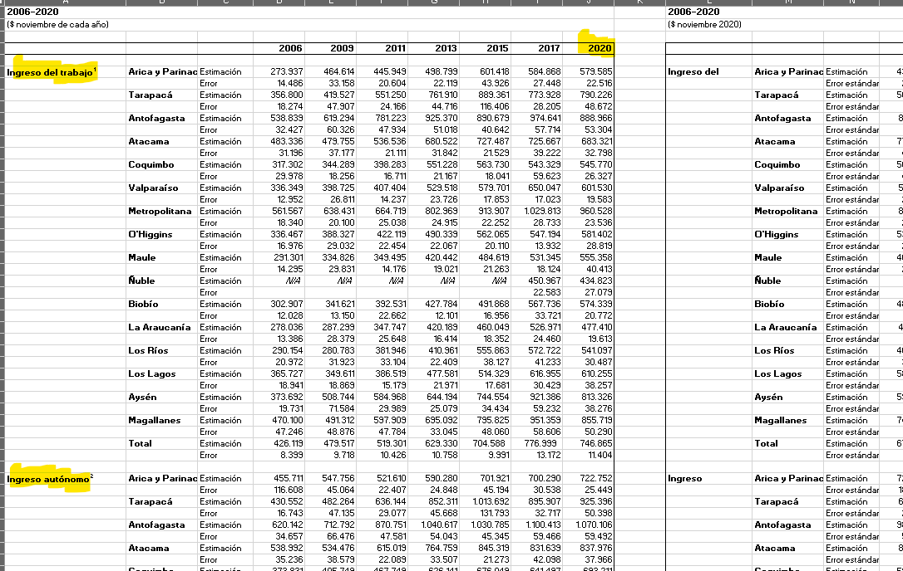

date: `r format(Sys.time(), "%d-%m-%Y")`
<style type="text/css">
.main-container {
  max-width: 1600px;
  margin-left: 100px;
  margin-right: auto;
}
</style>

```{r , message=FALSE, warning=FALSE, include = FALSE, eecho = FALSE}
#suppressWarnings(library(RODBC))
library(ggplot2)
library(ggpubr)
library(markdown)
library(shiny)
library(shinythemes)
library(tidyverse)
library(magrittr)
library(lubridate)
library(plotly)
library(xts)
library(dygraphs)
library(kableExtra)
library(knitr)
library("readxl")
library(rsconnect)
library(dplyr)
library(summarytools)
library(epiDisplay)
#library(leaflet)
library(haven)
library(epiDisplay)
library("readxl")
library(expss)
library(hrbrthemes)
library(viridis)
library(viridisLite)
library(DescTools)
library(roperators)
library(shinycssloaders)
library(writexl)
library(labelled)
library(tidyverse)
library(haven)
library(readr)
library(sjmisc)
library(WriteXLS)
library(ineq)
library(readstata13)
library(reldist)
library(foreign)
library(DT)

options(digits=2)
```

# Introducción


Cuando estimamos porcentualmente la variación del ingreso total personal entre el 2017 y el 2020 por comuna nos encontramos con una caída del -34,45294636 a nivel nacional, lo que no se condice con las estadísticas que obtuvimos a nivel de hogares [aquí](http://observatorio.ministeriodesarrollosocial.gob.cl/encuesta-casen-en-pandemia-2020): Ingreso promedio de los hogares por tipo de ingreso y región. Los últimos apenas varian  frente a la tremenda caida del -34% de ytotcor, pero como demostraremos, creemos que es problema de interpretación y no de método o base de datos corrupta, sino que del concepto de **Alquiler imputado** que suaviza muchísimo la pobreza por ingresos.

Casen se concentra en el analisis de los ingresos de los hogares, entonces el cálculo básico es el siguiente:

1 Se agrupan todos los hogares por núcleo familiar con una columna que indique su cantidad si queremos calcular los ingresos per cápita.

2 Hacemos un merge para traernos una variable de ingreso para el hogar (que es la suma de los ingresos de todos sus integrantes), por ejemplo ytrabajocorh (en general éstas terminan siempre con h).

3 Calculamos los promedios por región.

Dividimos el informe en tres:

1. Para el 2020 comparamos nuestros cálculos con los publicados.

2. Generalizamos para los cuatro ingresos fundamentales entre 2009 y 2020, agregando la variación porcentual entre años contiguos para nuestros ingresos calculados y agregando una gráfica que compara para todos los años disponibles los calculados y los publicados. Adjuntamos la tabla completa descargable.

3. Problema. 

Cuando llegamos al análisis de los ingresos por persona por comuna 2017-2020 nos encontramos con una caída enorme, que no parece justificada por las cifras oficiales. No hay error. Ésto es así. Lo que pasa es que en éste momento entra en juego el concepto de "Alquiler imputado". Una muy buena definición la entrega la fundación SOl:

Una persona de 75 años vive sola y, luego de haber pagado dividendos por más de 30 años, es dueña de su casa. El arriendo que se paga en el sector por una vivienda similar es de $300.000. Esta persona no recibe pensión básica y su pensión autofinanciada a través del sistema de AFP es de $100.000. Tampoco recibe aporte previsional solidario. Dicho de otro modo: es una persona mayor que vive en su casa y cuyo único ingreso es de $100.000. Al momento de calcular el porcentaje de pobreza, sin embargo, esta persona obtiene un ingreso mensual de $400.000, correspondiente a la suma del alquiler imputado y su pensión autofinanciada y, como la línea de pobreza para el hogar de una persona es de $158.145, figurará estadísticamente como que no es pobre.>https://www.elmostrador.cl/noticias/opinion/columnas/2018/08/29/y-si-miramos-la-pobreza-de-mercado-las-trampas-del-famoso-alquiler-imputado/

4. Solucion

Informes de las Casen e información básica para Casen 2011 y anteriores:\

1 Informes de las Casen e información básica:\

http://observatorio.ministeriodesarrollosocial.gob.cl/encuesta-casen-2011

# El problema

Nos encontramos con inconsistencias en el cálculo de  ingresos, pero como demostraremos, creemos que es problema de interpretación y no de método o base de datos corrupta.

<br>

## Los ingresos

Recordemos los cuatro datos fundamentales de la generación de los ingresos:

 | | | | 
:-----:|:-----:|:-----:|:-----:|:-----:
 | **Tipo** |Ingreso total|Ingreso autónomo|Ingreso del trabajo|Ingreso de la ocupación principal
año| | |
2020|ytotcor|yautcor|ytrabajocor|yoprcor
2017|ytotcor|yautcor|ytrabajocor|yoprcor
2015|ytotcor|yautcor|ytrabajocor|yoprcor
2013|ytotcor|yautcor|ytrabajocor|yoprcor
2011|ytrabaj |yautaj |ytrabaj      |yopraj
2009|ytrabaj |yautaj |ytrabaj      |yopraj
2006|ytrabaj |yautaj |ytrabaj      |yopraj


## Metodología y fuentes de datos

Nuestra metodología fue la de encontrar publicaciones oficiales con datos calculados de la Casen y compararlos con cálculos propios.

En general la Casen no es analizada a  nivel de personas, sino que de hogares. 

La página de la Casen 2020 en pandemia analizada contiene  un excel con datos calculados. Son todos referidos a hogares. Uno se llama:

"Ingreso promedio de los hogares por tipo de ingreso y región", con lo que se tiene que hacer el siguiente cálculo, por ejemplo para la variable ytrabajocorh:

para cada hogar la Casen lleva asociado la variable ytrabajocorh que significa "Ingreso del trabajo del hogar corregido" que se repite para cada registro perteneciente a un hogar (folio). Se transforma la tabla y se hace un sólo registro con el ingreso familiar. Se promedian en una región. Si bien el cálculo es simple, nos da cierto nivel de complejidad que hará notar con mayor facilidad los errores:

# Verificación para el Censo 2020

Los ejercicios resultan con los $ a noviembre de cada año.

Nuestra mayor preocupación era que las cifras de ingresos del Censo 2020 coincidieran con nuestros cálculos, por lo que la primera base de datos que buscamos fue ella.

Para ello calculamos el ingreso promedio de los hogares por tipo de ingreso y región, 2006-2020, ($ noviembre de cada año de la siguiente base de datos:




<!-- ############################################################################################################################################################ -->

## Verificación de nuestros cálculos con datos oficiales del 2020

```{r, warning=FALSE, message=FALSE} 
# casen2020 <- readRDS("C:/Users/chris/OneDrive/Documentos/archivos_grandes/casen/casen_2020.rds")
# casen2020 <- mutate_if(casen2020, is.factor, as.character)
# casen2017 <- readRDS("C:/Users/chris/OneDrive/Documentos/archivos_grandes/casen/casen_2017_c2.rds")
# casen2017 <- mutate_if(casen2017, is.factor, as.character)
# casen2015 <- readRDS("C:/Users/chris/OneDrive/Documentos/archivos_grandes/casen/casen_2015_c2.rds")
# casen2015 <- mutate_if(casen2015, is.factor, as.character)
# casen2013 <- readRDS("C:/Users/chris/OneDrive/Documentos/archivos_grandes/casen/casen_2013_c2.rds")
# casen2013 <- mutate_if(casen2013, is.factor, as.character)
# casen2011 <- readRDS("C:/Users/chris/OneDrive/Documentos/archivos_grandes/casen/casen_2011_c2.rds")
# casen2011 <- mutate_if(casen2011, is.factor, as.character)
# casen2009 <- readRDS("C:/Users/chris/OneDrive/Documentos/archivos_grandes/casen/casen_2009_c.rds")
# casen2009 <- mutate_if(casen2009, is.factor, as.character)
# casen2006 <- readRDS("C:/Users/chris/OneDrive/Documentos/archivos_grandes/casen/casen_2006_c.rds")
# casen2006 <- mutate_if(casen2006, is.factor, as.character)
 

casen2006 <- readRDS("C:/Users/chris/OneDrive/Documentos/archivos_grandes/casen_2006_c.rds")
casen2006 <- mutate_if(casen2006, is.factor, as.character)
casen2009 <- readRDS("C:/Users/chris/OneDrive/Documentos/archivos_grandes/casen_2009_c.rds")
casen2009 <- mutate_if(casen2009, is.factor, as.character)
casen2011 <- readRDS("C:/Users/chris/OneDrive/Documentos/archivos_grandes/casen_2011_c.rds")
casen2011 <- mutate_if(casen2011, is.factor, as.character)
casen2013 <- readRDS("C:/Users/chris/OneDrive/Documentos/archivos_grandes/casen_2013_c.rds")
casen2013 <- mutate_if(casen2013, is.factor, as.character)
casen2015 <- readRDS("C:/Users/chris/OneDrive/Documentos/archivos_grandes/casen_2015_c.rds")
casen2015 <- mutate_if(casen2015, is.factor, as.character)
casen2017 <- readRDS("C:/Users/chris/OneDrive/Documentos/archivos_grandes/casen_2017_c.rds")
casen2017 <- mutate_if(casen2017, is.factor, as.character)
casen2020 <- readRDS("casen2020.rds")
casen2020 <- mutate_if(casen2020, is.factor, as.character)
codigos_comunales <- readRDS(file = "C:/Users/chris/OneDrive/Documentos/archivos_grandes/codigos_comunales_2011-2017.rds")


region_20 <- unique(casen2020$region)
# length(reg_20)
reg_17 <- unique(casen2017$region)
# length(reg_17)
reg_15 <- unique(casen2015$region)
# length(reg_15)
reg_13 <- unique(casen2013$region)
# length(reg_13)
reg_11 <- unique(casen2011$region)
# length(reg_11)
reg_09 <- unique(casen2009$REGION)
# length(reg_09)
reg_06 <- unique(casen2006$R)
# length(reg_06)
```


```{r}
unique(casen2020$region)
```


```{r}
  reg_tara_personas <- filter(casen2020, casen2020$region == "Región de Tarapacá")
   reg_tara_personas <- reg_tara_personas[,c("region","folio","ytrabajocorh", "ytrabajocor")]
  reg_tara_personas
```


```{r}
write_xlsx( reg_tara_personas," reg_tara_personas.xlsx")
```


```{r}
tabla_prom_reg <- data.frame()


  casen_fh <- filter(casen2020, casen2020$region == "Región de Tarapacá")
  
  casen_fh <- casen_fh[,c("region","folio","ytrabajocorh")]
  casen_fh$folio <- as.character(casen_fh$folio)
  
  # construimos la tabla de frecuencias para familias
  tabla <- table(casen_fh$folio)
  tabla <- as.data.frame(tabla)
  colnames(tabla) <- c("folio","freq_folio")

  # unimos frecuencias con ingresos
  repetidos2 <- merge(x=casen_fh, y=tabla, by = "folio", all.x = T)
  repetidos2 <- repetidos2[,c(2,1,4,3)]
   reg_tara_hogares <- repetidos2[!duplicated(repetidos2$folio ), ]

  # determ,inamos el promedio
  # tabla_reg <- data.frame(
  # region = "Región de Tarapacá",
  # promedio = mean(rr$ytrabajocorh)
#)
# tabla_prom_reg <- rbind(tabla_prom_reg, tabla_reg)

 reg_tara_hogares

```


```{r}
write_xlsx( reg_tara_hogares," reg_tara_hogares.xlsx")
```

```{r}

# tabla_2017 <- casen2017
# tabla_2017$region[tabla_2017$region == "Región de Ayséndel Gral. Carlos Ibáñez del Campo"] <- "Región de Aysén del Gral. Carlos Ibáñez del Campo"
# tabla_2017$region[tabla_2017$region == "Región del Libertador Gral. Bernardo O’Higgins"] <- "Región del Libertador Gral. Bernardo O'Higgins"
# saveRDS(tabla_2017,"C:/Users/chris/OneDrive/Documentos/archivos_grandes/casen/casen_2017_c2.rds")
# 
# tabla_2015 <- casen2015
# tabla_2015$region[tabla_2015$region == "Región del Libertador Gral. Bernardo O Higgins"] <- "Región del Libertador Gral. Bernardo O'Higgins"
# saveRDS(tabla_2015,"C:/Users/chris/OneDrive/Documentos/archivos_grandes/casen/casen_2015_c2.rds")
# 
# tabla_2013 <- casen2013
# tabla_2013$region[tabla_2013$region == "I. Tarapaca"] <- "Región de Tarapacá"
# tabla_2013$region[tabla_2013$region == "II. Antofagasta"] <- "Región de Antofagasta"
# tabla_2013$region[tabla_2013$region == "III. Atacama"] <- "Región de Atacama"
# tabla_2013$region[tabla_2013$region == "IV. Coquimbo"] <- "Región de Coquimbo"
# tabla_2013$region[tabla_2013$region == "IX. La Araucanía"] <- "Región de La Araucanía"
# tabla_2013$region[tabla_2013$region == "Metropolitana"] <- "Región Metropolitana de Santiago"
# tabla_2013$region[tabla_2013$region == "V. Valparaíso"] <- "Región de Valparaíso"
# tabla_2013$region[tabla_2013$region == "VI. O Higgins"] <- "Región del Libertador Gral. Bernardo O'Higgins"
# tabla_2013$region[tabla_2013$region == "VII. Maule"] <- "Región del Maule"
# tabla_2013$region[tabla_2013$region == "VIII. Biobío"] <- "Región del Biobío"
# tabla_2013$region[tabla_2013$region == "X. Los Lagos"] <- "Región de Los Lagos"
# tabla_2013$region[tabla_2013$region == "XI. Aysén"] <- "Región de Aysén del Gral. Carlos Ibáñez del Campo"
# tabla_2013$region[tabla_2013$region == "XII. Magallanes"] <- "Región de Magallanes y de la Antártica Chilena"
# tabla_2013$region[tabla_2013$region == "XIV. Los Ríos"] <- "Región de Los Ríos"
# tabla_2013$region[tabla_2013$region == "XV. Arica y Parinacota"] <- "Región de Arica y Parinacota"
# saveRDS(tabla_2013,"C:/Users/chris/OneDrive/Documentos/archivos_grandes/casen/casen_2013_c2.rds")
# 
# tabla_2011 <- casen2011
# tabla_2011$region[tabla_2011$region == "Antofagasta"] <- "Región de Antofagasta"
# tabla_2011$region[tabla_2011$region == "Araucanía"] <- "Región de La Araucanía"
# tabla_2011$region[tabla_2011$region == "Arica y Parinacota"] <- "Región de Arica y Parinacota"
# tabla_2011$region[tabla_2011$region == "Aysén"] <- "Región de Aysén del Gral. Carlos Ibáñez del Campo"
# tabla_2011$region[tabla_2011$region == "Bio Bio"] <- "Región del Biobío"
# tabla_2011$region[tabla_2011$region == "Copiapó"] <- "Región de Atacama"
# tabla_2011$region[tabla_2011$region == "Coquimbo"] <- "Región de Coquimbo"
# tabla_2011$region[tabla_2011$region == "Los Lagos"] <- "Región de Los Lagos"
# tabla_2011$region[tabla_2011$region == "Los Ríos"] <- "Región de Los Ríos"
# tabla_2011$region[tabla_2011$region == "Magallanes"] <- "Región de Magallanes y de la Antártica Chilena"
# tabla_2011$region[tabla_2011$region == "Maule"] <- "Región del Maule"
# tabla_2011$region[tabla_2011$region == "Metropolitana"] <- "Región Metropolitana de Santiago"
# tabla_2011$region[tabla_2011$region == "O Higgins"] <- "Región del Libertador Gral. Bernardo O'Higgins"
# tabla_2011$region[tabla_2011$region == "Tarapacá"] <- "Región de Tarapacá"
# tabla_2011$region[tabla_2011$region == "Valparaíso"] <- "Región de Valparaíso"
# saveRDS(tabla_2011,"C:/Users/chris/OneDrive/Documentos/archivos_grandes/casen/casen_2011_c2.rds")

```

# HOGARES

Ingreso del trabajo corregido de los Hogares por Región 2020 Tarapacá

```{r}
casen2020$ytrabajocor
```


```{r} 
tabla_prom_reg <- data.frame()

for (i in region_20) {
  casen_fh <- filter(casen2020, casen2020$region == i)
  
  casen_fh <- casen_fh[,c("region","folio","ytrabajocorh")]
  casen_fh$folio <- as.character(casen_fh$folio)
  
  # construimos la tabla de frecuencias para familias
  tabla <- table(casen_fh$folio)
  tabla <- as.data.frame(tabla)
  colnames(tabla) <- c("folio","freq_folio")

  # unimos frecuencias con ingresos
  repetidos2 <- merge(x=casen_fh, y=tabla, by = "folio", all.x = T)
  repetidos2 <- repetidos2[,c(2,1,4,3)]
  rr <- repetidos2[!duplicated(repetidos2$folio ), ]

  # determ,inamos el promedio
  tabla_reg <- data.frame(
  region = i,
  promedio = mean(rr$ytrabajocorh)
)
tabla_prom_reg <- rbind(tabla_prom_reg, tabla_reg)
}
```


```{r} 
tabla_ing_aut <- read_xlsx("ingreso_del_trabajo_oficial_2020.xlsx")
names(tabla_ing_aut)[3] <- "region"
names(tabla_ing_aut)[1] <- "region_c"

tabla_unida = merge(x = tabla_prom_reg, y = tabla_ing_aut, by = "region", all.x = T)
tabla_unida <- tabla_unida[,-c(3)]

names(tabla_unida)[3] <- "ytrabajocorh oficial"

kbl(tabla_unida) %>%
  kable_styling(bootstrap_options = c("striped", "hover")) %>%
  kable_paper() %>%
  scroll_box(width = "100%", height = "300px")
```

# PERSONAS

```{r} 
library(GLDEX)
tabla_prom_reg <- data.frame()

for (i in region_20) {
  casen_fh <- filter(casen2020, casen2020$region == i)
  
  casen_fh <- casen_fh[,c("region","ytrabajocor")]
  
  casen_fh <- na.omit(casen_fh)

  
  
  # Determinamos el promedio regional sobre las personas:
  tabla_reg <- data.frame(
  region = i,
  promedio = mean(casen_fh$ytrabajocor)
  )
  tabla_prom_reg <- rbind(tabla_prom_reg, tabla_reg)
}
tabla_prom_reg

```


```{r, warning = FALSE, message=FALSE}
# p <- plot_ly(tabla_unida, width = 1200, x = ~
# region, y = ~promedio) %>%
#   add_lines() 
# p <- p %>% add_trace(y = ~`Ingreso del trabajo`, name = 'ingreso del trabajo oficial', mode = 'markers')
# p 
```


Debemos comparar con los ingresos de las personas:


