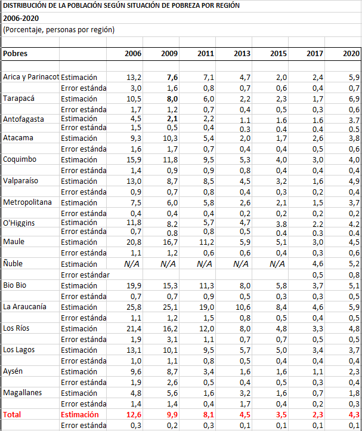

---

title: Análisis propios, comparados con los oficiales, tanto de los ingresos como de la pobreza en la<span style="color:green"> Encuesta Casen (2006-2020) </span>

author:
- name: VE-CC-AJ
  affiliation: DataIntelligence
subtitle: | 
  por comunas y regiones
header-includes:
   - \usepackage[]{babel}
output:
  rmdformats::html_clean:
    highlight: kate
    toc: true
    use_bookdown: true
    code_folding: "hide"    
---

Fecha: `r format(Sys.time(), "%d-%m-%Y")`
<style type="text/css">
.main-container {
  max-width: 1600px;
  margin-left: 100px;
  margin-right: auto;
}
</style>


```{r , message=FALSE, warning=FALSE, include = FALSE, eecho = FALSE}
#suppressWarnings(library(RODBC))
library(ggplot2)
library(ggpubr)
library(markdown)
library(shiny)
library(shinythemes)
library(tidyverse)
library(magrittr)
library(lubridate)
library(plotly)
library(xts)
library(dygraphs)
library(kableExtra)
library(knitr)
library("readxl")
library(rsconnect)
library(dplyr)
library(summarytools)
library(epiDisplay)
#library(leaflet)
library(haven)
library(epiDisplay)
library("readxl")
library(expss)
library(hrbrthemes)
library(viridis)
library(viridisLite)
library(DescTools)
library(roperators)
library(shinycssloaders)
library(writexl)
library(labelled)
library(tidyverse)
library(haven)
library(readr)
library(sjmisc)
library(WriteXLS)
library(ineq)
library(readstata13)
library(reldist)
library(foreign)
library(DT)
```

# Introducción


Una diferencia fundamental que hace la Casen es la división de los ingresos en presonales e individuales.

Necesitamos comparar los datos que calculamos por cuenta propia de los **Ingresos** con lo ya publicado para identificar los posibles errores en nuestras estimaciones.


[En un trabajo anterior](https://rpubs.com/dataintelligence/construccion_del_ingreso_en_la_casen), determinamos los ingresos fundamentales a partir de los cuales se puede deducir toda la estructura de ingresos de la Casen. Éstos son:

1. Ingresos totales\
2. Ingresos autónomos\
3. Ingresos del trabajo, e\
4. Ingresos de la ocupación principal.


Los análisis oficiales que entrega Casen y que son descargables de [aquí](http://observatorio.ministeriodesarrollosocial.gob.cl/encuesta-casen-en-pandemia-2020) para el 2020 y de [aquí](http://observatorio.ministeriodesarrollosocial.gob.cl/encuesta-casen-2011) del 2011 hasta 1990, entregan estad[isticas muy útiles sobres las cuales comparar.

Nos concentraremos en una primera parte en los ingresos que trae calculado por hogares la Casen del 2020 en pandemia y compararemos con los obtenidos por nosotros. Concluiremos que son prácticamente los mismos.


Cuando estimamos porcentualmente la variación del ingreso total personal entre el 2017 y el 2020 por comuna nos encontramos con una caída del -34,453 a nivel nacional, lo que no se condice con las estadísticas que obtuvimos a nivel de hogares [descargar aquí](http://observatorio.ministeriodesarrollosocial.gob.cl/encuesta-casen-en-pandemia-2020). Ingreso promedio de los hogares por tipo de ingreso y región. Los últimos apenas varian  frente a la tremenda caida del -34% de ytotcor, pero como demostraremos, creemos que es problema de interpretación y no de método o base de datos corrupta, sino que del concepto de **Alquiler imputado** que suaviza la pobreza por ingresos.


```{r}
casen2006 <- readRDS("C:/Users/chris/OneDrive/Documentos/archivos_grandes/casen_2006_c.rds")
casen2006 <- mutate_if(casen2006, is.factor, as.character)
casen2009 <- readRDS("C:/Users/chris/OneDrive/Documentos/archivos_grandes/casen_2009_c.rds")
casen2009 <- mutate_if(casen2009, is.factor, as.character)
casen2011 <- readRDS("C:/Users/chris/OneDrive/Documentos/archivos_grandes/casen_2011_c.rds")
casen2011 <- mutate_if(casen2011, is.factor, as.character)
casen2013 <- readRDS("C:/Users/chris/OneDrive/Documentos/archivos_grandes/casen_2013_c.rds")
casen2013 <- mutate_if(casen2013, is.factor, as.character)
casen2015 <- readRDS("C:/Users/chris/OneDrive/Documentos/archivos_grandes/casen_2015_c.rds")
casen2015 <- mutate_if(casen2015, is.factor, as.character)
casen2017 <- readRDS("C:/Users/chris/OneDrive/Documentos/archivos_grandes/casen_2017_c.rds")
casen2017 <- mutate_if(casen2017, is.factor, as.character)
#casen2020 <- read.spss(file="C:/Users/chris/OneDrive/Documentos/archivos_grandes/casen_2020.sav", to.data.frame=TRUE)
#saveRDS(casen2020,"casen2020.rds")
casen2020 <- readRDS("casen2020.rds")
casen2020 <- mutate_if(casen2020, is.factor, as.character)
codigos_comunales <- readRDS(file = "C:/Users/chris/OneDrive/Documentos/archivos_grandes/codigos_comunales_2011-2017.rds")
```


<br>

# Pobreza por ingresos
 
Desde 1990 Casen publica información sobre el porcentaje de pobreza de los chilenos, generalmente divididos en tres categorias: no pobres, pobres y pobres extremos. A continuación se muestran 2 porcentajes diferentes de pobreza y pobreza extrema:
 


## Pobreza 1


[(ver informe completo acá)](http://observatorio.ministeriodesarrollosocial.gob.cl/storage/docs/casen/2020/Resumen_de_resultados_de_Pobreza_por_Ingresos_y_Distribucion_de_Ingresos.pdf) 

Que coincide con otro informe:

## Pobreza 2



[(ver informe completo acá)](http://observatorio.ministeriodesarrollosocial.gob.cl/encuesta-casen-en-pandemia-2020)

## Pobreza 3


[(ver informe completo acá)](http://observatorio.ministeriodesarrollosocial.gob.cl/storage/docs/casen/2006/Resultados_Pobreza_Casen_2006.pdf) 


Entonces existen dos publicaciones oficiales de resultados de la medicion de la pobreza de la Casen: los del año y los actualizados.

Podemos demostrar que nuestros cálculos coinciden perfecto con los entregados del año 2006:

<!-- Pobreza por Ingreso Casen en Pandemia  -->
<!-- hoja 8 de Copia de Pobreza_por_Ingreso_Casen_en_Pandemia_2020-1 -->

A continuación vamos a construir y verificar que nuestros cálculos coincidan con los oficiales no corregidos.

```{r}
unique(casen2006$R)
casen2006 <- readRDS("C:/Users/enamo/Desktop/Shiny-R/Casen_en_pandemia_2020/casen/casen_2006_c.rds")
unique(casen2006$CORTE)
tabla_matp <-xtabs(casen2006$EXPR~R+CORTE, data = casen2006)
indigente <- tabla_matp[,1]
pobre_no_ind <- tabla_matp[,2]
no_pobre <- tabla_matp[,3]
total <- tabla_matp[,1] + tabla_matp[,2] + tabla_matp[,3]
indigente_por <- indigente*100/total
indigente_por
```
```{r}
tabla_matp <-xtabs(casen2006$EXPR~COMUNA+CORTE, data = casen2006)
head(tabla_matp,20)
```


```{r}
# totalisimo <- data.frame()
# 
# 
# indigente <- tabla_matp[,1]
# pobre_no_ind <- tabla_matp[,2]
# no_pobre <- tabla_matp[,3]
# total <- indigente+ pobre_no_ind + no_pobre 
# 
# indigente_por <- indigente*100/total
# indigente_por  <- as.data.frame(indigente_por)
# #indigente_por 
# 
# pobre_no_ind_por <- pobre_no_ind*100/total
# pobre_no_ind_por  <- as.data.frame(pobre_no_ind_por)
# #pobre_no_ind_por 
# 
# no_pobre_por <- no_pobre*100/total
# no_pobre_por  <- as.data.frame(no_pobre_por)
# #no_pobre_por
# 
# totalisimo <- rbind(totalisimo,indigente_por)
# totalisimo2 <- rbind(totalisimo,pobre_no_ind_por)
# totalisimo3 <- rbind(totalisimo2,no_pobre_por)


# datatable(tabla_matp, extensions = 'Buttons', escape = FALSE, rownames = FALSE,
#           options = list(dom = 'Bfrtip',
#           buttons = list('colvis', list(extend = 'collection',
#           buttons = list(
#           list(extend='copy'),
#           list(extend='excel',
#             filename = 'hitStats'),
#           list(extend='pdf',
#             filename= 'hitStats')),
#           text = 'Download')), scrollX = TRUE))

```


# Expansión comunal de la pobreza.

Caso ejemplo: 2006, Antofagasta. Region II.	Estimación pobres extremos	23.593  según la nueva metodologia, sin embargo nosotros contamos 10716.

## Pobreza 1


```{r}
# casen2006 <- readRDS("C:/Users/chris/OneDrive/Documentos/archivos_grandes/casen_2006_c.rds")
casen2006 <- readRDS("C:/Users/enamo/Desktop/Shiny-R/Casen_en_pandemia_2020/casen/casen_2006_c.rds")
casen2006 <- mutate_if(casen2006, is.factor, as.character)
# tabla_matp <-xtabs(casen2006$EXPC~COMUNA+R+CORTE, data = casen2006)
# head(tabla_matp,20)
region_2 <- filter(casen2006, casen2006$R == "II")
# region_2
```

```{r}
tabla_matp <-xtabs(region_2$EXPC~COMUNA+CORTE, data = region_2)
head(tabla_matp,20)
tabla_matp <- as.data.frame(tabla_matp)
```

Consideremos sólo los pobres extremos:

```{r}
frec_man_com_parcial_total <- filter(tabla_matp, tabla_matp$CORTE == "Indigente")
frec_man_com_parcial_total
codigos_com <- frec_man_com_parcial_total$COMUNA
#codigos_com
```
```{r}
sum(frec_man_com_parcial_total$Freq)
```

Expandiremos las frecuencias de pobres ty pobres extremos para que lleguen al nivel oficial de la nueva metodología y lo haremos por comuna.

```{r} 
frec_man_com_parcial_total2 <- data.frame()
for(i in codigos_com){
  frec_man_com_parcial <- filter(frec_man_com_parcial_total, frec_man_com_parcial_total$COMUNA == i)
  frec_man_com_parcial$p <- frec_man_com_parcial$Freq*100/sum(frec_man_com_parcial_total$Freq)/100
  frec_man_com_parcial_total2 <- rbind(frec_man_com_parcial_total2,frec_man_com_parcial)
}
 
```

<!-- ######################################################################################################################### 2006 -->


```{r}
pobreza <- read_xlsx("valores de pobreza actuales.xlsx", sheet = 9 )
regiones_pub <- pobreza[1:16,c(1,2,9)]
regiones_pub2 <- pobreza[19:34,c(1,2,9)]
regiones_pub$c2006 <- as.numeric(regiones_pub$c2006)
regiones_pub2$c2006 <- as.numeric(regiones_pub2$c2006)
 
cat <- unique(casen2006$CORTE)
```

```{r}
prop_cor <- data.frame()
for (cat in unique(casen2006$CORTE)[2]) {
  
proporcion <- data.frame()
fn_prp_pob <- function(n){
  
region_2 <- filter(casen2006, casen2006$R == n)

tabla_matp <-xtabs(region_2$EXPC~COMUNA+CORTE, data = region_2)
tabla_matp <- as.data.frame(tabla_matp)
tabla_matp2 <<- tabla_matp
frec_man_com_parcial_total <- filter(tabla_matp, tabla_matp$CORTE == cat)
codigos_com <- frec_man_com_parcial_total$COMUNA

frec_man_com_parcial_total2 <- data.frame()
for(i in codigos_com){
  frec_man_com_parcial <- filter(frec_man_com_parcial_total, frec_man_com_parcial_total$COMUNA == i)
  frec_man_com_parcial$p <- frec_man_com_parcial$Freq*100/sum(frec_man_com_parcial_total$Freq)/100
  frec_man_com_parcial_total2 <- rbind(frec_man_com_parcial_total2,frec_man_com_parcial) 
}
proporcion2 <<- frec_man_com_parcial_total2
} 
for (n in unique(casen2006$R)) {
 
  fn_prp_pob(n)
  proporcion2$ROMANOS <- n 
  proporcion <- rbind(proporcion,proporcion2)
}


proporcion <- proporcion[,c(5,1,2,3,4)]
prop_cor <- rbind(prop_cor,proporcion)
}
 
prop_cor = merge(x = prop_cor, y = regiones_pub, by="ROMANOS")

 
prop_cor$p_mul <- round(prop_cor$p * prop_cor$c2006)
names(prop_cor)[1] <- "region_r" 

pob_calculado <- data.frame()
for (i in unique(prop_cor$region)) {  
  tabla <- filter(prop_cor, prop_cor$region == i )
  tabla <- filter(tabla, tabla$CORTE == "Indigente" )
  
  tabla2 <- data.frame(
    region = i,
    calculado = sum(tabla$p_mul)
  ) 
   pob_calculado <- rbind(pob_calculado, tabla2)
}
a1 <- pob_calculado
```
 
 <!-- ########################### -->
 
```{r}
prop_cor <- data.frame()
for (cat in unique(casen2006$CORTE)[3]) {
  
proporcion <- data.frame()
fn_prp_pob <- function(n){
  
region_2 <- filter(casen2006, casen2006$R == n)

tabla_matp <-xtabs(region_2$EXPC~COMUNA+CORTE, data = region_2)
tabla_matp <- as.data.frame(tabla_matp)
tabla_matp2 <<- tabla_matp
frec_man_com_parcial_total <- filter(tabla_matp, tabla_matp$CORTE == cat)
codigos_com <- frec_man_com_parcial_total$COMUNA

frec_man_com_parcial_total2 <- data.frame()
for(i in codigos_com){
  frec_man_com_parcial <- filter(frec_man_com_parcial_total, frec_man_com_parcial_total$COMUNA == i)
  frec_man_com_parcial$p <- frec_man_com_parcial$Freq*100/sum(frec_man_com_parcial_total$Freq)/100
  frec_man_com_parcial_total2 <- rbind(frec_man_com_parcial_total2,frec_man_com_parcial) 
}
proporcion2 <<- frec_man_com_parcial_total2
} 
for (n in unique(casen2006$R)) {
 
  fn_prp_pob(n)
  proporcion2$ROMANOS <- n 
  proporcion <- rbind(proporcion,proporcion2)
}


proporcion <- proporcion[,c(5,1,2,3,4)]
prop_cor <- rbind(prop_cor,proporcion)
}
 
prop_cor = merge(x = prop_cor, y = regiones_pub2, by="ROMANOS")

 
prop_cor$p_mul <- round(prop_cor$p * prop_cor$c2006)
names(prop_cor)[1] <- "region_r" 

pob_calculado <- data.frame()
for (i in unique(prop_cor$region)) {  
  tabla <- filter(prop_cor, prop_cor$region == i )
  tabla <- filter(tabla, tabla$CORTE == "Pobre no indigente" )
  
  tabla2 <- data.frame(
    region = i,
    calculado = sum(tabla$p_mul)
  ) 
   pob_calculado <- rbind(pob_calculado, tabla2)
}
a2 <- pob_calculado
```

 
<!-- ######################################################################################################################### 2009 --> 

```{r}
pobreza <- read_xlsx("valores de pobreza actuales.xlsx", sheet = 9 )
regiones_pub <- pobreza[1:16,c(1,3,10)]
regiones_pub$c2009 <- as.numeric(regiones_pub$c2009)
regiones_pub2 <- pobreza[19:34,c(1,3,10)]
regiones_pub2$c2009 <- as.numeric(regiones_pub2$c2009)
 
cat <- unique(casen2009$CORTE)
 
```

```{r}
prop_cor <- data.frame()
for (cat in unique(casen2009$CORTE)[3]) {
  
proporcion <- data.frame()
fn_prp_pob <- function(n){
  
region_2 <- filter(casen2009, casen2009$REGION == n)

tabla_matp <-xtabs(region_2$EXPC~COMUNA+CORTE, data = region_2)
tabla_matp <- as.data.frame(tabla_matp) 
frec_man_com_parcial_total <- filter(tabla_matp, tabla_matp$CORTE == cat)
codigos_com <- frec_man_com_parcial_total$COMUNA

frec_man_com_parcial_total2 <- data.frame()
for(i in codigos_com){
  frec_man_com_parcial <- filter(frec_man_com_parcial_total, frec_man_com_parcial_total$COMUNA == i)
  frec_man_com_parcial$p <- frec_man_com_parcial$Freq*100/sum(frec_man_com_parcial_total$Freq)/100
  frec_man_com_parcial_total2 <- rbind(frec_man_com_parcial_total2,frec_man_com_parcial) 
}
proporcion2 <<- frec_man_com_parcial_total2
} 
for (n in unique(casen2009$REGION)) {
 
  fn_prp_pob(n)
  proporcion2$region_09 <- n 
  proporcion <- rbind(proporcion,proporcion2)
}


proporcion <- proporcion[,c(5,1,2,3,4)]
prop_cor <- rbind(prop_cor,proporcion)
}
 
prop_cor = merge(x = prop_cor, y = regiones_pub, by="region_09")
 
prop_cor$p_mul <- round(prop_cor$p * prop_cor$c2009)
names(prop_cor)[1] <- "region_r" 

pob_calculado <- data.frame()
for (i in unique(prop_cor$region)) {  
  tabla <- filter(prop_cor, prop_cor$region == i )
  tabla <- filter(tabla, tabla$CORTE == "Indigente" )
  
  tabla2 <- data.frame(
    region = i,
    calculado = sum(tabla$p_mul)
  ) 
   pob_calculado <- rbind(pob_calculado, tabla2)
}
a3 <- pob_calculado
```

<!-- ############################# -->

```{r}
prop_cor <- data.frame()
for (cat in unique(casen2009$CORTE)[1]) {
  
proporcion <- data.frame()
fn_prp_pob <- function(n){
  
region_2 <- filter(casen2009, casen2009$REGION == n)

tabla_matp <-xtabs(region_2$EXPC~COMUNA+CORTE, data = region_2)
tabla_matp <- as.data.frame(tabla_matp) 
frec_man_com_parcial_total <- filter(tabla_matp, tabla_matp$CORTE == cat)
codigos_com <- frec_man_com_parcial_total$COMUNA

frec_man_com_parcial_total2 <- data.frame()
for(i in codigos_com){
  frec_man_com_parcial <- filter(frec_man_com_parcial_total, frec_man_com_parcial_total$COMUNA == i)
  frec_man_com_parcial$p <- frec_man_com_parcial$Freq*100/sum(frec_man_com_parcial_total$Freq)/100
  frec_man_com_parcial_total2 <- rbind(frec_man_com_parcial_total2,frec_man_com_parcial) 
}
proporcion2 <<- frec_man_com_parcial_total2
} 
for (n in unique(casen2009$REGION)) {
 
  fn_prp_pob(n)
  proporcion2$region_09 <- n 
  proporcion <- rbind(proporcion,proporcion2)
}


proporcion <- proporcion[,c(5,1,2,3,4)]
prop_cor <- rbind(prop_cor,proporcion)
}
 
prop_cor = merge(x = prop_cor, y = regiones_pub2, by="region_09")
 
prop_cor$p_mul <- round(prop_cor$p * prop_cor$c2009)
names(prop_cor)[1] <- "region_r" 

pob_calculado <- data.frame()
for (i in unique(prop_cor$region)) {  
  tabla <- filter(prop_cor, prop_cor$region == i )
  tabla <- filter(tabla, tabla$CORTE == "Pobre no Indigente" )
  
  tabla2 <- data.frame(
    region = i,
    calculado = sum(tabla$p_mul)
  ) 
   pob_calculado <- rbind(pob_calculado, tabla2)
}
a4 <- pob_calculado
```


<!-- ######################################################################################################################### 2011 --> 


```{r}
pobreza <- read_xlsx("valores de pobreza actuales.xlsx", sheet = 9 )
regiones_pub <- pobreza[1:16,c(1,4)]
regiones_pub$c2011 <- as.numeric(regiones_pub$c2011)
regiones_pub2 <- pobreza[19:32,c(1,4)]
regiones_pub2$c2011 <- as.numeric(regiones_pub2$c2011)

cat <- unique(casen2011$corte)
 
```
 
## Pobreza 1 


```{r}
prop_cor <- data.frame()
for (cat in unique(casen2011$corte)[3]) {
  
proporcion <- data.frame()
fn_prp_pob <- function(n){
  
region_2 <- filter(casen2011, casen2011$region == n)

tabla_matp <-xtabs(region_2$expc_full~comuna+corte, data = region_2)
tabla_matp <- as.data.frame(tabla_matp) 
frec_man_com_parcial_total <- filter(tabla_matp, tabla_matp$corte == cat)
codigos_com <- frec_man_com_parcial_total$comuna

frec_man_com_parcial_total2 <- data.frame()
for(i in codigos_com){
  frec_man_com_parcial <- filter(frec_man_com_parcial_total, frec_man_com_parcial_total$comuna == i)
  frec_man_com_parcial$p <- frec_man_com_parcial$Freq*100/sum(frec_man_com_parcial_total$Freq)/100
  frec_man_com_parcial_total2 <- rbind(frec_man_com_parcial_total2,frec_man_com_parcial) 
}
proporcion2 <<- frec_man_com_parcial_total2
} 
for (n in unique(casen2011$region)) {
 
  fn_prp_pob(n)
  proporcion2$region <- n 
  proporcion <- rbind(proporcion,proporcion2)
}


proporcion <- proporcion[,c(5,1,2,3,4)]
prop_cor <- rbind(prop_cor,proporcion)
}

prop_cor = merge(x = prop_cor, y = regiones_pub, by="region")
 
prop_cor$p_mul <- round(prop_cor$p * prop_cor$c2011)
names(prop_cor)[1] <- "region_r" 

pob_calculado <- data.frame()
for (i in unique(prop_cor$region)) {  
  tabla <- filter(prop_cor, prop_cor$region == i )
  tabla <- filter(tabla, tabla$corte == "Pobreza extrema" )
  
  tabla2 <- data.frame(
    region = i,
    calculado = sum(tabla$p_mul)
  ) 
   pob_calculado <- rbind(pob_calculado, tabla2)
}
a5 <- pob_calculado
```

<!-- ########################## -->


```{r}
prop_cor <- data.frame()
for (cat in unique(casen2011$corte)[2]) {
  
proporcion <- data.frame()
fn_prp_pob <- function(n){
  
region_2 <- filter(casen2011, casen2011$region == n)

tabla_matp <-xtabs(region_2$expc_full~comuna+corte, data = region_2)
tabla_matp <- as.data.frame(tabla_matp) 
frec_man_com_parcial_total <- filter(tabla_matp, tabla_matp$corte == cat)
codigos_com <- frec_man_com_parcial_total$comuna

frec_man_com_parcial_total2 <- data.frame()
for(i in codigos_com){
  frec_man_com_parcial <- filter(frec_man_com_parcial_total, frec_man_com_parcial_total$comuna == i)
  frec_man_com_parcial$p <- frec_man_com_parcial$Freq*100/sum(frec_man_com_parcial_total$Freq)/100
  frec_man_com_parcial_total2 <- rbind(frec_man_com_parcial_total2,frec_man_com_parcial) 
}
proporcion2 <<- frec_man_com_parcial_total2
} 
for (n in unique(casen2011$region)) {
 
  fn_prp_pob(n)
  proporcion2$region <- n 
  proporcion <- rbind(proporcion,proporcion2)
}

 
proporcion <- proporcion[,c(5,1,2,3,4)]
prop_cor <- rbind(prop_cor,proporcion)
}


prop_cor = merge(x = prop_cor, y = regiones_pub2, by="region")
 
prop_cor$p_mul <- round(prop_cor$p * prop_cor$c2011)
names(prop_cor)[1] <- "region_r" 

pob_calculado <- data.frame()
for (i in unique(prop_cor$region)) {  
  tabla <- filter(prop_cor, prop_cor$region == i )
  tabla <- filter(tabla, tabla$corte == "Pobre" )
  
  tabla2 <- data.frame(
    region = i,
    calculado = sum(tabla$p_mul)
  ) 
   pob_calculado <- rbind(pob_calculado, tabla2)
}
a6 <- pob_calculado
```

<!-- ######################################################################################################################### 2013  --> 


```{r} 
pobreza <- read_xlsx("valores de pobreza actuales.xlsx", sheet = 9 )
regiones_pub <- pobreza[1:16,c(1,5)]
regiones_pub$c2013 <- as.numeric(regiones_pub$c2013)
regiones_pub2 <- pobreza[19:34,c(1,5)]
regiones_pub2$c2013 <- as.numeric(regiones_pub2$c2013)
cat <- unique(casen2013$pobreza_MN)

```

```{r}
prop_cor <- data.frame()
for (cat in unique(casen2013$pobreza_MN)[4]) {
  
proporcion <- data.frame()
fn_prp_pob <- function(n){
  
region_2 <- filter(casen2013, casen2013$region == n)

tabla_matp <-xtabs(region_2$expc~comuna+pobreza_MN, data = region_2)
tabla_matp <- as.data.frame(tabla_matp) 
frec_man_com_parcial_total <- filter(tabla_matp, tabla_matp$pobreza_MN == cat)
codigos_com <- frec_man_com_parcial_total$comuna

frec_man_com_parcial_total2 <- data.frame()
for(i in codigos_com){
  frec_man_com_parcial <- filter(frec_man_com_parcial_total, frec_man_com_parcial_total$comuna == i)
  frec_man_com_parcial$p <- frec_man_com_parcial$Freq*100/sum(frec_man_com_parcial_total$Freq)/100
  frec_man_com_parcial_total2 <- rbind(frec_man_com_parcial_total2,frec_man_com_parcial) 
}
proporcion2 <<- frec_man_com_parcial_total2
} 
for (n in unique(casen2013$region)) {
 
  fn_prp_pob(n)
  proporcion2$region <- n 
  proporcion <- rbind(proporcion,proporcion2)
}

proporcion <- proporcion[,c(5,1,2,3,4)]
prop_cor <- rbind(prop_cor,proporcion)
}

prop_cor = merge(x = prop_cor, y = regiones_pub, by="region")
 
prop_cor$p_mul <- round(prop_cor$p * prop_cor$c2013)
names(prop_cor)[1] <- "region_r" 

pob_calculado <- data.frame()
for (i in unique(prop_cor$region)) {  
  tabla <- filter(prop_cor, prop_cor$region == i )
  tabla <- filter(tabla, tabla$pobreza_MN == "Pobres extremos" )
  
  tabla2 <- data.frame(
    region = i,
    calculado = sum(tabla$p_mul)
  ) 
   pob_calculado <- rbind(pob_calculado, tabla2)
}
a7 <- pob_calculado
```

```{r}
prop_cor <- data.frame()
for (cat in unique(casen2013$pobreza_MN)[2]) {
  
proporcion <- data.frame()
fn_prp_pob <- function(n){
  
region_2 <- filter(casen2013, casen2013$region == n)

tabla_matp <-xtabs(region_2$expc~comuna+pobreza_MN, data = region_2)
tabla_matp <- as.data.frame(tabla_matp) 
frec_man_com_parcial_total <- filter(tabla_matp, tabla_matp$pobreza_MN == cat)
codigos_com <- frec_man_com_parcial_total$comuna

frec_man_com_parcial_total2 <- data.frame()
for(i in codigos_com){
  frec_man_com_parcial <- filter(frec_man_com_parcial_total, frec_man_com_parcial_total$comuna == i)
  frec_man_com_parcial$p <- frec_man_com_parcial$Freq*100/sum(frec_man_com_parcial_total$Freq)/100
  frec_man_com_parcial_total2 <- rbind(frec_man_com_parcial_total2,frec_man_com_parcial) 
}
proporcion2 <<- frec_man_com_parcial_total2
} 
for (n in unique(casen2013$region)) {
 
  fn_prp_pob(n)
  proporcion2$region <- n 
  proporcion <- rbind(proporcion,proporcion2)
}


proporcion <- proporcion[,c(5,1,2,3,4)]
prop_cor <- rbind(prop_cor,proporcion)
}
 
prop_cor = merge(x = prop_cor, y = regiones_pub2, by="region")
 
prop_cor$p_mul <- round(prop_cor$p * prop_cor$c2013)
names(prop_cor)[1] <- "region_r" 

pob_calculado <- data.frame()
for (i in unique(prop_cor$region)) {  
  tabla <- filter(prop_cor, prop_cor$region == i )
  tabla <- filter(tabla, tabla$pobreza_MN == "Pobres no extremos" )
  
  tabla2 <- data.frame(
    region = i,
    calculado = sum(tabla$p_mul)
  ) 
   pob_calculado <- rbind(pob_calculado, tabla2)
}
a8 <- pob_calculado
```
```{r}
a1$año <- 2006
a3$año <- 2009
a5$año <- 2011
a7$año <- 2013
a2$año <- 2006
a4$año <- 2009
a6$año <- 2011
a8$año <- 2013
a1$tp <- "Pobres extremos"
a3$tp <- "Pobres extremos"
a5$tp <- "Pobres extremos"
a7$tp <- "Pobres extremos"
a2$tp <- "Pobres no extremos"
a4$tp <- "Pobres no extremos"
a6$tp <- "Pobres no extremos"
a8$tp <- "Pobres no extremos"
tabla_f1 <- rbind(a1,a3,a5,a7)
tabla_f2 <- rbind(a2,a4,a6,a8)
tabla_f3 <- rbind(tabla_f1,tabla_f2)
datatable(tabla_f3, extensions = 'Buttons', escape = FALSE, rownames = FALSE,
          options = list(dom = 'Bfrtip',
          buttons = list('colvis', list(extend = 'collection',
          buttons = list(
          list(extend='copy'),
          list(extend='excel',
            filename = 'hitStats'),
          list(extend='pdf',
            filename= 'hitStats')),
          text = 'Download')), scrollX = TRUE))
 
```


# Expansión comunal de la pobreza.

Caso ejemplo: 2006, Antofagasta. Region II.	Estimación pobres extremos	23.593  según la nueva metodologia, sin embargo nosotros contamos 10716.

## Pobreza 1


```{r}
casen2006 <- readRDS("C:/Users/chris/OneDrive/Documentos/archivos_grandes/casen_2006_c.rds")
casen2006 <- mutate_if(casen2006, is.factor, as.character)
# tabla_matp <-xtabs(casen2006$EXPC~COMUNA+R+CORTE, data = casen2006)
# head(tabla_matp,20)
region_2 <- filter(casen2006, casen2006$R == "II")
# region_2
```

```{r}
tabla_matp <-xtabs(region_2$EXPC~COMUNA+CORTE, data = region_2)
head(tabla_matp,20)
tabla_matp <- as.data.frame(tabla_matp)
```

Consideremos sólo los pobres extremos:

```{r}
frec_man_com_parcial_total <- filter(tabla_matp, tabla_matp$CORTE == "Indigente")
frec_man_com_parcial_total
codigos_com <- frec_man_com_parcial_total$COMUNA
#codigos_com
```
```{r}
sum(frec_man_com_parcial_total$Freq)
```

Expandiremos las frecuencias de pobres ty pobres extremos para que lleguen al nivel oficial de la nueva metodología y lo haremos por comuna.

```{r}
frec_man_com_parcial_total2 <- data.frame()
for(i in codigos_com){
  frec_man_com_parcial <- filter(frec_man_com_parcial_total, frec_man_com_parcial_total$COMUNA == i)
  frec_man_com_parcial$p <- frec_man_com_parcial$Freq*100/sum(frec_man_com_parcial_total$Freq)/100
  frec_man_com_parcial_total2 <- rbind(frec_man_com_parcial_total2,frec_man_com_parcial)
}
```

Calculando una proporción poblacional

```{r}

   frec_man_com_parcial_total2
```
```{r}
sum(frec_man_com_parcial_total2$p)
```


y multiplicandola con el valor al que deseamos llegar:

```{r}
 frec_man_com_parcial_total2$p_mul <- round(frec_man_com_parcial_total2$p *23593)
 frec_man_com_parcial_total2 
```

 
```{r}
sum( frec_man_com_parcial_total2$p_mul)
```

La columna p_multi sería la que que contenga la cantidad de pobres extremos por comuna corregidos.
 
 
<br>


# Desde 2015 tenemos las frecuencias sin problemas:

## 2015

```{r}
# casen2015 <- readRDS("C:/Users/chris/OneDrive/Documentos/archivos_grandes/casen_2015_c.rds")
# casen2015 <- mutate_if(casen2015, is.factor, as.character)
# casen2017 <- readRDS("C:/Users/chris/OneDrive/Documentos/archivos_grandes/casen_2017_c.rds")
# casen2017 <- mutate_if(casen2017, is.factor, as.character)
# #casen2020 <- read.spss(file="C:/Users/chris/OneDrive/Documentos/archivos_grandes/casen_2020.sav", to.data.frame=TRUE)
# #saveRDS(casen2020,"casen2020.rds")
# casen2020 <- readRDS("casen2020.rds")
# casen2020 <- mutate_if(casen2020, is.factor, as.character)

casen2020 <- readRDS("C:/Users/enamo/Desktop/Shiny-R/Casen_en_pandemia_2020/casen/casen_2020.rds")
casen2020 <- mutate_if(casen2020, is.factor, as.character)
casen2017 <- readRDS("C:/Users/enamo/Desktop/Shiny-R/Casen_en_pandemia_2020/casen/casen_2017_c2.rds")
casen2017 <- mutate_if(casen2017, is.factor, as.character)
casen2015 <- readRDS("C:/Users/enamo/Desktop/Shiny-R/Casen_en_pandemia_2020/casen/casen_2015_c2.rds")
casen2015 <- mutate_if(casen2015, is.factor, as.character)

```


```{r}
tabla_matp <-xtabs(casen2015$expc~comuna+pobreza, data = casen2015)
head(tabla_matp,20)
tabla_matp15 <- as.data.frame(tabla_matp)
tabla_matp15$año <- "2015"
head(tabla_matp15)
```

```{r}
unique(tabla_matp15$pobreza)
```


```{r}
tabla_matp <-xtabs(casen2017$expc~comuna+pobreza, data = casen2017)
head(tabla_matp,20)
tabla_matp17 <- as.data.frame(tabla_matp)
tabla_matp17$año <- "2017"
head(tabla_matp17)
```


```{r}
unique(tabla_matp17$pobreza)
```


```{r}
tabla_matp <-xtabs(casen2020$expc~comuna+pobreza, data = casen2020)
head(tabla_matp,20)
tabla_matp20 <- as.data.frame(tabla_matp)
tabla_matp20$año <- "2020"
head(tabla_matp20)
```

```{r}
unique(tabla_matp20$pobreza)
```


<br>

#Desgargue información de pobreza del 2015, 2017 y 2020:

```{r}
pobreza_15_20 <- rbind(tabla_matp15,tabla_matp17,tabla_matp20)
datatable(pobreza_15_20, extensions = 'Buttons', escape = FALSE, rownames = FALSE,
          options = list(dom = 'Bfrtip',
          buttons = list('colvis', list(extend = 'collection',
          buttons = list(
          list(extend='copy'),
          list(extend='excel',
            filename = 'hitStats'),
          list(extend='pdf',
            filename= 'hitStats')),
          text = 'Download')), scrollX = TRUE))
```


<br>
<br>
<br>
<br>
<br>
<br>
<br>


<!-- # Análisis de la pobreza -->


<!-- Uno a nivel **comunal** en la Región Metropolitana y tres a nivel Regional: -->

<!-- i. Ingreso autónomo <span style="color:red">percápita</span>  -->
<!-- del hogar, CASEN 2011 -->
<!-- ($ de noviembre de 2011) -->
<!-- de la pagina 16 [de aquí](https://ciperchile.cl/wp-content/uploads/INDICE-DE-PRIORIDAD-SOCIAL-2014.pdf -->
<!-- ). -->


<!-- ii. Ingreso autónomo promedio e ingreso monetario promedio del hogar a nivel regional el 2015: -->

<!-- https://www.bcn.cl/portal/noticias?id=principales-resultados-sobre-pobreza-e-ingresos-regionales-encuesta-casen-2015 -->


<!-- Por dos instrumentos diferentes oficiales llegamos a los mismos resultados y son a los cuales intentamos aproximarnos. -->


<!-- iii.  Se comparará con la tabla obtenida en las III [(ver aquí)](https://datasocial.ministeriodesarrollosocial.gob.cl/dataSocial/csv/Tablas_Ingreso.xlsx)  -->

<!--  <!--  --> 

<!-- iiii. Y la otra con una página interactiva con datos por región [(ver aquí)](https://datasocial.ministeriodesarrollosocial.gob.cl/fichaIndicador/513/2) -->


<br>


<br>
<br>
<br>
<br>
<br>
<br>
<br>
<br>


