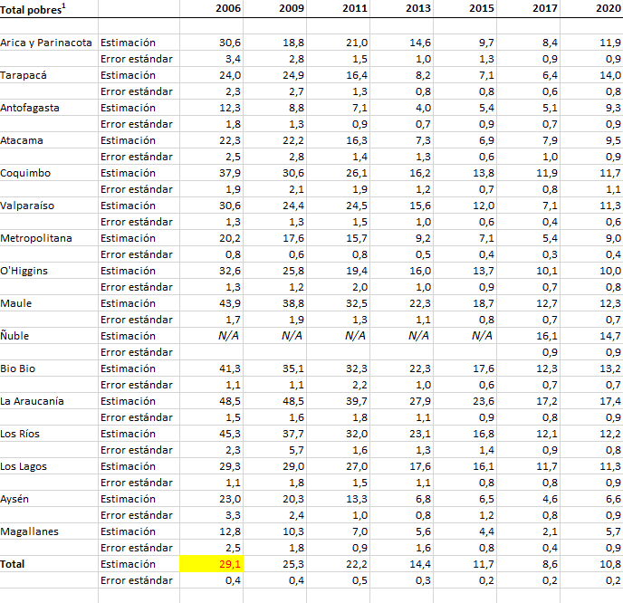

Fecha: `r format(Sys.time(), "%d-%m-%Y")`
<style type="text/css">
.main-container {
  max-width: 1600px;
  margin-left: 100px;
  margin-right: auto;
}
</style>


```{r , message=FALSE, warning=FALSE, include = FALSE, eecho = FALSE}
#suppressWarnings(library(RODBC))
library(ggplot2)
library(ggpubr)
library(markdown)
library(shiny)
library(shinythemes)
library(tidyverse)
library(magrittr)
library(lubridate)
library(plotly)
library(xts)
library(dygraphs)
library(kableExtra)
library(knitr)
library("readxl")
library(rsconnect)
library(dplyr)
library(summarytools)
library(epiDisplay)
#library(leaflet)
library(haven)
library(epiDisplay)
library("readxl")
library(expss)
library(hrbrthemes)
library(viridis)
library(viridisLite)
library(DescTools)
library(roperators)
library(shinycssloaders)
library(writexl)
library(labelled)
library(tidyverse)
library(haven)
library(readr)
library(sjmisc)
library(WriteXLS)
library(ineq)
library(readstata13)
library(reldist)
library(foreign)
library(DT)
```

# Introducción

La encuesta Casen, divide a la pobreza (con diferentes nombres), en tres grandes grupos: no pobres, pobres y pobres extremos.

Cada año se hace la publicación de los resultados. los que a nivel regional coinciden casi exactamente con los que obtenemos con cálculos propios.

Pero hay un problema, pues las cifras entregadas en los primeros años de vuelta a la democracia fueron corregidos el 2015 según una nueva metodología que no conocemos. 

Como lo valores que obtenemos a nivel regional son exactos, podemos deducir que serán también muy aproximados a nivel comunal, por lo que ideamos una metodología para llevar las frecuencias de pobres y pobres extremos a niveles calculados con la nueva metodología para poder hacer comparaciones anuales entre diferentes Casen.

Utilizaremos las cifra oficiales de **frecuencias** que entrega Casen y que son descargables de [aquí](http://observatorio.ministeriodesarrollosocial.gob.cl/encuesta-casen-en-pandemia-2020) para todo el rango de tiempo de interés.

Existe un punto de quiebre en el 2014. Antes de ese año las cifras de pobrezas estaban subrepresentadas por el hecho que desde el [2015] (http://www.desarrollosocialyfamilia.gob.cl/pdf/upload/IDS2.pdf) se comenzó a aplicar una nueva metodología de medición de pobreza que subió los estándares. Es por eso que tuvimos que corregir 4 Casen: 2006, 2009, 2011 y 2013. La metodología para ello se incluye en éste documento.


```{r}
casen2006 <- readRDS("C:/Users/chris/OneDrive/Documentos/archivos_grandes/casen_2006_c.rds")
casen2006 <- mutate_if(casen2006, is.factor, as.character)
casen2009 <- readRDS("C:/Users/chris/OneDrive/Documentos/archivos_grandes/casen_2009_c.rds")
casen2009 <- mutate_if(casen2009, is.factor, as.character)
casen2011 <- readRDS("C:/Users/chris/OneDrive/Documentos/archivos_grandes/casen_2011_c.rds")
casen2011 <- mutate_if(casen2011, is.factor, as.character)
casen2013 <- readRDS("C:/Users/chris/OneDrive/Documentos/archivos_grandes/casen_2013_c.rds")
casen2013 <- mutate_if(casen2013, is.factor, as.character)
casen2015 <- readRDS("C:/Users/chris/OneDrive/Documentos/archivos_grandes/casen_2015_c.rds")
casen2015 <- mutate_if(casen2015, is.factor, as.character)
casen2017 <- readRDS("C:/Users/chris/OneDrive/Documentos/archivos_grandes/casen_2017_c.rds")
casen2017 <- mutate_if(casen2017, is.factor, as.character)
#casen2020 <- read.spss(file="C:/Users/chris/OneDrive/Documentos/archivos_grandes/casen_2020.sav", to.data.frame=TRUE)
#saveRDS(casen2020,"casen2020.rds")
casen2020 <- readRDS("casen2020.rds")
casen2020 <- mutate_if(casen2020, is.factor, as.character)
codigos_comunales <- readRDS(file = "C:/Users/chris/OneDrive/Documentos/archivos_grandes/codigos_comunales_2011-2017.rds")
```


# Pobreza por ingresos

Desde 1990 Casen publica información sobre el porcentaje de pobreza de los chilenos, generalmente divididos en tres categorias: no pobres, pobres y pobres extremos. A continuación se muestran 3 informes diferentes de pobreza y pobreza extrema. Los dos primeros se confirman pues están basados en la nueva metodología.

El tercero, el del 2006 contiene cifras dispares, pero que son ciertas en el año que se aplicó, si bien el standard para medirla era muy bajo.

Tanto 2.1 como 2.2 son publicaciones del año 2020

## Pobreza 1 (medición 1)

[(ver informe completo acá)](http://observatorio.ministeriodesarrollosocial.gob.cl/storage/docs/casen/2020/Resumen_de_resultados_de_Pobreza_por_Ingresos_y_Distribucion_de_Ingresos.pdf) 

Cuyo resultado detallado por Región es:

## Pobreza 2 

[(ver informe completo acá)](http://observatorio.ministeriodesarrollosocial.gob.cl/encuesta-casen-en-pandemia-2020)

Un segundo informe publicado en el 2006 es sorprendente porque informa a nivel nacional una tasa de pobreza y pobreza extrema de casi 1/3 del que actualmente se afirma que existía (13,7 versus 29,1).

## Pobreza 3

[(ver informe completo acá)](http://observatorio.ministeriodesarrollosocial.gob.cl/storage/docs/casen/2006/Resultados_Pobreza_Casen_2006.pdf) 


# Confirmación de resultados de pobreza a nivel Regional en la Casen al año de publicación (2006-2013)


```{r}
casen2006 <- readRDS("C:/Users/chris/OneDrive/Documentos/archivos_grandes/casen_2006_c.rds")
tabla_matp <-xtabs(casen2006$EXPR~R+CORTE, data = casen2006)
indigente <- tabla_matp[,1]
pobre_no_ind <- tabla_matp[,2]
no_pobre <- tabla_matp[,3]
total <- tabla_matp[,1] + tabla_matp[,2] + tabla_matp[,3]
indigente_por <- indigente*100/total
indigente_por

tabla_matp <-xtabs(casen2006$EXPC~COMUNA+CORTE, data = casen2006)

# datatable(tabla_matp, extensions = 'Buttons', escape = FALSE, rownames = FALSE,
#           options = list(dom = 'Bfrtip',
#           buttons = list('colvis', list(extend = 'collection',
#           buttons = list(
#           list(extend='copy'),
#           list(extend='excel',
#             filename = 'hitStats'),
#           list(extend='pdf',
#             filename= 'hitStats')),
#           text = 'Download')), scrollX = TRUE))

```

## 2009


```{r}
casen2009 <- readRDS("C:/Users/chris/OneDrive/Documentos/archivos_grandes/casen_2009_c.rds")
tabla_matp <-xtabs(casen2009$EXPR~REGION+CORTE, data = casen2009)
indigente <- tabla_matp[,1]
pobre_no_ind <- tabla_matp[,2]
no_pobre <- tabla_matp[,3]
total <- tabla_matp[,1] + tabla_matp[,2] + tabla_matp[,3]
indigente_por <- (indigente+pobre_no_ind)*100/total
indigente_por

tabla_matp <-xtabs(casen2006$EXPC~COMUNA+CORTE, data = casen2006)

# datatable(tabla_matp, extensions = 'Buttons', escape = FALSE, rownames = FALSE,
#           options = list(dom = 'Bfrtip',
#           buttons = list('colvis', list(extend = 'collection',
#           buttons = list(
#           list(extend='copy'),
#           list(extend='excel',
#             filename = 'hitStats'),
#           list(extend='pdf',
#             filename= 'hitStats')),
#           text = 'Download')), scrollX = TRUE))
```


## 2011


```{r}
casen2011 <- readRDS("C:/Users/chris/OneDrive/Documentos/archivos_grandes/casen_2011_c.rds")
tabla_matp <-xtabs(casen2011$expr_full~region+casen2011$corte, data = casen2011)
indigente <- tabla_matp[,1]
pobre_no_ind <- tabla_matp[,2]
no_pobre <- tabla_matp[,3]
total <- tabla_matp[,1] + tabla_matp[,2] + tabla_matp[,3]
indigente_por <- (indigente+pobre_no_ind)*100/total
indigente_por <- data.frame(indigente_por)
indigente_por

tabla_matp <-xtabs(casen2013$expr~region+casen2013$pobreza_MN, data = casen2013)

# datatable(tabla_matp, extensions = 'Buttons', escape = FALSE, rownames = FALSE,
#           options = list(dom = 'Bfrtip',
#           buttons = list('colvis', list(extend = 'collection',
#           buttons = list(
#           list(extend='copy'),
#           list(extend='excel',
#             filename = 'hitStats'),
#           list(extend='pdf',
#             filename= 'hitStats')),
#           text = 'Download')), scrollX = TRUE))
```


## 2013


```{r}
casen2013 <- readRDS("C:/Users/chris/OneDrive/Documentos/archivos_grandes/casen_2013_c.rds")
tabla_matp <-xtabs(casen2013$expr~region+casen2013$pobreza_MN, data = casen2013)
indigente <- tabla_matp[,1]
pobre_no_ind <- tabla_matp[,2]
no_pobre <- tabla_matp[,3]
total <- tabla_matp[,1] + tabla_matp[,2] + tabla_matp[,3]
indigente_por <- (indigente)*100/total
indigente_por <- data.frame(indigente_por)
indigente_por

tabla_matp <-xtabs(casen2013$expr~region+casen2013$pobreza_MN, data = casen2013)

# datatable(tabla_matp, extensions = 'Buttons', escape = FALSE, rownames = FALSE,
#           options = list(dom = 'Bfrtip',
#           buttons = list('colvis', list(extend = 'collection',
#           buttons = list(
#           list(extend='copy'),
#           list(extend='excel',
#             filename = 'hitStats'),
#           list(extend='pdf',
#             filename= 'hitStats')),
#           text = 'Download')), scrollX = TRUE))
```


## 2015


```{r}
casen2015 <- readRDS("C:/Users/chris/OneDrive/Documentos/archivos_grandes/casen_2015_c.rds")
tabla_matp <-xtabs(casen2015$expr~region+casen2015$pobreza, data = casen2015)
indigente <- tabla_matp[,1]
pobre_no_ind <- tabla_matp[,2]
no_pobre <- tabla_matp[,3]
total <- tabla_matp[,1] + tabla_matp[,2] + tabla_matp[,3]
indigente_por <- (indigente+pobre_no_ind)*100/total
indigente_por <- data.frame(indigente_por)
indigente_por

tabla_matp <-xtabs(casen2013$expr~region+casen2013$pobreza_MN, data = casen2013)

# datatable(tabla_matp, extensions = 'Buttons', escape = FALSE, rownames = FALSE,
#           options = list(dom = 'Bfrtip',
#           buttons = list('colvis', list(extend = 'collection',
#           buttons = list(
#           list(extend='copy'),
#           list(extend='excel',
#             filename = 'hitStats'),
#           list(extend='pdf',
#             filename= 'hitStats')),
#           text = 'Download')), scrollX = TRUE))
```

 <span style="color:red">A partir del 2015 ya no es necesario corregir.</span>

# Expansión comunal de la pobreza.

## La metodología

Nos basamos para corregir a criterios actuales de la tabla oficial.

http://observatorio.ministeriodesarrollosocial.gob.cl/encuesta-casen-en-pandemia-2020


Caso ejemplo: 2006, Antofagasta. Region II.	Estimación pobres extremos	23.593  según la nueva metodologia. Nosotros contamos 10716.

## Pobreza 2006 ejemplo de expansión para la región II.


```{r}
casen2006 <- readRDS("C:/Users/chris/OneDrive/Documentos/archivos_grandes/casen_2006_c.rds")
casen2006 <- mutate_if(casen2006, is.factor, as.character)
# tabla_matp <-xtabs(casen2006$EXPC~COMUNA+R+CORTE, data = casen2006)
# head(tabla_matp,20)
region_2 <- filter(casen2006, casen2006$R == "II")
# region_2
```

Filtramos por Region II

```{r}
tabla_matp <-xtabs(region_2$EXPC~COMUNA+CORTE, data = region_2)
head(tabla_matp,20)
tabla_matp <- as.data.frame(tabla_matp)
```

Consideramos sólo los pobres extremos:

```{r}
frec_man_com_parcial_total <- filter(tabla_matp, tabla_matp$CORTE == "Indigente")
frec_man_com_parcial_total
codigos_com <- frec_man_com_parcial_total$COMUNA
#codigos_com
```
y los sumamos:

```{r}
sum(frec_man_com_parcial_total$Freq)
```

Expandiremos las frecuencias de pobres y pobres extremos para que lleguen al nivel oficial de la nueva metodología y lo haremos por comuna.

```{r}
frec_man_com_parcial_total2 <- data.frame()
for(i in codigos_com){
  frec_man_com_parcial <- filter(frec_man_com_parcial_total, frec_man_com_parcial_total$COMUNA == i)
  frec_man_com_parcial$p <- frec_man_com_parcial$Freq*100/sum(frec_man_com_parcial_total$Freq)/100
  frec_man_com_parcial_total2 <- rbind(frec_man_com_parcial_total2,frec_man_com_parcial)
}
```

Calculando una proporción poblacional

```{r}

   frec_man_com_parcial_total2
```
```{r}
sum(frec_man_com_parcial_total2$p)
```


y multiplicandola con el valor al que deseamos llegar:

```{r}
 frec_man_com_parcial_total2$p_mul <- round(frec_man_com_parcial_total2$p *23593)
 frec_man_com_parcial_total2
```


```{r}
sum( frec_man_com_parcial_total2$p_mul)
```

La columna p_multi sería la que que contenga la cantidad de pobres extremos por comuna corregidos.


<!-- # Análisis de la pobreza -->


<!-- Uno a nivel **comunal** en la Región Metropolitana y tres a nivel Regional: -->

<!-- i. Ingreso autónomo <span style="color:red">percápita</span>  -->
<!-- del hogar, CASEN 2011 -->
<!-- ($ de noviembre de 2011) -->
<!-- de la pagina 16 [de aquí](https://ciperchile.cl/wp-content/uploads/INDICE-DE-PRIORIDAD-SOCIAL-2014.pdf -->
<!-- ). -->


<!-- ii. Ingreso autónomo promedio e ingreso monetario promedio del hogar a nivel regional el 2015: -->

<!-- https://www.bcn.cl/portal/noticias?id=principales-resultados-sobre-pobreza-e-ingresos-regionales-encuesta-casen-2015 -->


<!-- Por dos instrumentos diferentes oficiales llegamos a los mismos resultados y son a los cuales intentamos aproximarnos. -->


<!-- iii.  Se comparará con la tabla obtenida en las III [(ver aquí)](https://datasocial.ministeriodesarrollosocial.gob.cl/dataSocial/csv/Tablas_Ingreso.xlsx)  -->

<!--  <!--  --> 

<!-- iiii. Y la otra con una página interactiva con datos por región [(ver aquí)](https://datasocial.ministeriodesarrollosocial.gob.cl/fichaIndicador/513/2) -->


<br>


2006

```{r}
pobreza <- read_xlsx("valores de pobreza actuales.xlsx", sheet = 9 )
regiones_pub <- pobreza[1:16,c(1,2,9)]
regiones_pub2 <- pobreza[19:34,c(1,2,9)]
regiones_pub$c2006 <- as.numeric(regiones_pub$c2006)
regiones_pub2$c2006 <- as.numeric(regiones_pub2$c2006)

cat <- unique(casen2006$CORTE)
prop_cor <- data.frame()
for (cat in unique(casen2006$CORTE)[2]) {
  
proporcion <- data.frame()
fn_prp_pob <- function(n){
  
region_2 <- filter(casen2006, casen2006$R == n)

tabla_matp <-xtabs(region_2$EXPC~COMUNA+CORTE, data = region_2)
tabla_matp <- as.data.frame(tabla_matp)
tabla_matp2 <<- tabla_matp
frec_man_com_parcial_total <- filter(tabla_matp, tabla_matp$CORTE == cat)
codigos_com <- frec_man_com_parcial_total$COMUNA

frec_man_com_parcial_total2 <- data.frame()
for(i in codigos_com){
  frec_man_com_parcial <- filter(frec_man_com_parcial_total, frec_man_com_parcial_total$COMUNA == i)
  frec_man_com_parcial$p <- frec_man_com_parcial$Freq*100/sum(frec_man_com_parcial_total$Freq)/100
  frec_man_com_parcial_total2 <- rbind(frec_man_com_parcial_total2,frec_man_com_parcial) 
}
proporcion2 <<- frec_man_com_parcial_total2
} 
for (n in unique(casen2006$R)) {
 
  fn_prp_pob(n)
  proporcion2$ROMANOS <- n 
  proporcion <- rbind(proporcion,proporcion2)
}

proporcion <- proporcion[,c(5,1,2,3,4)]
prop_cor <- rbind(prop_cor,proporcion)
}

prop_cor = merge(x = prop_cor, y = regiones_pub, by="ROMANOS")
prop_cor$p_mul <- round(prop_cor$p * prop_cor$c2006)
names(prop_cor)[1] <- "region_r" 

a1 <- prop_cor
 

  
prop_cor <- data.frame()
for (cat in unique(casen2006$CORTE)[3]) {
  
proporcion <- data.frame()
fn_prp_pob <- function(n){
  
region_2 <- filter(casen2006, casen2006$R == n)

tabla_matp <-xtabs(region_2$EXPC~COMUNA+CORTE, data = region_2)
tabla_matp <- as.data.frame(tabla_matp)
tabla_matp2 <<- tabla_matp
frec_man_com_parcial_total <- filter(tabla_matp, tabla_matp$CORTE == cat)
codigos_com <- frec_man_com_parcial_total$COMUNA

frec_man_com_parcial_total2 <- data.frame()
for(i in codigos_com){
  frec_man_com_parcial <- filter(frec_man_com_parcial_total, frec_man_com_parcial_total$COMUNA == i)
  frec_man_com_parcial$p <- frec_man_com_parcial$Freq*100/sum(frec_man_com_parcial_total$Freq)/100
  frec_man_com_parcial_total2 <- rbind(frec_man_com_parcial_total2,frec_man_com_parcial) 
}
proporcion2 <<- frec_man_com_parcial_total2
} 
for (n in unique(casen2006$R)) {
 
  fn_prp_pob(n)
  proporcion2$ROMANOS <- n 
  proporcion <- rbind(proporcion,proporcion2)
}
proporcion <- proporcion[,c(5,1,2,3,4)]
prop_cor <- rbind(prop_cor,proporcion)
}
prop_cor = merge(x = prop_cor, y = regiones_pub2, by="ROMANOS")
prop_cor$p_mul <- round(prop_cor$p * prop_cor$c2006)
names(prop_cor)[1] <- "region_r" 

a2 <- prop_cor
datatable(rbind(a1,a2), extensions = 'Buttons', escape = FALSE, rownames = FALSE,
          options = list(dom = 'Bfrtip',
          buttons = list('colvis', list(extend = 'collection',
          buttons = list(
          list(extend='copy'),
          list(extend='excel',
            filename = 'hitStats'),
          list(extend='pdf',
            filename= 'hitStats')),
          text = 'Download')), scrollX = TRUE))
```

<br>


## Desde 2015 tenemos las frecuencias sin problemas


```{r}
casen2015 <- readRDS("C:/Users/chris/OneDrive/Documentos/archivos_grandes/casen_2015_c.rds")
casen2015 <- mutate_if(casen2015, is.factor, as.character)
casen2017 <- readRDS("C:/Users/chris/OneDrive/Documentos/archivos_grandes/casen_2017_c.rds")
casen2017 <- mutate_if(casen2017, is.factor, as.character)
#casen2020 <- read.spss(file="C:/Users/chris/OneDrive/Documentos/archivos_grandes/casen_2020.sav", to.data.frame=TRUE)
#saveRDS(casen2020,"casen2020.rds")
casen2020 <- readRDS("casen2020.rds")
casen2020 <- mutate_if(casen2020, is.factor, as.character)
```

### 2015


```{r}
tabla_matp <-xtabs(casen2015$expc_todas~comuna+pobreza, data = casen2015)
head(tabla_matp,20)
tabla_matp15 <- as.data.frame(tabla_matp)
tabla_matp15$año <- "2015"
# tabla_matp15
```


### 2017


```{r}
tabla_matp <-xtabs(casen2017$expc~comuna+pobreza, data = casen2017)
head(tabla_matp,20)
tabla_matp17 <- as.data.frame(tabla_matp)
tabla_matp17$año <- "2017"
# tabla_matp17
```


### 2020


```{r}
tabla_matp <-xtabs(casen2020$expc~comuna+pobreza, data = casen2020)
head(tabla_matp,20)
tabla_matp20 <- as.data.frame(tabla_matp)
tabla_matp20$año <- "2020"
# tabla_matp20
```


# Descarga de la información de pobreza del 2015, 2017 y 2020:

```{r}
pobreza_15_20 <- rbind(tabla_matp15,tabla_matp17,tabla_matp20)
datatable(pobreza_15_20, extensions = 'Buttons', escape = FALSE, rownames = FALSE,
          options = list(dom = 'Bfrtip',
          buttons = list('colvis', list(extend = 'collection',
          buttons = list(
          list(extend='copy'),
          list(extend='excel',
            filename = 'hitStats'),
          list(extend='pdf',
            filename= 'hitStats')),
          text = 'Download')), scrollX = TRUE))
```


<br>
<br>
<br>
<br>
<br>
<br>
<br>


