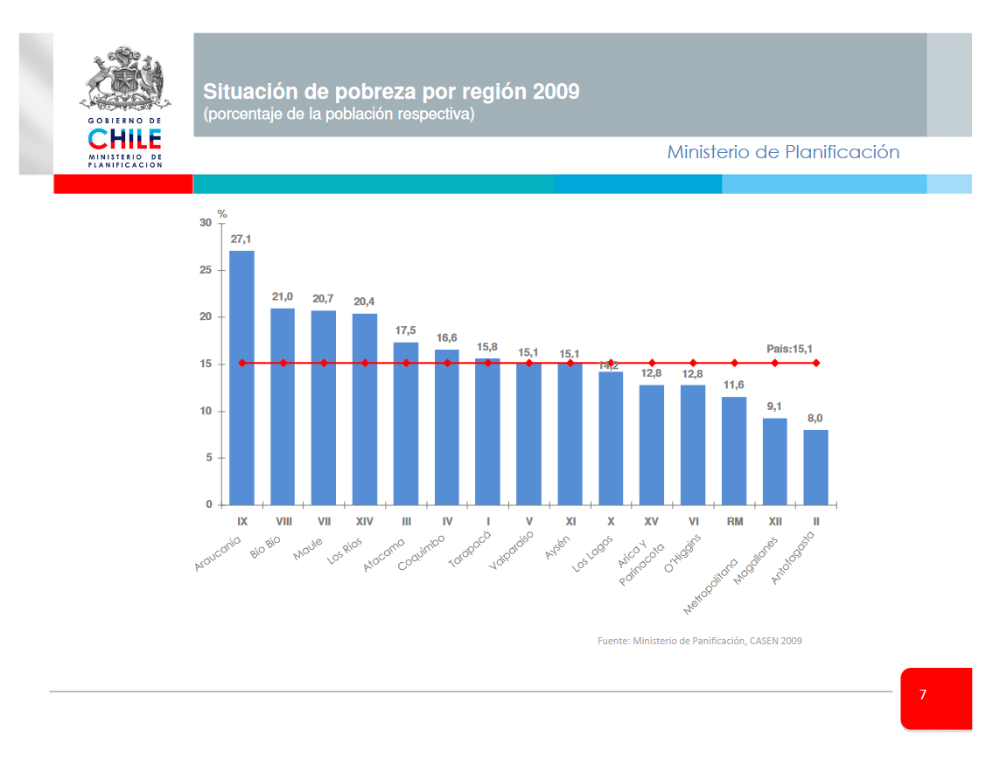
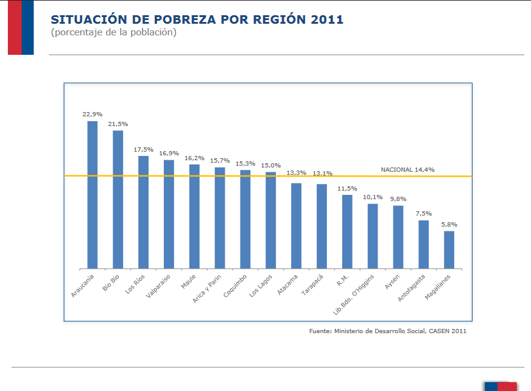
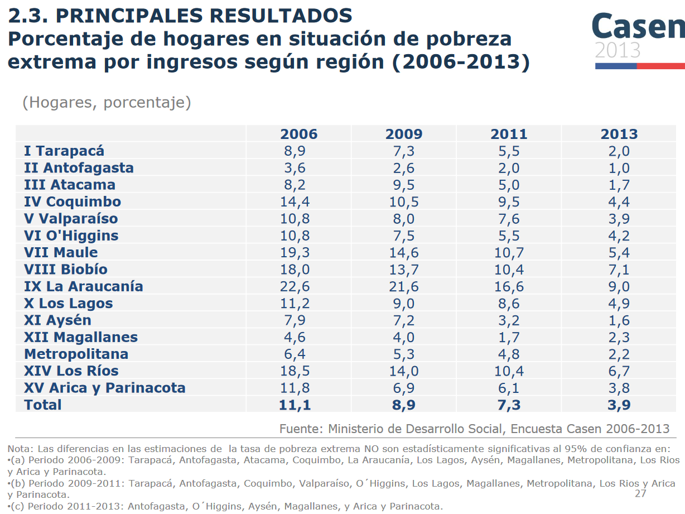
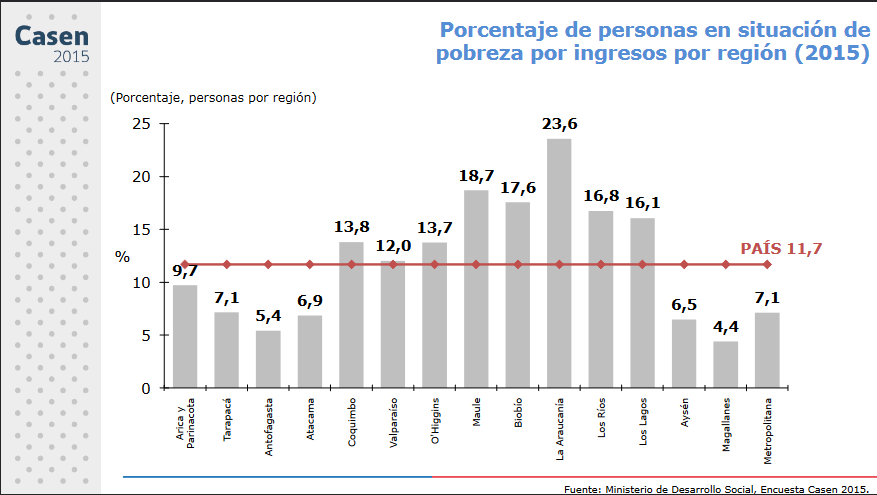
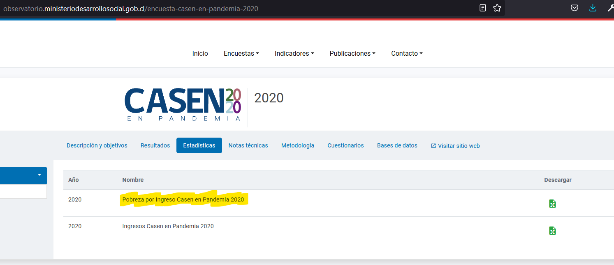

Fecha: `r format(Sys.time(), "%d-%m-%Y")`
<style type="text/css">
.main-container {
  max-width: 1600px;
  margin-left: 100px;
  margin-right: auto;
}
</style>


```{r , message=FALSE, warning=FALSE, include = FALSE, eecho = FALSE}
#suppressWarnings(library(RODBC))
library(ggplot2)
library(ggpubr)
library(markdown)
library(shiny)
library(shinythemes)
library(tidyverse)
library(magrittr)
library(lubridate)
library(plotly)
library(xts)
library(dygraphs)
library(kableExtra)
library(knitr)
library("readxl")
library(rsconnect)
library(dplyr)
library(summarytools)
library(epiDisplay)
#library(leaflet)
library(haven)
library(epiDisplay)
library("readxl")
library(expss)
library(hrbrthemes)
library(viridis)
library(viridisLite)
library(DescTools)
library(roperators)
library(shinycssloaders)
library(writexl)
library(labelled)
library(tidyverse)
library(haven)
library(readr)
library(sjmisc)
library(WriteXLS)
library(ineq)
library(readstata13)
library(reldist)
library(foreign)
library(DT)
```

# Introducción

En éste trabajo nos concentraremos en la distribución de la pobreza en Chile, pobreza que se divide, con diferentes nombres, en tres grandes grupos: no pobres, pobres y pobres extremos.

Veremos que para cifras del año y a  nivel regional, los cálculos  a los que llegamos son exactos a los obtenidos y publicados por Casen en cada año en que fue aplicada. Pero éste es un problema, pues las cifras entregadas en los primeros años de vuelta a la democracia fueron corregidos según una nueva metodología que no conocemos. 

Como lo valores que obtenemos a nivel regional son exactos a los publicados a nivel regional, podemos deducir que también lo serán a nivel comunal, por lo que ideamos una metodología para llevar las frecuencias de pobres y no pobres a niveles calculados con la nueva metodología para poder hacer comparaciones anuales entre Casen de diferentes años.

Los análisis oficiales que entrega Casen y que son descargables de [aquí](http://observatorio.ministeriodesarrollosocial.gob.cl/encuesta-casen-en-pandemia-2020) para el 2020 y de [aquí](http://observatorio.ministeriodesarrollosocial.gob.cl/encuesta-casen-2011) del 2011 hasta 1990, entregan estadísticas muy útiles sobres las cuales comparar.


```{r}
# casen2006 <- readRDS("C:/Users/chris/OneDrive/Documentos/archivos_grandes/casen_2006_c.rds")
# casen2006 <- mutate_if(casen2006, is.factor, as.character)
# casen2009 <- readRDS("C:/Users/chris/OneDrive/Documentos/archivos_grandes/casen_2009_c.rds")
# casen2009 <- mutate_if(casen2009, is.factor, as.character)
# casen2011 <- readRDS("C:/Users/chris/OneDrive/Documentos/archivos_grandes/casen_2011_c.rds")
# casen2011 <- mutate_if(casen2011, is.factor, as.character)
# casen2013 <- readRDS("C:/Users/chris/OneDrive/Documentos/archivos_grandes/casen_2013_c.rds")
# casen2013 <- mutate_if(casen2013, is.factor, as.character)
# casen2015 <- readRDS("C:/Users/chris/OneDrive/Documentos/archivos_grandes/casen_2015_c.rds")
# casen2015 <- mutate_if(casen2015, is.factor, as.character)
# casen2017 <- readRDS("C:/Users/chris/OneDrive/Documentos/archivos_grandes/casen_2017_c.rds")
# casen2017 <- mutate_if(casen2017, is.factor, as.character)
# #casen2020 <- read.spss(file="C:/Users/chris/OneDrive/Documentos/archivos_grandes/casen_2020.sav", to.data.frame=TRUE)
# #saveRDS(casen2020,"casen2020.rds")
# casen2020 <- readRDS("casen2020.rds")
# casen2020 <- mutate_if(casen2020, is.factor, as.character)
# codigos_comunales <- readRDS(file = "C:/Users/chris/OneDrive/Documentos/archivos_grandes/codigos_comunales_2011-2017.rds")

casen2020 <- readRDS("C:/Users/enamo/Desktop/Shiny-R/Casen_en_pandemia_2020/casen/casen_2020.rds")
casen2020 <- mutate_if(casen2020, is.factor, as.character)
casen2017 <- readRDS("C:/Users/enamo/Desktop/Shiny-R/Casen_en_pandemia_2020/casen/casen_2017_c.rds")
casen2017 <- mutate_if(casen2017, is.factor, as.character)
casen2015 <- readRDS("C:/Users/enamo/Desktop/Shiny-R/Casen_en_pandemia_2020/casen/casen_2015_c.rds")
casen2015 <- mutate_if(casen2015, is.factor, as.character)
casen2013 <- readRDS("C:/Users/enamo/Desktop/Shiny-R/Casen_en_pandemia_2020/casen/casen_2013_c.rds")
casen2013 <- mutate_if(casen2013, is.factor, as.character)
 
casen2011 <- readRDS("C:/Users/enamo/Desktop/Shiny-R/Casen_en_pandemia_2020/casen/casen_2011_c.rds")
casen2011 <- mutate_if(casen2011, is.factor, as.character)
 
casen2009 <- readRDS("C:/Users/enamo/Desktop/Shiny-R/Casen_en_pandemia_2020/casen/casen_2009_c.rds")
casen2009 <- mutate_if(casen2009, is.factor, as.character)
casen2006 <- readRDS("C:/Users/enamo/Desktop/Shiny-R/Casen_en_pandemia_2020/casen/casen_2006_c.rds")
casen2006 <- mutate_if(casen2006, is.factor, as.character)

```


<br>

# Pobreza por ingresos
 
Desde 1990 Casen publica información sobre el porcentaje de pobreza de los chilenos, generalmente divididos en tres categorias: no pobres, pobres y pobres extremos. A continuación se muestran 2 porcentajes diferentes de pobreza y pobreza extrema:
 


<br>

# Pobreza por ingresos

Desde 1990 Casen publica información sobre el porcentaje de pobreza de los chilenos, generalmente divididos en tres categorias: no pobres, pobres y pobres extremos. A continuación se muestran 3 informes diferentes de pobreza y pobreza extrema (los dos primeros se confirman):


## Pobreza 1


[(ver informe completo acá)](http://observatorio.ministeriodesarrollosocial.gob.cl/storage/docs/casen/2020/Resumen_de_resultados_de_Pobreza_por_Ingresos_y_Distribucion_de_Ingresos.pdf) 

Que coincide con otro informe:

## Pobreza 2


Entonces existen dos publicaciones oficiales de resultados de la medicion de la pobreza de la Casen: los del año y los actualizados.

Podemos demostrar que nuestros cálculos coinciden perfecto con los entregados del año 2006:

<!-- Pobreza por Ingreso Casen en Pandemia  -->
<!-- hoja 8 de Copia de Pobreza_por_Ingreso_Casen_en_Pandemia_2020-1 -->

A continuación vamos a construir y verificar que nuestros cálculos coincidan con los oficiales no corregidos.

```{r}
unique(casen2006$R)
casen2006 <- readRDS("C:/Users/enamo/Desktop/Shiny-R/Casen_en_pandemia_2020/casen/casen_2006_c.rds")
unique(casen2006$CORTE)
tabla_matp <-xtabs(casen2006$EXPR~R+CORTE, data = casen2006)
indigente <- tabla_matp[,1]
pobre_no_ind <- tabla_matp[,2]
no_pobre <- tabla_matp[,3]
total <- tabla_matp[,1] + tabla_matp[,2] + tabla_matp[,3]
indigente_por <- indigente*100/total
indigente_por
```
```{r}
tabla_matp <-xtabs(casen2006$EXPR~COMUNA+CORTE, data = casen2006)
head(tabla_matp,20)
```


```{r}
# totalisimo <- data.frame()
# 
# 
# indigente <- tabla_matp[,1]
# pobre_no_ind <- tabla_matp[,2]
# no_pobre <- tabla_matp[,3]
# total <- indigente+ pobre_no_ind + no_pobre 
# 
# indigente_por <- indigente*100/total
# indigente_por  <- as.data.frame(indigente_por)
# #indigente_por 
# 
# pobre_no_ind_por <- pobre_no_ind*100/total
# pobre_no_ind_por  <- as.data.frame(pobre_no_ind_por)
# #pobre_no_ind_por 
# 
# no_pobre_por <- no_pobre*100/total
# no_pobre_por  <- as.data.frame(no_pobre_por)
# #no_pobre_por
# 
# totalisimo <- rbind(totalisimo,indigente_por)
# totalisimo2 <- rbind(totalisimo,pobre_no_ind_por)
# totalisimo3 <- rbind(totalisimo2,no_pobre_por)


# datatable(tabla_matp, extensions = 'Buttons', escape = FALSE, rownames = FALSE,
#           options = list(dom = 'Bfrtip',
#           buttons = list('colvis', list(extend = 'collection',
#           buttons = list(
#           list(extend='copy'),
#           list(extend='excel',
#             filename = 'hitStats'),
#           list(extend='pdf',
#             filename= 'hitStats')),
#           text = 'Download')), scrollX = TRUE))

```


# Expansión comunal de la pobreza.

Caso ejemplo: 2006, Antofagasta. Region II.	Estimación pobres extremos	23.593  según la nueva metodologia, sin embargo nosotros contamos 10716.

## Pobreza 1


```{r}
# casen2006 <- readRDS("C:/Users/chris/OneDrive/Documentos/archivos_grandes/casen_2006_c.rds")
casen2006 <- readRDS("C:/Users/enamo/Desktop/Shiny-R/Casen_en_pandemia_2020/casen/casen_2006_c.rds")
casen2006 <- mutate_if(casen2006, is.factor, as.character)
# tabla_matp <-xtabs(casen2006$EXPC~COMUNA+R+CORTE, data = casen2006)
# head(tabla_matp,20)
region_2 <- filter(casen2006, casen2006$R == "II")
# region_2
```

```{r}
tabla_matp <-xtabs(region_2$EXPC~COMUNA+CORTE, data = region_2)
head(tabla_matp,20)
tabla_matp <- as.data.frame(tabla_matp)
```

Consideremos sólo los pobres extremos:

```{r}
frec_man_com_parcial_total <- filter(tabla_matp, tabla_matp$CORTE == "Indigente")
frec_man_com_parcial_total
codigos_com <- frec_man_com_parcial_total$COMUNA
#codigos_com
```
```{r}
sum(frec_man_com_parcial_total$Freq)
```

Expandiremos las frecuencias de pobres ty pobres extremos para que lleguen al nivel oficial de la nueva metodología y lo haremos por comuna.
 
<!-- ######################################################################################################################### Poblacion Total por a;os-->


```{r}
# saveRDS(union_pob,"union_pob_2.rds")
union_pob <- readRDS("union_pob_2.rds")
```

```{r}
p06 <- union_pob[,c("Poblacion_2006","sum.poblacion$`Poblacion 2006`")]
p09 <- union_pob[,c("Poblacion_2009","sum.poblacion$`Poblacion 2009`")]
p11 <- union_pob[,c("Poblacion_2011","sum.poblacion$`Poblacion 2011`")]
p13 <- union_pob[,c("Poblacion_2013","sum.poblacion$`Poblacion 2013`")]
p15 <- union_pob[,c("Poblacion_2015","sum.poblacion$`Poblacion 2015`")]
p17 <- union_pob[,c("Poblacion_2017","sum.poblacion$`Poblacion 2017`")]
p20 <- union_pob[,c("Poblacion_2017","sum.poblacion$`Poblacion 2020`")]


colnames(p06) <- c("codigo Comuna", "poblacion total")
colnames(p09) <- c("codigo Comuna", "poblacion total")
colnames(p11) <- c("codigo Comuna", "poblacion total")
colnames(p13) <- c("codigo Comuna", "poblacion total")
colnames(p15) <- c("codigo Comuna", "poblacion total")
colnames(p17) <- c("codigo Comuna", "poblacion total")
colnames(p20) <- c("codigo Comuna", "poblacion total")

p06$año <- 2006
p09$año <- 2009
p11$año <- 2011
p13$año <- 2013
p15$año <- 2015
p17$año <- 2017
p20$año <- 2020

tabla_pob <- rbind(p06,p09,p11,p13,p15,p17,p20)

```


<!-- ######################################################################################################################### 2006 -->


```{r}
pobreza <- read_xlsx("valores de pobreza actuales.xlsx", sheet = 9 )
regiones_pub <- pobreza[1:16,c(1,2,9)]
regiones_pub2 <- pobreza[19:34,c(1,2,9)]
regiones_pub$c2006 <- as.numeric(regiones_pub$c2006)
regiones_pub2$c2006 <- as.numeric(regiones_pub2$c2006)

cat <- unique(casen2006$CORTE)
prop_cor <- data.frame()
for (cat in unique(casen2006$CORTE)[2]) {
  
proporcion <- data.frame()
fn_prp_pob <- function(n){
  
region_2 <- filter(casen2006, casen2006$R == n)

tabla_matp <-xtabs(region_2$EXPC~COMUNA+CORTE, data = region_2)
tabla_matp <- as.data.frame(tabla_matp)
tabla_matp2 <<- tabla_matp
frec_man_com_parcial_total <- filter(tabla_matp, tabla_matp$CORTE == cat)
codigos_com <- frec_man_com_parcial_total$COMUNA

frec_man_com_parcial_total2 <- data.frame()
for(i in codigos_com){
  frec_man_com_parcial <- filter(frec_man_com_parcial_total, frec_man_com_parcial_total$COMUNA == i)
  frec_man_com_parcial$p <- frec_man_com_parcial$Freq*100/sum(frec_man_com_parcial_total$Freq)/100
  frec_man_com_parcial_total2 <- rbind(frec_man_com_parcial_total2,frec_man_com_parcial) 
}
proporcion2 <<- frec_man_com_parcial_total2
} 
for (n in unique(casen2006$R)) {
 
  fn_prp_pob(n)
  proporcion2$ROMANOS <- n 
  proporcion <- rbind(proporcion,proporcion2)
}

proporcion <- proporcion[,c(5,1,2,3,4)]
prop_cor <- rbind(prop_cor,proporcion)
}

prop_cor = merge(x = prop_cor, y = regiones_pub, by="ROMANOS")
prop_cor$p_mul <- round(prop_cor$p * prop_cor$c2006)
names(prop_cor)[1] <- "region_r" 

a1 <- prop_cor
 
 # <!-- ########################### -->
  
prop_cor <- data.frame()
for (cat in unique(casen2006$CORTE)[3]) {
  
proporcion <- data.frame()
fn_prp_pob <- function(n){
  
region_2 <- filter(casen2006, casen2006$R == n)

tabla_matp <-xtabs(region_2$EXPC~COMUNA+CORTE, data = region_2)
tabla_matp <- as.data.frame(tabla_matp)
tabla_matp2 <<- tabla_matp
frec_man_com_parcial_total <- filter(tabla_matp, tabla_matp$CORTE == cat)
codigos_com <- frec_man_com_parcial_total$COMUNA

frec_man_com_parcial_total2 <- data.frame()
for(i in codigos_com){
  frec_man_com_parcial <- filter(frec_man_com_parcial_total, frec_man_com_parcial_total$COMUNA == i)
  frec_man_com_parcial$p <- frec_man_com_parcial$Freq*100/sum(frec_man_com_parcial_total$Freq)/100
  frec_man_com_parcial_total2 <- rbind(frec_man_com_parcial_total2,frec_man_com_parcial) 
}
proporcion2 <<- frec_man_com_parcial_total2
} 
for (n in unique(casen2006$R)) {
 
  fn_prp_pob(n)
  proporcion2$ROMANOS <- n 
  proporcion <- rbind(proporcion,proporcion2)
}
proporcion <- proporcion[,c(5,1,2,3,4)]
prop_cor <- rbind(prop_cor,proporcion)
}
prop_cor = merge(x = prop_cor, y = regiones_pub2, by="ROMANOS")
prop_cor$p_mul <- round(prop_cor$p * prop_cor$c2006)
names(prop_cor)[1] <- "region_r" 

a2 <- prop_cor
b1 <- rbind(a1,a2)
datatable(rbind(a1,a2), extensions = 'Buttons', escape = FALSE, rownames = FALSE,
          options = list(dom = 'Bfrtip',
          buttons = list('colvis', list(extend = 'collection',
          buttons = list(
          list(extend='copy'),
          list(extend='excel',
            filename = 'hitStats'),
          list(extend='pdf',
            filename= 'hitStats')),
          text = 'Download')), scrollX = TRUE))
```
```{r}
pob_calculado <- data.frame()
for (i in unique(b1$region)) {
  # tabla <- filter(tabla_unida, tabla_unida$año.y == 2006 )
  tabla <- filter(b1, b1$region == i )
  tabla <- filter(tabla, tabla$CORTE == "Pobre no indigente" )

  tabla2 <- data.frame(
    region = i,
    calculado = sum(tabla$p_mul)
  )
   pob_calculado <- rbind(pob_calculado, tabla2)
}
pob_calculado
```
```{r}
write_xlsx(b1,"tabla_2006.xlsx")
```


```{r}
# <!-- ######################################################################################################################### 2009 --> 
 
pobreza <- read_xlsx("valores de pobreza actuales.xlsx", sheet = 9 )
regiones_pub <- pobreza[1:16,c(1,3,10)]
regiones_pub$c2009 <- as.numeric(regiones_pub$c2009)
regiones_pub2 <- pobreza[19:34,c(1,3,10)]
regiones_pub2$c2009 <- as.numeric(regiones_pub2$c2009)
 
cat <- unique(casen2009$CORTE)
 
prop_cor <- data.frame()
for (cat in unique(casen2009$CORTE)[3]) {
  
proporcion <- data.frame()
fn_prp_pob <- function(n){
  
region_2 <- filter(casen2009, casen2009$REGION == n)

tabla_matp <-xtabs(region_2$EXPC~COMUNA+CORTE, data = region_2)
tabla_matp <- as.data.frame(tabla_matp) 
frec_man_com_parcial_total <- filter(tabla_matp, tabla_matp$CORTE == cat)
codigos_com <- frec_man_com_parcial_total$COMUNA

frec_man_com_parcial_total2 <- data.frame()
for(i in codigos_com){
  frec_man_com_parcial <- filter(frec_man_com_parcial_total, frec_man_com_parcial_total$COMUNA == i)
  frec_man_com_parcial$p <- frec_man_com_parcial$Freq*100/sum(frec_man_com_parcial_total$Freq)/100
  frec_man_com_parcial_total2 <- rbind(frec_man_com_parcial_total2,frec_man_com_parcial) 
}
proporcion2 <<- frec_man_com_parcial_total2
} 
for (n in unique(casen2009$REGION)) {
 
  fn_prp_pob(n)
  proporcion2$region_09 <- n 
  proporcion <- rbind(proporcion,proporcion2)
}


proporcion <- proporcion[,c(5,1,2,3,4)]
prop_cor <- rbind(prop_cor,proporcion)
}
 
prop_cor = merge(x = prop_cor, y = regiones_pub, by="region_09")
 
prop_cor$p_mul <- round(prop_cor$p * prop_cor$c2009)
names(prop_cor)[1] <- "region_r" 

a3 <- prop_cor
 
# <!-- ############################# -->
 
prop_cor <- data.frame()
for (cat in unique(casen2009$CORTE)[1]) {
proporcion <- data.frame()
fn_prp_pob <- function(n){
region_2 <- filter(casen2009, casen2009$REGION == n)
tabla_matp <-xtabs(region_2$EXPC~COMUNA+CORTE, data = region_2)
tabla_matp <- as.data.frame(tabla_matp) 
frec_man_com_parcial_total <- filter(tabla_matp, tabla_matp$CORTE == cat)
codigos_com <- frec_man_com_parcial_total$COMUNA
frec_man_com_parcial_total2 <- data.frame()
for(i in codigos_com){
  frec_man_com_parcial <- filter(frec_man_com_parcial_total, frec_man_com_parcial_total$COMUNA == i)
  frec_man_com_parcial$p <- frec_man_com_parcial$Freq*100/sum(frec_man_com_parcial_total$Freq)/100
  frec_man_com_parcial_total2 <- rbind(frec_man_com_parcial_total2,frec_man_com_parcial) 
}
proporcion2 <<- frec_man_com_parcial_total2
} 
for (n in unique(casen2009$REGION)) {
 
  fn_prp_pob(n)
  proporcion2$region_09 <- n 
  proporcion <- rbind(proporcion,proporcion2)
}
proporcion <- proporcion[,c(5,1,2,3,4)]
prop_cor <- rbind(prop_cor,proporcion)
}
prop_cor = merge(x = prop_cor, y = regiones_pub2, by="region_09")
prop_cor$p_mul <- round(prop_cor$p * prop_cor$c2009)
names(prop_cor)[1] <- "region_r" 
a4 <- prop_cor

a4 <- prop_cor
b2 <- rbind(a3,a4)
datatable(rbind(a3,a4), extensions = 'Buttons', escape = FALSE, rownames = FALSE,
          options = list(dom = 'Bfrtip',
          buttons = list('colvis', list(extend = 'collection',
          buttons = list(
          list(extend='copy'),
          list(extend='excel',
            filename = 'hitStats'),
          list(extend='pdf',
            filename= 'hitStats')),
          text = 'Download')), scrollX = TRUE))
```
```{r}
pob_calculado <- data.frame()
for (i in unique(b2$region)) {
  # tabla <- filter(tabla_unida, tabla_unida$año.y == 2006 )
  tabla <- filter(b2, b2$region == i )
  tabla <- filter(tabla, tabla$CORTE == "Indigente" )

  tabla2 <- data.frame(
    region = i,
    calculado = sum(tabla$p_mul)
  )
   pob_calculado <- rbind(pob_calculado, tabla2)
}
pob_calculado
```

```{r}
# <!-- ######################################################################################################################### 2011 -->
tabla_2011 <- casen2011
tabla_2011$region[tabla_2011$region == "Antofagasta"] <- "Región de Antofagasta"
tabla_2011$region[tabla_2011$region == "Araucanía"] <- "Región de La Araucanía"
tabla_2011$region[tabla_2011$region == "Arica y Parinacota"] <- "Región de Arica y Parinacota"
tabla_2011$region[tabla_2011$region == "Aysén"] <- "Región de Aysén del Gral. Carlos Ibáñez del Campo"
tabla_2011$region[tabla_2011$region == "Bio Bio"] <- "Región del Biobío"
tabla_2011$region[tabla_2011$region == "Copiapó"] <- "Región de Atacama"
tabla_2011$region[tabla_2011$region == "Coquimbo"] <- "Región de Coquimbo"
tabla_2011$region[tabla_2011$region == "Los Lagos"] <- "Región de Los Lagos"
tabla_2011$region[tabla_2011$region == "Los Ríos"] <- "Región de Los Ríos"
tabla_2011$region[tabla_2011$region == "Magallanes"] <- "Región de Magallanes y de la Antártica Chilena"
tabla_2011$region[tabla_2011$region == "Maule"] <- "Región del Maule"
tabla_2011$region[tabla_2011$region == "Metropolitana"] <- "Región Metropolitana de Santiago"
tabla_2011$region[tabla_2011$region == "O Higgins"] <- "Región del Libertador Gral. Bernardo O'Higgins"
tabla_2011$region[tabla_2011$region == "Tarapacá"] <- "Región de Tarapacá"
tabla_2011$region[tabla_2011$region == "Valparaíso"] <- "Región de Valparaíso"
casen2011 <- tabla_2011

pobreza <- read_xlsx("valores de pobreza actuales.xlsx", sheet = 9 )
regiones_pub <- pobreza[1:16,c(1,4)]
regiones_pub$c2011 <- as.numeric(regiones_pub$c2011)
regiones_pub2 <- pobreza[19:32,c(1,4)]
regiones_pub2$c2011 <- as.numeric(regiones_pub2$c2011)
cat <- unique(casen2011$corte)

prop_cor <- data.frame()
for (cat in unique(casen2011$corte)[3]) {
proporcion <- data.frame()
fn_prp_pob <- function(n){
region_2 <- filter(casen2011, casen2011$region == n)

tabla_matp <-xtabs(region_2$expc_full~comuna+corte, data = region_2)
tabla_matp <- as.data.frame(tabla_matp) 
frec_man_com_parcial_total <- filter(tabla_matp, tabla_matp$corte == cat)
codigos_com <- frec_man_com_parcial_total$comuna

frec_man_com_parcial_total2 <- data.frame()
for(i in codigos_com){
  frec_man_com_parcial <- filter(frec_man_com_parcial_total, frec_man_com_parcial_total$comuna == i)
  frec_man_com_parcial$p <- frec_man_com_parcial$Freq*100/sum(frec_man_com_parcial_total$Freq)/100
  frec_man_com_parcial_total2 <- rbind(frec_man_com_parcial_total2,frec_man_com_parcial) 
}
proporcion2 <<- frec_man_com_parcial_total2
} 
for (n in unique(casen2011$region)) {
 
  fn_prp_pob(n)
  proporcion2$region <- n 
  proporcion <- rbind(proporcion,proporcion2)
}

proporcion <- proporcion[,c(5,1,2,3,4)]
prop_cor <- rbind(prop_cor,proporcion)
}
prop_cor = merge(x = prop_cor, y = regiones_pub, by="region")
prop_cor$p_mul <- round(prop_cor$p * prop_cor$c2011)
names(prop_cor)[1] <- "region_r" 
a5 <- prop_cor

# <!-- ########################## -->
 
prop_cor <- data.frame()
for (cat in unique(casen2011$corte)[2]) {
proporcion <- data.frame()
fn_prp_pob <- function(n){
region_2 <- filter(casen2011, casen2011$region == n)
tabla_matp <-xtabs(region_2$expc_full~comuna+corte, data = region_2)
tabla_matp <- as.data.frame(tabla_matp) 
frec_man_com_parcial_total <- filter(tabla_matp, tabla_matp$corte == cat)
codigos_com <- frec_man_com_parcial_total$comuna

frec_man_com_parcial_total2 <- data.frame()
for(i in codigos_com){
  frec_man_com_parcial <- filter(frec_man_com_parcial_total, frec_man_com_parcial_total$comuna == i)
  frec_man_com_parcial$p <- frec_man_com_parcial$Freq*100/sum(frec_man_com_parcial_total$Freq)/100
  frec_man_com_parcial_total2 <- rbind(frec_man_com_parcial_total2,frec_man_com_parcial) 
}
proporcion2 <<- frec_man_com_parcial_total2
} 
for (n in unique(casen2011$region)) {
  fn_prp_pob(n)
  proporcion2$region <- n 
  proporcion <- rbind(proporcion,proporcion2)
}
proporcion <- proporcion[,c(5,1,2,3,4)]
prop_cor <- rbind(prop_cor,proporcion)
}
prop_cor = merge(x = prop_cor, y = regiones_pub2, by="region")
prop_cor$p_mul <- round(prop_cor$p * prop_cor$c2011)
names(prop_cor)[1] <- "region_r" 

a6 <- prop_cor
b3 <- rbind(a5,a6)
datatable(rbind(a5,a6), extensions = 'Buttons', escape = FALSE, rownames = FALSE,
          options = list(dom = 'Bfrtip',
          buttons = list('colvis', list(extend = 'collection',
          buttons = list(
          list(extend='copy'),
          list(extend='excel',
            filename = 'hitStats'),
          list(extend='pdf',
            filename= 'hitStats')),
          text = 'Download')), scrollX = TRUE))
```
```{r}
pob_calculado <- data.frame()
for (i in unique(b3$region_r)) {
  # tabla <- filter(tabla_unida, tabla_unida$año.y == 2006 )
  tabla <- filter(b3, b3$region_r == i )
  tabla <- filter(tabla, tabla$corte == "Pobreza extrema" )

  tabla2 <- data.frame(
    region = i,
    calculado = sum(tabla$p_mul)
  )
   pob_calculado <- rbind(pob_calculado, tabla2)
}
pob_calculado
```

```{r}
# <!-- ######################################################################################################################### 2013  --> 
 tabla_2013 <- casen2013
tabla_2013$region[tabla_2013$region == "I. Tarapaca"] <- "Región de Tarapacá"
tabla_2013$region[tabla_2013$region == "II. Antofagasta"] <- "Región de Antofagasta"
tabla_2013$region[tabla_2013$region == "III. Atacama"] <- "Región de Atacama"
tabla_2013$region[tabla_2013$region == "IV. Coquimbo"] <- "Región de Coquimbo"
tabla_2013$region[tabla_2013$region == "IX. La Araucanía"] <- "Región de La Araucanía"
tabla_2013$region[tabla_2013$region == "Metropolitana"] <- "Región Metropolitana de Santiago"
tabla_2013$region[tabla_2013$region == "V. Valparaíso"] <- "Región de Valparaíso"
tabla_2013$region[tabla_2013$region == "VI. O Higgins"] <- "Región del Libertador Gral. Bernardo O'Higgins"
tabla_2013$region[tabla_2013$region == "VII. Maule"] <- "Región del Maule"
tabla_2013$region[tabla_2013$region == "VIII. Biobío"] <- "Región del Biobío"
tabla_2013$region[tabla_2013$region == "X. Los Lagos"] <- "Región de Los Lagos"
tabla_2013$region[tabla_2013$region == "XI. Aysén"] <- "Región de Aysén del Gral. Carlos Ibáñez del Campo"
tabla_2013$region[tabla_2013$region == "XII. Magallanes"] <- "Región de Magallanes y de la Antártica Chilena"
tabla_2013$region[tabla_2013$region == "XIV. Los Ríos"] <- "Región de Los Ríos"
tabla_2013$region[tabla_2013$region == "XV. Arica y Parinacota"] <- "Región de Arica y Parinacota"
casen2013 <-tabla_2013
pobreza <- read_xlsx("valores de pobreza actuales.xlsx", sheet = 9 )
regiones_pub <- pobreza[1:16,c(1,5)]
regiones_pub$c2013 <- as.numeric(regiones_pub$c2013)
regiones_pub2 <- pobreza[19:34,c(1,5)]
regiones_pub2$c2013 <- as.numeric(regiones_pub2$c2013)
cat <- unique(casen2013$pobreza_MN)
prop_cor <- data.frame()
for (cat in unique(casen2013$pobreza_MN)[4]) {
proporcion <- data.frame()
fn_prp_pob <- function(n){
region_2 <- filter(casen2013, casen2013$region == n)
tabla_matp <-xtabs(region_2$expc~comuna+pobreza_MN, data = region_2)
tabla_matp <- as.data.frame(tabla_matp) 
frec_man_com_parcial_total <- filter(tabla_matp, tabla_matp$pobreza_MN == cat)
codigos_com <- frec_man_com_parcial_total$comuna
frec_man_com_parcial_total2 <- data.frame()
for(i in codigos_com){
  frec_man_com_parcial <- filter(frec_man_com_parcial_total, frec_man_com_parcial_total$comuna == i)
  frec_man_com_parcial$p <- frec_man_com_parcial$Freq*100/sum(frec_man_com_parcial_total$Freq)/100
  frec_man_com_parcial_total2 <- rbind(frec_man_com_parcial_total2,frec_man_com_parcial) 
}
proporcion2 <<- frec_man_com_parcial_total2
} 
for (n in unique(casen2013$region)) {
 
  fn_prp_pob(n)
  proporcion2$region <- n 
  proporcion <- rbind(proporcion,proporcion2)
}
proporcion <- proporcion[,c(5,1,2,3,4)]
prop_cor <- rbind(prop_cor,proporcion)
}
prop_cor = merge(x = prop_cor, y = regiones_pub, by="region")
prop_cor$p_mul <- round(prop_cor$p * prop_cor$c2013)
names(prop_cor)[1] <- "region_r" 
a7 <- prop_cor

 # <!-- ########################## -->
prop_cor <- data.frame()
for (cat in unique(casen2013$pobreza_MN)[2]) {
proporcion <- data.frame()
fn_prp_pob <- function(n){
region_2 <- filter(casen2013, casen2013$region == n)

tabla_matp <-xtabs(region_2$expc~comuna+pobreza_MN, data = region_2)
tabla_matp <- as.data.frame(tabla_matp) 
frec_man_com_parcial_total <- filter(tabla_matp, tabla_matp$pobreza_MN == cat)
codigos_com <- frec_man_com_parcial_total$comuna

frec_man_com_parcial_total2 <- data.frame()
for(i in codigos_com){
  frec_man_com_parcial <- filter(frec_man_com_parcial_total, frec_man_com_parcial_total$comuna == i)
  frec_man_com_parcial$p <- frec_man_com_parcial$Freq*100/sum(frec_man_com_parcial_total$Freq)/100
  frec_man_com_parcial_total2 <- rbind(frec_man_com_parcial_total2,frec_man_com_parcial) 
}
proporcion2 <<- frec_man_com_parcial_total2
} 
for (n in unique(casen2013$region)) {
 
  fn_prp_pob(n)
  proporcion2$region <- n 
  proporcion <- rbind(proporcion,proporcion2)
}
proporcion <- proporcion[,c(5,1,2,3,4)]
prop_cor <- rbind(prop_cor,proporcion)
}
prop_cor = merge(x = prop_cor, y = regiones_pub2, by="region")
prop_cor$p_mul <- round(prop_cor$p * prop_cor$c2013)
names(prop_cor)[1] <- "region_r" 
a8 <- prop_cor
b4 <- rbind(a7,a8)
datatable(rbind(a7,a8), extensions = 'Buttons', escape = FALSE, rownames = FALSE,
          options = list(dom = 'Bfrtip',
          buttons = list('colvis', list(extend = 'collection',
          buttons = list(
          list(extend='copy'),
          list(extend='excel',
            filename = 'hitStats'),
          list(extend='pdf',
            filename= 'hitStats')),
          text = 'Download')), scrollX = TRUE))
```
```{r}
pob_calculado <- data.frame()
for (i in unique(b4$region_r)) {
  # tabla <- filter(tabla_unida, tabla_unida$año.y == 2006 )
  tabla <- filter(b4, b4$region_r == i )
  tabla <- filter(tabla, tabla$pobreza_MN == "Pobres no extremos" )

  tabla2 <- data.frame(
    region = i,
    calculado = sum(tabla$p_mul)
  )
   pob_calculado <- rbind(pob_calculado, tabla2)
}
pob_calculado
```


```{r}
a1 <- a1[,-1]
a2 <- a2[,-1]
a3 <- a3[,-1]
a4 <- a4[,-1]
a1 <- a1[,c(5,1,2,3,4,6,7)]
a2 <- a2[,c(5,1,2,3,4,6,7)]
a3 <- a3[,c(5,1,2,3,4,6,7)]
a4 <- a4[,c(5,1,2,3,4,6,7)]
colnames(a1) <- colnames(a6)
colnames(a2) <- colnames(a6)
colnames(a3) <- colnames(a6)
colnames(a4) <- colnames(a6)
colnames(a5) <- colnames(a6)
colnames(a6) <- colnames(a6)
colnames(a7) <- colnames(a6)
colnames(a8) <- colnames(a6)
a1$año <- 2006
a3$año <- 2009
a5$año <- 2011
a7$año <- 2013
a2$año <- 2006
a4$año <- 2009
a6$año <- 2011
a8$año <- 2013
```


```{r}
b1 <- rbind(a1,a2)
b2 <- rbind(a3,a4)
b3 <- rbind(a5,a6)
b4 <- rbind(a7,a8)
```


```{r}
codigos_comunales <- readRDS(file = "C:/Users/enamo/Desktop/Shiny-R/Casen_en_pandemia_2020/codigos_comunales_2006.rds") 
names(codigos_comunales)[1] <- "codigo Comuna"
names(codigos_comunales)[2] <- "comuna" 
b1 = merge(x = b1, y = codigos_comunales, by="comuna" )
b1 = merge(x = b1, y = p06, by="codigo Comuna" )

codigos_comunales <- readRDS(file = "C:/Users/enamo/Desktop/Shiny-R/Casen_en_pandemia_2020/codigos_comunales_2009.rds") 
names(codigos_comunales)[1] <- "codigo Comuna"
names(codigos_comunales)[2] <- "comuna" 
b2 = merge(x = b2, y = codigos_comunales, by="comuna" )
b2 = merge(x = b2, y = p09, by="codigo Comuna" )

codigos_comunales <- readRDS(file = "C:/Users/enamo/Desktop/Shiny-R/Casen_en_pandemia_2020/codigos_comunales_2011-2017.rds") 
names(codigos_comunales)[1] <- "codigo Comuna"
names(codigos_comunales)[2] <- "comuna" 
b3 = merge(x = b3, y = codigos_comunales, by="comuna" )
b3 = merge(x = b3, y = p11, by="codigo Comuna" )

b4 = merge(x = b4, y = codigos_comunales, by="comuna" )
b4 = merge(x = b4, y = p13, by="codigo Comuna" )
 
```


```{r}
tabla_unida <- rbind(b1,b2,b3,b4)
names(tabla_unida)[7] <- "oficial"
tabla_unida <- mutate_if(tabla_unida, is.factor, as.character)
tabla_unida$corte[tabla_unida$corte == "Indigente"] <- "Pobres extremos"
tabla_unida$corte[tabla_unida$corte == "Pobreza extrema"] <- "Pobres extremos"
tabla_unida$corte[tabla_unida$corte == "Pobre"] <- "Pobres no extremos"
tabla_unida$corte[tabla_unida$corte == "Pobre no Indigente"] <- "Pobres no extremos"
tabla_unida$corte[tabla_unida$corte == "Pobre no indigente"] <- "Pobres no extremos"
names(tabla_unida)[3] <- "region"
datatable(tabla_unida, extensions = 'Buttons', escape = FALSE, rownames = FALSE,
          options = list(dom = 'Bfrtip',
          buttons = list('colvis', list(extend = 'collection',
          buttons = list(
          list(extend='copy'),
          list(extend='excel',
            filename = 'hitStats'),
          list(extend='pdf',
            filename= 'hitStats')),
          text = 'Download')), scrollX = TRUE))
```

```{r}
pob_calculado <- data.frame()
for (i in unique(tabla_unida$region)) {
  tabla <- filter(tabla_unida, tabla_unida$año.y == 2006 )
  tabla <- filter(tabla, tabla$region == i )
  tabla <- filter(tabla, tabla$corte == "Pobres no extremos" )

  tabla2 <- data.frame(
    region = i,
    calculado = sum(tabla$p_mul)
  )
   pob_calculado <- rbind(pob_calculado, tabla2)
}
pob_calculado
```


```{r}
write_xlsx(tabla_unida,"tabla_pobreza_2006-2013.xlsx")
```

# Verificaremos la exactitud de nuestros calculos para los años 2009, 2011, 2013, 2015, 2017 y 2020.

## 2009




```{r}
# casen2009 <- readRDS("C:/Users/chris/OneDrive/Documentos/archivos_grandes/casen_2009_c.rds")
tabla_matp <-xtabs(casen2009$EXPR~REGION+CORTE, data = casen2009)
indigente <- tabla_matp[,1]
pobre_no_ind <- tabla_matp[,2]
no_pobre <- tabla_matp[,3]
total <- tabla_matp[,1] + tabla_matp[,2] + tabla_matp[,3]
indigente_por <- (indigente+pobre_no_ind)*100/total
indigente_por

tabla_matp <-xtabs(casen2006$EXPC~COMUNA+CORTE, data = casen2006)

# datatable(tabla_matp, extensions = 'Buttons', escape = FALSE, rownames = FALSE,
#           options = list(dom = 'Bfrtip',
#           buttons = list('colvis', list(extend = 'collection',
#           buttons = list(
#           list(extend='copy'),
#           list(extend='excel',
#             filename = 'hitStats'),
#           list(extend='pdf',
#             filename= 'hitStats')),
#           text = 'Download')), scrollX = TRUE))
```


## 2011



```{r}
# casen2011 <- readRDS("C:/Users/chris/OneDrive/Documentos/archivos_grandes/casen_2011_c.rds")
tabla_matp <-xtabs(casen2011$expr_full~region+casen2011$corte, data = casen2011)
indigente <- tabla_matp[,1]
pobre_no_ind <- tabla_matp[,2]
no_pobre <- tabla_matp[,3]
total <- tabla_matp[,1] + tabla_matp[,2] + tabla_matp[,3]
indigente_por <- (indigente+pobre_no_ind)*100/total
indigente_por <- data.frame(indigente_por)
indigente_por

tabla_matp <-xtabs(casen2013$expr~region+casen2013$pobreza_MN, data = casen2013)

# datatable(tabla_matp, extensions = 'Buttons', escape = FALSE, rownames = FALSE,
#           options = list(dom = 'Bfrtip',
#           buttons = list('colvis', list(extend = 'collection',
#           buttons = list(
#           list(extend='copy'),
#           list(extend='excel',
#             filename = 'hitStats'),
#           list(extend='pdf',
#             filename= 'hitStats')),
#           text = 'Download')), scrollX = TRUE))
```


## 2013




```{r}
# casen2013 <- readRDS("C:/Users/chris/OneDrive/Documentos/archivos_grandes/casen_2013_c.rds")
tabla_matp <-xtabs(casen2013$expr~region+casen2013$pobreza_MN, data = casen2013)
indigente <- tabla_matp[,1]
pobre_no_ind <- tabla_matp[,2]
no_pobre <- tabla_matp[,3]
total <- tabla_matp[,1] + tabla_matp[,2] + tabla_matp[,3]
indigente_por <- (indigente)*100/total
indigente_por <- data.frame(indigente_por)
indigente_por

tabla_matp <-xtabs(casen2013$expr~region+casen2013$pobreza_MN, data = casen2013)

# datatable(tabla_matp, extensions = 'Buttons', escape = FALSE, rownames = FALSE,
#           options = list(dom = 'Bfrtip',
#           buttons = list('colvis', list(extend = 'collection',
#           buttons = list(
#           list(extend='copy'),
#           list(extend='excel',
#             filename = 'hitStats'),
#           list(extend='pdf',
#             filename= 'hitStats')),
#           text = 'Download')), scrollX = TRUE))
```


## 2015



```{r}
# casen2015 <- readRDS("C:/Users/chris/OneDrive/Documentos/archivos_grandes/casen_2015_c.rds")
tabla_matp <-xtabs(casen2015$expr~region+casen2015$pobreza, data = casen2015)
indigente <- tabla_matp[,1]
pobre_no_ind <- tabla_matp[,2]
no_pobre <- tabla_matp[,3]
total <- tabla_matp[,1] + tabla_matp[,2] + tabla_matp[,3]
indigente_por <- (indigente+pobre_no_ind)*100/total
indigente_por <- data.frame(indigente_por)
indigente_por

tabla_matp <-xtabs(casen2013$expr~region+casen2013$pobreza_MN, data = casen2013)

# datatable(tabla_matp, extensions = 'Buttons', escape = FALSE, rownames = FALSE,
#           options = list(dom = 'Bfrtip',
#           buttons = list('colvis', list(extend = 'collection',
#           buttons = list(
#           list(extend='copy'),
#           list(extend='excel',
#             filename = 'hitStats'),
#           list(extend='pdf',
#             filename= 'hitStats')),
#           text = 'Download')), scrollX = TRUE))
```

 <span style="color:red">A partir del 2015 ya no es necesario corregir</span>

# Expansión comunal de la pobreza.

Nos basamos para corregir a criterios actuales de la tabla oficial
http://observatorio.ministeriodesarrollosocial.gob.cl/encuesta-casen-en-pandemia-2020





Caso ejemplo: 2006, Antofagasta. Region II.	Estimación pobres extremos	23.593  según la nueva metodologia. Nosotros contamos 10716.

## Pobreza 1


```{r}
# casen2006 <- readRDS("C:/Users/chris/OneDrive/Documentos/archivos_grandes/casen_2006_c.rds")
casen2006 <- mutate_if(casen2006, is.factor, as.character)
# tabla_matp <-xtabs(casen2006$EXPC~COMUNA+R+CORTE, data = casen2006)
# head(tabla_matp,20)
region_2 <- filter(casen2006, casen2006$R == "II")
# region_2
```

Filtramos por Region II

```{r}
tabla_matp <-xtabs(region_2$EXPC~COMUNA+CORTE, data = region_2)
head(tabla_matp,20)
tabla_matp <- as.data.frame(tabla_matp)
```

Consideramos sólo los pobres extremos:

```{r}
frec_man_com_parcial_total <- filter(tabla_matp, tabla_matp$CORTE == "Indigente")
frec_man_com_parcial_total
codigos_com <- frec_man_com_parcial_total$COMUNA
#codigos_com
```
y los sumamos:

```{r}
sum(frec_man_com_parcial_total$Freq)
```

Expandiremos las frecuencias de pobres ty pobres extremos para que lleguen al nivel oficial de la nueva metodología y lo haremos por comuna.

```{r}
frec_man_com_parcial_total2 <- data.frame()
for(i in codigos_com){
  frec_man_com_parcial <- filter(frec_man_com_parcial_total, frec_man_com_parcial_total$COMUNA == i)
  frec_man_com_parcial$p <- frec_man_com_parcial$Freq*100/sum(frec_man_com_parcial_total$Freq)/100
  frec_man_com_parcial_total2 <- rbind(frec_man_com_parcial_total2,frec_man_com_parcial)
}
```

Calculando una proporción poblacional

```{r}

   frec_man_com_parcial_total2
```
```{r}
sum(frec_man_com_parcial_total2$p)
```


y multiplicandola con el valor al que deseamos llegar:

```{r}
 frec_man_com_parcial_total2$p_mul <- round(frec_man_com_parcial_total2$p *23593)
 frec_man_com_parcial_total2 
```

 
```{r}
sum( frec_man_com_parcial_total2$p_mul)
```

La columna p_multi sería la que que contenga la cantidad de pobres extremos por comuna corregidos.
 
 
<br>


# Desde 2015 tenemos las frecuencias sin problemas:

## 2015


```{r}
tabla_matp <-xtabs(casen2015$expc_todas ~comuna+pobreza, data = casen2015)
head(tabla_matp,20)
tabla_matp15 <- as.data.frame(tabla_matp)
tabla_matp15$año <- "2015"
 omu <- casen2015[,c("comuna","region")]
region_comu <- region_comu[!duplicated(region_comu$comuna ), ] 
tabla_matp15 = merge(x = region_comu, y=tabla_matp15, by= "comuna",) 
tabla_matp15 = merge(x = tabla_matp15, y = codigos_comunales, by="comuna" )
tabla_matp15 = merge(x = tabla_matp15, y = p15, by="codigo Comuna" )
head(tabla_matp15)
```
 
 

```{r}
unique(tabla_matp15$pobreza)
```


 
```{r}
tabla_matp <-xtabs(casen2017$expc~comuna+pobreza, data = casen2017)
head(tabla_matp,20)
tabla_matp17 <- as.data.frame(tabla_matp)
tabla_matp17$año <- "2017"
region_comu <- casen2017[,c("comuna","region")]
region_comu <- region_comu[!duplicated(region_comu$comuna ), ] 
tabla_matp17 = merge(x = region_comu, y=tabla_matp17, by= "comuna",)
tabla_matp17 = merge(x = tabla_matp17, y = codigos_comunales, by="comuna" )
tabla_matp17 = merge(x = tabla_matp17, y = p17, by="codigo Comuna" )
head(tabla_matp17)
```
 
 
```{r}
unique(tabla_matp17$pobreza)
```


```{r}
tabla_matp <-xtabs(casen2020$expc~comuna+pobreza, data = casen2020)
head(tabla_matp,20)
tabla_matp20 <- as.data.frame(tabla_matp)
tabla_matp20$año <- "2020"
region_comu <- casen2020[,c("comuna","region")]
region_comu <- region_comu[!duplicated(region_comu$comuna ), ] 
tabla_matp20 = merge(x = region_comu, y=tabla_matp20, by= "comuna",)
tabla_matp20 = merge(x = tabla_matp20, y = codigos_comunales, by="comuna" )
tabla_matp20 = merge(x = tabla_matp20, y = p20, by="codigo Comuna" )
head(tabla_matp20)
```

```{r}
unique(tabla_matp20$pobreza)
```


<br>

#Desgargue información de pobreza del 2015, 2017 y 2020:

```{r}
pobreza_15_20 <- rbind(tabla_matp15,tabla_matp17,tabla_matp20)
pobreza_15_20 <- pobreza_15_20[,c(1,2,3,4,5,7,8)]

tabla_unida <- tabla_unida[,c(1,2,3,4,8,10,9)]

colnames(tabla_unida) <- colnames(pobreza_15_20)
 
tablaf <- rbind(tabla_unida,pobreza_15_20)
tablaf$porcentaje <- tablaf$Freq*100/(tablaf$`poblacion total`)
datatable(tablaf, extensions = 'Buttons', escape = FALSE, rownames = FALSE,
          options = list(dom = 'Bfrtip',
          buttons = list('colvis', list(extend = 'collection',
          buttons = list(
          list(extend='copy'),
          list(extend='excel',
            filename = 'hitStats'),
          list(extend='pdf',
            filename= 'hitStats')),
          text = 'Download')), scrollX = TRUE))
```
```{r}
write_xlsx(tablaf,"tabla_pobreza_2006-2020.xlsx")
saveRDS(tablaf,"tabla_pobreza_2006-2020.rds")
```


<br>
<br>
<br>
<br>
<br>
<br>
<br>


<!-- # Análisis de la pobreza -->


<!-- Uno a nivel **comunal** en la Región Metropolitana y tres a nivel Regional: -->

<!-- i. Ingreso autónomo <span style="color:red">percápita</span>  -->
<!-- del hogar, CASEN 2011 -->
<!-- ($ de noviembre de 2011) -->
<!-- de la pagina 16 [de aquí](https://ciperchile.cl/wp-content/uploads/INDICE-DE-PRIORIDAD-SOCIAL-2014.pdf -->
<!-- ). -->


<!-- ii. Ingreso autónomo promedio e ingreso monetario promedio del hogar a nivel regional el 2015: -->

<!-- https://www.bcn.cl/portal/noticias?id=principales-resultados-sobre-pobreza-e-ingresos-regionales-encuesta-casen-2015 -->


<!-- Por dos instrumentos diferentes oficiales llegamos a los mismos resultados y son a los cuales intentamos aproximarnos. -->


<!-- iii.  Se comparará con la tabla obtenida en las III [(ver aquí)](https://datasocial.ministeriodesarrollosocial.gob.cl/dataSocial/csv/Tablas_Ingreso.xlsx)  -->

<!--  <!--  --> 

<!-- iiii. Y la otra con una página interactiva con datos por región [(ver aquí)](https://datasocial.ministeriodesarrollosocial.gob.cl/fichaIndicador/513/2) -->

