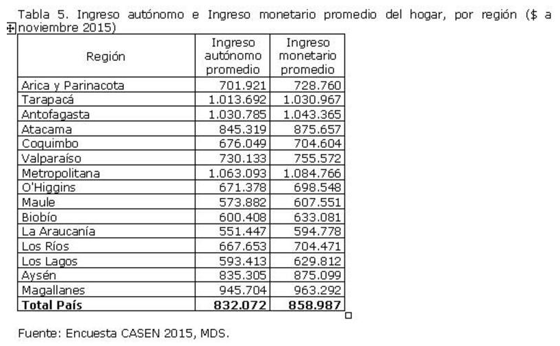

date: `r format(Sys.time(), "%d-%m-%Y")`
<style type="text/css">
.main-container {
  max-width: 1600px;
  margin-left: 100px;
  margin-right: auto;
}
</style>


```{r , message=FALSE, warning=FALSE, include = FALSE, eecho = FALSE}
#suppressWarnings(library(RODBC))
library(ggplot2)
library(ggpubr)
library(markdown)
library(shiny)
library(shinythemes)
library(tidyverse)
library(magrittr)
library(lubridate)
library(plotly)
library(xts)
library(dygraphs)
library(kableExtra)
library(knitr)
library("readxl")
library(rsconnect)
library(dplyr)
library(summarytools)
library(epiDisplay)
#library(leaflet)
library(haven)
library(epiDisplay)
library("readxl")
library(expss)
library(hrbrthemes)
library(viridis)
library(viridisLite)
library(DescTools)
library(roperators)
library(shinycssloaders)
library(writexl)
library(labelled)
library(tidyverse)
library(haven)
library(readr)
library(sjmisc)
library(WriteXLS)
library(ineq)
library(readstata13)
library(reldist)
library(foreign)
```


# Introducción

1 Información de las Casen:\
http://observatorio.ministeriodesarrollosocial.gob.cl/encuesta-casen-2011

2 En difícil encontar datos oficiales que entreguen información de los ingresos a nivel  de **persona** por **comunas** en la Casen, porque es de hogares, lo que sociológicamente tiene sentido. La sociedad se comporta como órganos individuales funcionando dentro de los hogares. La enfermedad, como así mismo la caída del ingreso de un integrante de la familia los afecta a todos. Pensemos en la etnia, el sexo, edad, etc. 

3 Fue un error haber eliminado outliers de las distribuciones de ingresos pues los resultados obtenidos de esta manera los hacen incomparables con cualquier otro tipo de análisis que no siga la misma metodologia. Casen no excluye outliers.

## Cuatro fuentes de datos (las dos últimas las mismas, pero dupicadas)

Logramos obtener tres fuentes de datos:


Uno a nivel **comunal** en la Región Metropolitana y tres a nivel Regional:

i. Ingreso autónomo <span style="color:red">percápita</span> 
del hogar, CASEN 2011
($ de noviembre de 2011)
de la pagina 16 [de aquí](https://ciperchile.cl/wp-content/uploads/INDICE-DE-PRIORIDAD-SOCIAL-2014.pdf
).


ii. Ingreso autónomo promedio e ingreso monetario promedio del hogar a nivel regional el 2015:

https://www.bcn.cl/portal/noticias?id=principales-resultados-sobre-pobreza-e-ingresos-regionales-encuesta-casen-2015


Por dos instrumentos diferentes oficiales llegamos a los mismos resultados y son a los cuales intentamos aproximarnos.


iii.  Una es por una tabla extensa obtenida de [(ver aquí)](https://datasocial.ministeriodesarrollosocial.gob.cl/dataSocial/csv/Tablas_Ingreso.xlsx) 

 <!--  -->

iiii. Y la otra con una página interactiva con datos por región [(ver aquí)](https://datasocial.ministeriodesarrollosocial.gob.cl/fichaIndicador/513/2)


<br>


## Los ingresos

Recordemos los cuatro datos cuantitativos fundamentales de la generación de los ingresos:

 | | | | 
:-----:|:-----:|:-----:|:-----:|:-----:
 | **Tipo** |Ingreso total|Ingreso autónomo|Ingreso del trabajo|Ingreso de la ocupación principal
año| | |
2020|ytotcor|yautcor|ytrabajocor|yoprcor
2017|ytotcor|yautcor|ytrabajocor|yoprcor
2015|ytotcor|yautcor|ytrabajocor|yoprcor
2013|ytotcor|yautcor|ytrabajocor|yoprcor
2011|ytrabaj |yautaj |ytrabaj      |yopraj
2009|ytrabaj |yautaj |ytrabaj      |yopraj
2006|ytrabaj |yautaj |ytrabaj      |yopraj

 

# El ingreso autónomo per cápita del hogar 

## Ingreso autónomo <span style="color:red">percápita</span>  del hogar, CASEN 2011 ($ de noviembre de 2011) 

Ingreso autónomo per cápita del hogar, promedio de los 
hogares es el Valor correspondiente a la suma de los ingresos autónomos per cápita de todos los hogares, dividido por el total de hogares. 
 
El ingreso autónomo se define como todos los pagos que recibe el hogar, 
provenientes tanto del trabajo como de la propiedad de los activos. Estos 
incluyen sueldos y salarios (monetarios y en especies), ganancias 
provenientes del trabajo independiente, la auto provisión de bienes 
producidos por el hogar, rentas, intereses, jubilaciones, pensiones, 
montepíos y transferencias corrientes entre privados. 
 
El  ingreso  autónomo  per  cápita  del  hogar  es  la  suma  de  los  ingresos 
autónomos  de  todos  los  miembros  del  hogar,  dividido  por  el  número  de 
integrantes del hogar, excluido el servicio doméstico puertas adentro. 


<span style="color:red">folio: Identificación del hogar.</span>


## Calculos propios sin expandir

Haremos un primer cálculo tal como lo entendemos
 
### Lectura de casen 2011

```{r}
casen2011 <- readRDS("C:/Users/chris/OneDrive/Documentos/archivos_grandes/casen_2011_c.rds")
casen2011  <- mutate_if(casen2011, is.factor, as.character)
# head(casen2011,5)
```
 
 
### Hacemos un subset con la region metropolitana
 
 
```{r}
casen2011_rm <- filter(casen2011, casen2011$region == "Metropolitana")
```

```{r}
# comuna_ing <- unique(casen2011_rm$comuna)
tabla <- table(casen2011_rm$folio)
tabla <- as.data.frame(tabla)
colnames(tabla) <- c("folio","freq_folio")
head(tabla,10)
```


```{r}
casen_fh <- casen2011_rm[,c("comuna","folio","yauthaj","expc_full","numper")] 
casen_fh$folio <- as.character(casen_fh$folio)
repetidos2 <- merge(x=casen_fh, y=tabla, by = "folio", all.x = T)
#repetidos2 <- repetidos2[,c(2,1,6,4,5)]
rr <- repetidos2[!duplicated(repetidos2$folio), ]
head(rr,10)
```


Aca vamos a calcular promedios de personas por hogar:

```{r}
rr$ing_per_h <- rr$yauthaj/rr$freq_folio
head(rr,10)
```


```{r}
aaa <- aggregate(rr$ing_per_h, list(rr$comuna), FUN=mean) 
names(aaa)[1]<-c("Comuna")
aaa$`mean.rr$ing_per_h` <- as.numeric(aaa$`mean.rr$ing_per_h`)
names(aaa)[2]<-c("calculo_propio")
```


```{r}
write_xlsx(aaa, "aaaa.xlsx")
```


```{r}
bbb <- read.csv2("ing_aut_percap_del_hogar_casen2011.csv")
bbb$`iaph` <- as.numeric(bbb$`iaph`)
names(bbb)[1] <- "Comuna"
```


```{r}
ccc <- merge(x = aaa, y = bbb, by = "Comuna", all.x = TRUE)
ccc
```


```{r}
p <- plot_ly(ccc, width = 1200, x = ~
Comuna, y = ~calculo_propio) %>%
  add_lines()
#p <- plot_ly(width = 800, height = 800)
p <- p %>% add_trace(y = ~iaph, name = 'iaph', mode = 'markers')
p 
```


```{r}
cor(x=ccc$calculo_propio, y=ccc$iaph, method="spearman")
```


## Fórmula propuesta en stata por la Casen

Existe una metodología del 2020 extrapolable a las anteriores [aquí](http://observatorio.ministeriodesarrollosocial.gob.cl/storage/docs/casen/2020/Manual_del_Investigador_Casen_en_Pandemia_2020.pdf) que nos permite calcular éstos valores, pero están en stata:


ING04: Ingreso autónomo per cápita del hogar, promedio de los 
hogares 
pp. 49

 
 $$\frac{\sum_{n=j}^{n}  yauth_j / numper_j} {{Total de hogares}}$$

Veamos la comuna de Santiago


```{r}
 el_dato <- sum(rr$ing_per_h)/sum(rr$freq_folio)
 el_dato
```
 
 
 


<!-- ################################################### -->
<!-- #####################---- Tratamiento casen 2015 -----############################## -->


# Lectura base de datos Casen 2015

Obtuvimos valores oficiales para hogares, para regiones, para Ingreso autónomo del hogar 
corregido e Ingreso Monetario del hogar
corregido **sin expandir**.

https://www.bcn.cl/portal/noticias?id=principales-resultados-sobre-pobreza-e-ingresos-regionales-encuesta-casen-2015



```{r}
casen2015 <- readRDS("C:/Users/chris/OneDrive/Documentos/archivos_grandes/casen_2015_c.rds")
casen2015 <- mutate_if(casen2015, is.factor, as.character)
```

<!-- https://www.inflation.eu/es/tasas-de-inflacion/chile/inflacion-historica/ipc-inflacion-chile.aspx -->

```{r} 
y <- unique(casen2015$region)
y[1]
```


**yautcorh** 
Ingreso autónomo del hogar 
corregido

**ymonecorh** 
Ingreso Monetario del hogar
corregido


```{r}
dataframe_001 <- data.frame()
for(h in y){
  casen2015_r <- filter(casen2015, casen2015$region ==  h)
  casen2015_r$yautcorh <- as.numeric(casen2015_r$yautcorh)
  a <- mean(casen2015_r$yautcorh)
  casen2015_r$ymoneCorh <- as.numeric(casen2015_r$ymoneCorh)
  b <- mean(casen2015_r$ymoneCorh)
  dataframe_002 <- cbind(h,a,b)
  dataframe_001 <- rbind(dataframe_001,dataframe_002)
}
```


```{r}
dataframe_001 <- as.data.frame(dataframe_001)
names(dataframe_001)[2]<-c("yautcorh")
names(dataframe_001)[3]<-c("ymoneCorh")
dataframe_001
```


```{r}
write_xlsx(dataframe_001, "dataframe_001.xlsx")
```
```{r}
d001 <- read_xlsx("dataframe_001.xlsx")
names(d001)[1]<-c("Region")
d002 <- read_xlsx("regiones_001.xlsx")
d001
d002
```


```{r}
d001_d002 <- merge(x = d001, y = d002, by = "Region", all.x = TRUE)
d001_d002


```


```{r}
p <- plot_ly(d001_d002, width = 1200, x = ~
Region, y = ~yautcorh) %>%
  add_lines()
#p <- plot_ly(width = 800, height = 800)
p <- p %>% add_trace(y = ~autonomo, name = 'autonomo', mode = 'markers')
p 
```


```{r}
p <- plot_ly(d001_d002, width = 1200, x = ~
Region, y = ~ymoneCorh) %>%
  add_lines()
#p <- plot_ly(width = 800, height = 800)
p <- p %>% add_trace(y = ~monetario, name = 'monetario', mode = 'markers')
p 
```


# Ejercicio con regiones y nuevas variables para la Casen 2015

Utilizaremos el set de variables duplicadas (las dos últimas) para construir cuatro tablas de nuestros ingresos con variable que aun no hemos utilizado.

**ytotcor***


```{r} 
casen_fh <- filter(casen2015, casen2015$region == "Región Metropolitana de Santiago")
 
casen_fh <- casen_fh[,c("region","folio.x","o.x","ytrabajoCorh","expr_div")]
casen_fh$folio.x <- as.character(casen_fh$folio.x)
  
tabla <- table(casen_fh$folio.x)
tabla <- as.data.frame(tabla)
colnames(tabla) <- c("folio.x","freq_folio")
repetidos2 <- merge(x=casen_fh, y=tabla, by = "folio.x", all.x = T)
repetidos2 <- repetidos2[,c(2,1,6,4,5)]
 
# rr <- repetidos2
rr <- repetidos2[!duplicated(repetidos2$folio.x ), ]

# rr$ing_per_h <- rr$ytrabajoCorh*rr$freq_folio*rr$expr_div


kbl(head(rr,30)) %>%
  kable_styling(bootstrap_options = c("striped", "hover")) %>%
  kable_paper() %>%
  scroll_box(width = "100%", height = "300px")
```
 
 
 


```{r}
mean(rr$ytrabajoCorh)
```

Debimos llega a:

913907,141084357


**Región Metropolitana de Santiago yautcorh**

```{r} 
casen_fh <- filter(casen2015, casen2015$region == "Región Metropolitana de Santiago")
 
casen_fh <- casen_fh[,c("region","folio.x","o.x","yautcorh","expr_div")]
casen_fh$folio.x <- as.character(casen_fh$folio.x)
  
tabla <- table(casen_fh$folio.x)
tabla <- as.data.frame(tabla)
colnames(tabla) <- c("folio.x","freq_folio")
repetidos2 <- merge(x=casen_fh, y=tabla, by = "folio.x", all.x = T)
repetidos2 <- repetidos2[,c(2,1,6,4,5)]
 
# rr <- repetidos2
rr <- repetidos2[!duplicated(repetidos2$folio.x ), ]

# rr$ing_per_h <- rr$ytrabajoCorh*rr$freq_folio*rr$expr_div


kbl(head(rr,30)) %>%
  kable_styling(bootstrap_options = c("striped", "hover")) %>%
  kable_paper() %>%
  scroll_box(width = "100%", height = "300px")
```


```{r}
mean(rr$yautcorh)
```


Debimos llegar a: 958652,034702053


**Región de Valparaíso**

```{r} 
casen_fh <- filter(casen2015, casen2015$region == "Región de Valparaíso")
 
casen_fh <- casen_fh[,c("region","folio.x","o.x","ytrabajoCorh","expr")]
casen_fh$folio.x <- as.character(casen_fh$folio.x)
  
tabla <- table(casen_fh$folio.x)
tabla <- as.data.frame(tabla)
colnames(tabla) <- c("folio.x","freq_folio")
repetidos2 <- merge(x=casen_fh, y=tabla, by = "folio.x", all.x = T)
repetidos2 <- repetidos2[,c(2,1,6,4,5)]

# rr <- repetidos2
rr <- repetidos2[!duplicated(repetidos2$folio.x ), ]

rr$ing_ponderado <- rr$ytrabajoCorh*rr$expr
rr <- filter(rr, rr$ytrabajoCorh != 0)

kbl(head(rr,30)) %>%
  kable_styling(bootstrap_options = c("striped", "hover")) %>%
  kable_paper() %>%
  scroll_box(width = "100%", height = "300px")
```
```{r}
mean(rr$ytrabajoCorh)
```
 
 
debimos llega a:
 
608083,47649721
 
 
 
# intento de expansión sobre comunas

Creemos que el error esta en la expansión, intentamos aplicarla


```{r} 
# casen_fh <- filter(recptaculo, recptaculo$comuna == "Santiago")  
# casen_fh <- casen_fh[,c("comuna","folio","o","yauthaj","expc_full","tot_hogviv","numper")]
# # na.omit(casen_fh)
#  
# casen_fh$folio <- as.character(casen_fh$folio)
#  
# tabla <- table(casen_fh$folio)
# tabla <- as.data.frame(tabla)

```


```{r} 
# colnames(tabla) <- c("folio","freq_folio")
# repetidos2 <- merge(x=casen_fh, y=tabla, by = "folio", all.x = T)
# repetidos2 <- repetidos2[,c(2,1,6,4,5)]
#  
# rr <- repetidos2[!duplicated(repetidos2$folio), ]
# 
# head(rr,10)
```


```{r} 
# # rr$ing_per_h <- rr$yauthaj/rr$freq_folio
# #rr$ing_per_hexp <- (rr$yauthaj)*rr$expc_full
# # rr$ing_per_h <- sum(rr$yauthaj)/sum(rr$freq_folio*rr$expc_full)
# rr$ing_per_h <- rr$yauthaj*(rr$freq_folio*rr$expc_full)
#  head(rr,10)
```


```{r}
# promedio <- mean((rr$ing_per_h)/(rr$freq_folio*rr$expc_full))
# promedio
```

 
 
 
 
 
 
 
 
 
 
 
 
 
 
 